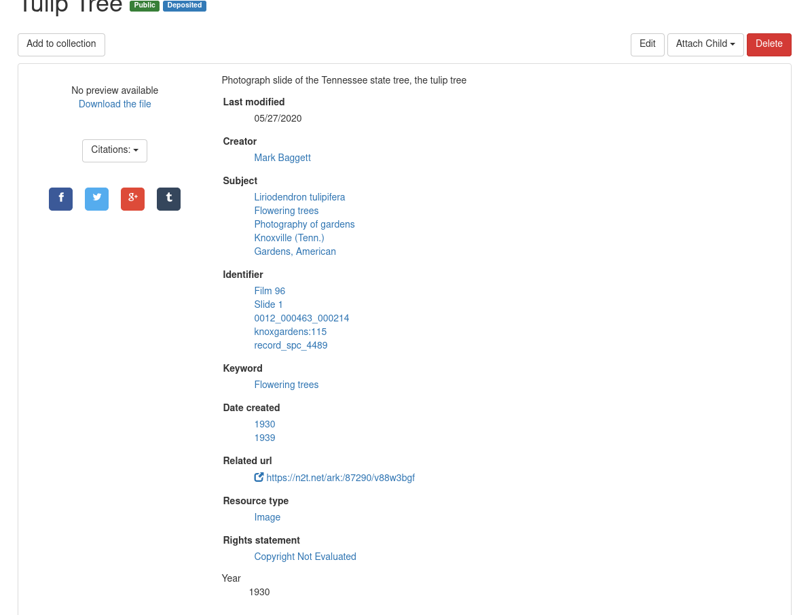
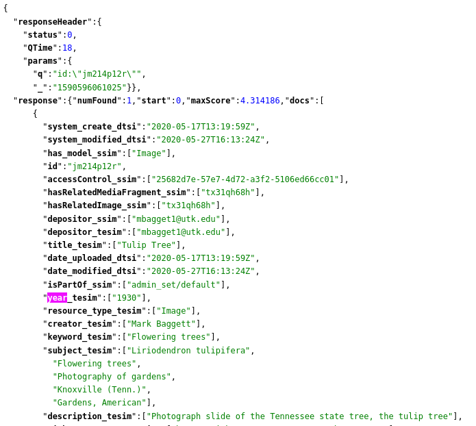
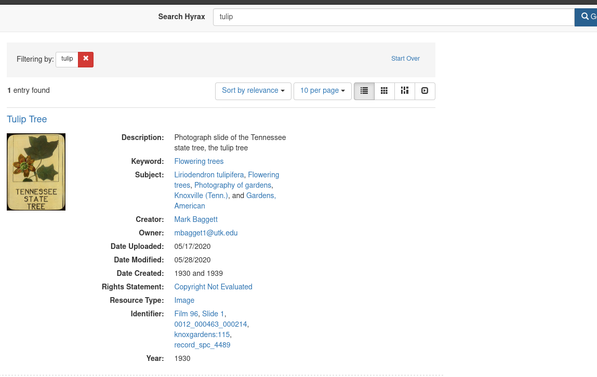

4. Working with Metadata in Hyrax
=================================

Adding a New Metadata Field with Integration Tests and Unit Tests with Capybara
-------------------------------------------------------------------------------

Hyrax uses `Capybara <https://teamcapybara.github.io/capybara/>`_ to automate integration tests and unit tests for the
entire application. This section exists to help me remember how to:

1. Create a new metadata field in a Work
2. Create the associated integration tests
3. Create the associated unit tests

The Hyrax Work Generator creates a default feature test for each work type you create. For example, if you created
a work type called `Image` like so:

.. code-block:: sh

    bundle exec rails generate hyrax:work Image

you'd generate a feature test in a file named `spec/features/create_image_spec.rb` like:

.. code-block:: ruby
    :linenos:

    scenario do
      visit '/dashboard'
      click_link "Works"
      click_link "Add new work"

      # If you generate more than one work uncomment these lines
      # choose "payload_concern", option: "Image"
      # click_button "Create work"

      expect(page).to have_content "Add New Image"
      click_link "Files" # switch tab
      expect(page).to have_content "Add files"
      expect(page).to have_content "Add folder"
      within('span#addfiles') do
        attach_file("files[]", "#{Hyrax::Engine.root}/spec/fixtures/image.jp2", visible: false)
        attach_file("files[]", "#{Hyrax::Engine.root}/spec/fixtures/jp2_fits.xml", visible: false)
      end
      click_link "Descriptions" # switch tab
      fill_in('Title', with: 'My Test Work')
      fill_in('Creator', with: 'Doe, Jane')
      fill_in('Keyword', with: 'testing')
      select('In Copyright', from: 'Rights statement')

      # With selenium and the chrome driver, focus remains on the
      # select box. Click outside the box so the next line can't find
      # its element
      find('body').click
      choose('image_visibility_open')
      expect(page).to have_content('Please note, making something visible to the world (i.e. marking this as Public) may be viewed as publishing which could impact your ability to')
      check('agreement')

      click_on('Save')
      expect(page).to have_content('My Test Work')
      expect(page).to have_content "Your files are being processed by Hyrax in the background."
    end

The feature test runs directly in browser.

You can run the entire test suite like so:

.. code-block:: sh

    rspec spec

You can run just this test like this:

.. code-block:: sh

    rspec spec/features/create_image_spec.rb

In order to add a new metadata field, there are several steps we should follow:

1. Add the new field to our feature spec.
2. Add a unit test for our new metadata field to our model.
3. Add the new metadata field and its predicate to our model.
4. Add test to our form.
5. Add field to our form.
6. Run tests.

In my example, let's add to an Image work year from http://www.europeana.eu/schemas/edm/year (RDF::Vocab::EDM.year).

===========================================================
1. Add the New Field to our Feature Spec / Integration Test
===========================================================

For starters, we need to add to our existing feature test a definition of how we expect our new field to work in Hyrax.
To do this, edit our test scenario at `spec/features/create_image_spec.rb` by adding the following after the
copyright selection test:

.. code-block:: ruby

    click_link("Additional fields")
    fill_in "Year", with: "2005"

If you run `rspec`, it will fail because we haven't updated our model.

==========================================================
2. Add a Unit Test for our New Metadata Field to our Model
==========================================================

Before we update our model, let's add a unit test for our model update in `spec/models/image_spec.rb`. Inside of
the Rspec.describe block, add this:

.. code-block:: ruby

      describe "#year" do
        context "with a new Image" do
          it "has no year value when it is first created" do
            image = Image.new
            expect(image.year).to be_empty
          end
        end

        context "with an Image that has a year defined" do
          it "can set and retrieve a year value" do
            image = Image.new
            image.year = ["2005"]
            expect(image.year).to eq(["2005"])
          end
        end
      end

If you run tests now, you'll have even more fails! Let's Fix it.

===================================================
3. Add the New Field and its Predicate to our Model
===================================================

Edit `app/models/image.rb` and add the following before `include ::Hyrax::BasicMetadata`:

.. code-block:: ruby

    property :year, predicate: "http://www.europeana.eu/schemas/edm/year"

This updates our model. Running rspec now will result in passing unit tests but failing integration tests.

===============================
4. Add a Unit Test for our Form
===============================

As always, start by adding your unit test to the form by modifying `spec/forms/hyrax/image_form_spec.rb`. Replace or
add to  the parts inside the Rspec.describe block with:

.. code-block:: ruby

      subject { form }
      let(:image)    { Image.new }
      let(:ability) { Ability.new(nil) }
      let(:request) { nil }
      let(:form)    { described_class.new(image, ability, request) }
      it "has the expected terms" do
        expect(form.terms).to include(:title)
        expect(form.terms).to include(:year)
      end

========================
5. Add Field to our Form
========================

Rspec will still fail until will modify `app/forms/hyrax/image_form.rb` by adding this line:

.. code-block:: ruby

    self.terms += [:year]

============
6. Run Tests
============

Now run tests.  Everyone is happy!

Add New Metadata Field to Views and Index
-----------------------------------------

In the previous section, I added a metadata field to our Image model and its associated form with integration and unit
tests. The field is now present in the form view and populates a triple in the associated Fedora container.  Now, let's
add the field to the Object View and Index.

========================
1. Add Show feature test
========================

As always, let's start with an integration / feature test. Create a new file at `spec/features/show_image_spec.rb`:

.. code-block:: ruby
    :linenos:

    require 'rails_helper'

    RSpec.feature 'Display an Image' do
      let(:title)      { ['Journey to Skull Island'] }
      let(:creator)    { ['Quest, Jane'] }
      let(:keyword)    { ['Pirates', 'Adventure'] }
      let(:visibility) { Hydra::AccessControls::AccessRight::VISIBILITY_TEXT_VALUE_PUBLIC }
      let(:user)       { 'test@example.com' }

      let :image do
        Image.create(title:      title,
                    creator:    creator,
                    keyword:    keyword,
                    visibility: visibility,
                    depositor:  user)
      end

      scenario "Show a public Image" do
        visit("/concern/images/#{image.id}")

        expect(page).to have_content image.title.first
        expect(page).to have_content image.creator.first
        expect(page).to have_content image.keyword.first
        expect(page).to have_content image.keyword.last
      end
    end

This feature tests whether the Object view has the fields we expect.

If we run tests with `rspec spec` or `rspec spec/features/show_image_spec.rb` everything should pass.

============================================
2. Add Our New Field to Our New Feature Test
============================================

Now, let's add our new field to our new feature test.

We need to:

1. Define our new field with a value.
2. Add population to our create block
3. Add an expectation that our field and value are there.

.. code-block:: ruby
    :linenos:
    :emphasize-lines: 9, 17, 27

    require 'rails_helper'

    RSpec.feature 'Display an Image' do
      let(:title)      { ['Journey to Skull Island'] }
      let(:creator)    { ['Quest, Jane'] }
      let(:keyword)    { ['Pirates', 'Adventure'] }
      let(:visibility) { Hydra::AccessControls::AccessRight::VISIBILITY_TEXT_VALUE_PUBLIC }
      let(:user)       { 'test@example.com' }
      let(:year)       { ['2010'] }

      let :image do
        Image.create(title:      title,
                    creator:    creator,
                    keyword:    keyword,
                    visibility: visibility,
                    depositor:  user,
                    year: year)
      end

      scenario "Show a public Image" do
        visit("/concern/images/#{image.id}")

        expect(page).to have_content image.title.first
        expect(page).to have_content image.creator.first
        expect(page).to have_content image.keyword.first
        expect(page).to have_content image.keyword.last
        expect(page).to have_content image.year.first
      end
    end

If we run `rspec spec/features/show_image_spec.rb`, we should get a failure like this:

.. code-block:: text

    Display an Image
        Show a public Image (FAILED - 1)

    Failures:

      1) Display an Image Show a public Image
         Failure/Error: expect(page).to have_content image.year.first
           expected to find text "2010" in "Skip to Content\nToggle navigation Hyrax\nSwitch language English\nSwitch language Deutsch English Español Français Italiano Português do Brasil 中文\nLogin\nHome About Help Contact\nSearch Hyrax\nGo\nHome\nImage\nJourney to Skull Island\nPublic\n× Add to collection\nYou do not have access to any existing collections. You may create a new collection.\nClose\nCitations:\nEndNote Zotero Mendeley\nCreator\nQuest, Jane\nKeyword\nPiratesAdventure\nRelationships\nItems\nThere are no publicly available items in this Image.\nA service of Samvera.\nHyrax v3.0.0-beta1\nCopyright © 2018 Samvera Licensed under the Apache License, Version 2.0"
         # ./spec/features/show_image_spec.rb:27:in `block (2 levels) in <top (required)>'

The test fails because while it can add the new value to our year field, it can't display it because we haven't told it to do so.

===========================================
3. Modify the Presenter for our Image class
===========================================

Rails adheres to the "model-view-controller" pattern. In addition to models, views, and controllers, we also have
presenters, sometimes also referred to as a **"Decorator"** or **"View-Model."** The presenter is responsible for
translating values from the model to a presentable form.

When we "scaffolded" / **"generated"** our Image work, 2 other files were created for us:

1. `app/presenters/hyrax/image_presenter.rb`
2. `spec/presenters/hyrax/image_presenter_spec.rb`

Let's start by creating a test to our stubbed `spec/presenters/hyrax/image_presenter_spec.rb` file.  The stub looks
like this:

.. code-block:: ruby

    # Generated via
    #  `rails generate hyrax:work Image`
    require 'rails_helper'

    RSpec.describe Hyrax::ImagePresenter do
      it "has tests" do
        skip "Add your tests here"
      end
    end

Let's update this code with a unit test:

.. code-block:: ruby

    require 'rails_helper'

    RSpec.describe Hyrax::ImagePresenter do
      subject { presenter }

      let(:title) { ['Journey to Skull Island'] }
      let(:creator) { ['Quest, Jane'] }
      let(:keyword) { ['Pirates', 'Adventure'] }
      let(:degree) { ['Master of Pirate Studies'] }
      let(:year) { ['2010'] }
      let(:visibility) { Hydra::AccessControls::AccessRight::VISIBILITY_TEXT_VALUE_PUBLIC }
      let :image do
        Image.new(
          title: title,
          creator: creator,
          keyword: keyword,
          year: year,
          visibility: visibility
        )
      end

      let(:ability) { Ability.new(user) }

      let(:solr_document) { SolrDocument.new(image.to_solr) }

      let(:presenter) do
        described_class.new(solr_document, nil)
      end

      it "delegates year to solr document" do
        expect(solr_document).to receive(:year)
        presenter.year
      end
    end

If we test our file with `rspec spec/presenters/hyrax/image_presenter_spec.rb`, it should fail with:

.. code-block:: text

    Hyrax::ImagePresenter
      delegates year to solr document (FAILED - 1)

    Failures:

      1) Hyrax::ImagePresenter delegates year to solr document
         Failure/Error: expect(solr_document).to receive(:year)
           #<SolrDocument:0x0000558d1f7cf7c0 @_source={"system_create_dtsi"=>"2020-05-27T13:28:44Z", "system_modified_dtsi"=>"2020-05-27T13:28:44Z", "has_model_ssim"=>["Image"], "id"=>nil, "title_tesim"=>["Journey to Skull Island"], "title_sim"=>["Journey to Skull Island"], "creator_tesim"=>["Quest, Jane"], "creator_sim"=>["Quest, Jane"], "keyword_tesim"=>["Adventure", "Pirates"], "keyword_sim"=>["Adventure", "Pirates"], "thumbnail_path_ss"=>"/assets/work-ff055336041c3f7d310ad69109eda4a887b16ec501f35afc0a547c4adb97ee72.png", "suppressed_bsi"=>false, "member_ids_ssim"=>[], "member_of_collections_ssim"=>[], "member_of_collection_ids_ssim"=>[], "generic_type_sim"=>["Work"], "file_set_ids_ssim"=>[], "visibility_ssi"=>"open", "admin_set_sim"=>"", "admin_set_tesim"=>"", "human_readable_type_sim"=>"Image", "human_readable_type_tesim"=>"Image", "read_access_group_ssim"=>["public"]}, @response=nil, @export_formats={:xml=>{:content_type=>#<Mime::Type:0x0000558d1503ae88 @synonyms=["text/xml", "application/x-xml"], @symbol=:xml, @string="application/xml", @hash=3027524866981404255>}, :dc_xml=>{:content_type=>"text/xml"}, :oai_dc_xml=>{:content_type=>"text/xml"}, :nt=>{:content_type=>"application/n-triples"}, :jsonld=>{:content_type=>"application/ld+json"}, :ttl=>{:content_type=>"text/turtle"}}> does not implement: year
         # ./spec/presenters/hyrax/image_presenter_spec.rb:31:in `block (2 levels) in <top (required)>'

Let's add this line to `app/presenters/hyrax/image_presenter.rb`:

.. code-block:: ruby
    :linenos:
    :emphasize-lines: 5

    # Generated via
    #  `rails generate hyrax:work Image`
    module Hyrax
      class ImagePresenter < Hyrax::WorkShowPresenter
        delegate :year, to: :solr_document
      end
    end

Normally, we'd also have to add our custom presenter to the relevant controller (in this case, `app/controllers/hyrax/images_controller.rb`),
but if we review this file we can see that's already there for us because of our **generator**:

.. code-block:: ruby
    :linenos:
    :emphasize-lines: 12

    # Generated via
    #  `rails generate hyrax:work Image`
    module Hyrax
      # Generated controller for Image
      class ImagesController < ApplicationController
        # Adds Hyrax behaviors to the controller.
        include Hyrax::WorksControllerBehavior
        include Hyrax::BreadcrumbsForWorks
        self.curation_concern_type = ::Image

        # Use this line if you want to use a custom presenter
        self.show_presenter = Hyrax::ImagePresenter
      end
    end

Finally, if we run tests, we should see a new failure:

.. code-block:: text

    Hyrax::ImagePresenter
      delegates year to solr document (FAILED - 1)

    Failures:

      1) Hyrax::ImagePresenter delegates year to solr document
         Failure/Error: expect(solr_document).to receive(:year)
           #<SolrDocument:0x000055a1f28626c8 @_source={"system_create_dtsi"=>"2020-05-27T13:38:03Z", "system_modified_dtsi"=>"2020-05-27T13:38:03Z", "has_model_ssim"=>["Image"], "id"=>nil, "title_tesim"=>["Journey to Skull Island"], "title_sim"=>["Journey to Skull Island"], "creator_tesim"=>["Quest, Jane"], "creator_sim"=>["Quest, Jane"], "keyword_tesim"=>["Pirates", "Adventure"], "keyword_sim"=>["Pirates", "Adventure"], "thumbnail_path_ss"=>"/assets/work-ff055336041c3f7d310ad69109eda4a887b16ec501f35afc0a547c4adb97ee72.png", "suppressed_bsi"=>false, "member_ids_ssim"=>[], "member_of_collections_ssim"=>[], "member_of_collection_ids_ssim"=>[], "generic_type_sim"=>["Work"], "file_set_ids_ssim"=>[], "visibility_ssi"=>"open", "admin_set_sim"=>"", "admin_set_tesim"=>"", "human_readable_type_sim"=>"Image", "human_readable_type_tesim"=>"Image", "read_access_group_ssim"=>["public"]}, @response=nil, @export_formats={:xml=>{:content_type=>#<Mime::Type:0x000055a1e8c39558 @synonyms=["text/xml", "application/x-xml"], @symbol=:xml, @string="application/xml", @hash=-1551218801630174043>}, :dc_xml=>{:content_type=>"text/xml"}, :oai_dc_xml=>{:content_type=>"text/xml"}, :nt=>{:content_type=>"application/n-triples"}, :jsonld=>{:content_type=>"application/ld+json"}, :ttl=>{:content_type=>"text/turtle"}}> does not implement: year

Progress! Our test is looking for year in Solr, but it's not there.  Let's put it there.

===========================
4. Adding Our Field to Solr
===========================

Let's open our image model (`app/models/image.rb`) and add instructions for how our field should be indexed.

.. code-block:: ruby
    :linenos:
    :emphasize-lines: 12-14

    # Generated via
    #  `rails generate hyrax:work Image`
    class Image < ActiveFedora::Base
      include ::Hyrax::WorkBehavior

      self.indexer = ImageIndexer
      # Change this to restrict which works can be added as a child.
      # self.valid_child_concerns = []
      validates :title, presence: { message: 'Your work must have a title.' }

      property :year, predicate: "http://www.europeana.eu/schemas/edm/year"
      property :year, predicate: "http://www.europeana.eu/schemas/edm/year" do |index|
        index.as :stored_searchable
      end

      # This must be included at the end, because it finalizes the metadata
      # schema (by adding accepts_nested_attributes)
      include ::Hyrax::BasicMetadata
    end

Now, let's add the field to our solr document by editing `app/models/solr_document.rb`:

.. code-block:: ruby
    :linenos:
    :emphasize-lines: 29 - 31

    # frozen_string_literal: true
    class SolrDocument
      include Blacklight::Solr::Document
      include Blacklight::Gallery::OpenseadragonSolrDocument

      # Adds Hyrax behaviors to the SolrDocument.
      include Hyrax::SolrDocumentBehavior

      # self.unique_key = 'id'

      # Email uses the semantic field mappings below to generate the body of an email.
      SolrDocument.use_extension(Blacklight::Document::Email)

      # SMS uses the semantic field mappings below to generate the body of an SMS email.
      SolrDocument.use_extension(Blacklight::Document::Sms)

      # DublinCore uses the semantic field mappings below to assemble an OAI-compliant Dublin Core document
      # Semantic mappings of solr stored fields. Fields may be multi or
      # single valued. See Blacklight::Document::SemanticFields#field_semantics
      # and Blacklight::Document::SemanticFields#to_semantic_values
      # Recommendation: Use field names from Dublin Core
      use_extension(Blacklight::Document::DublinCore)

      # Do content negotiation for AF models.

      use_extension( Hydra::ContentNegotiation )

      def year
        self[Solrizer.solr_name('year')]
      end
    end

Now, our test `rspec spec/presenters/hyrax/image_presenter_spec.rb` passes.

=======================================
5. Adding the Field to Our Test Partial
=======================================

Currently, our Hyrax app does not have a file like ` <https://github.com/samvera/hyrax/blob/master/app/views/hyrax/base/_attribute_rows.html.erb>`_

Let's copy it to the same path and add our new field:

.. code-block:: ruby
    :linenos:
    :emphasize-lines: 19

    <%= presenter.attribute_to_html(:abstract, html_dl: true) %>
    <%= presenter.attribute_to_html(:date_modified, label: t('hyrax.base.show.last_modified'), html_dl: true) %>
    <%= presenter.attribute_to_html(:creator, render_as: :faceted, html_dl: true) %>
    <%= presenter.attribute_to_html(:contributor, render_as: :faceted, html_dl: true) %>
    <%= presenter.attribute_to_html(:subject, render_as: :faceted, html_dl: true) %>
    <%= presenter.attribute_to_html(:publisher, render_as: :faceted, html_dl: true) %>
    <%= presenter.attribute_to_html(:language, render_as: :faceted, html_dl: true) %>
    <%= presenter.attribute_to_html(:identifier, render_as: :linked, search_field: 'identifier_tesim', html_dl: true) %>
    <%= presenter.attribute_to_html(:keyword, render_as: :faceted, html_dl: true) %>
    <%= presenter.attribute_to_html(:date_created, render_as: :linked, search_field: 'date_created_tesim', html_dl: true) %>
    <%= presenter.attribute_to_html(:based_near_label, html_dl: true) %>
    <%= presenter.attribute_to_html(:related_url, render_as: :external_link, html_dl: true) %>
    <%= presenter.attribute_to_html(:resource_type, render_as: :faceted, html_dl: true) %>
    <%= presenter.attribute_to_html(:source, html_dl: true) %>
    <%= presenter.attribute_to_html(:rights_statement, render_as: :rights_statement, html_dl: true) %>
    <%= presenter.attribute_to_html(:rights_notes, html_dl: true) %>
    <%= presenter.attribute_to_html(:access_right, html_dl: true) %>
    <%= presenter.attribute_to_html(:license, render_as: :license, html_dl: true) %>
    <%= presenter.attribute_to_html(:year) %>

If we run our test, `rspec spec/features/show_image_spec.rb`, it should pass.

==================================
6. Let's Look at Solr and the View
==================================

Now, if we check out our view, we should see something like this:

And in Solr, we should see something like this:

Add Fields to Search Results and Facets
---------------------------------------

So far we've:

1. Created a New Metadata Field
2. Added it to our metadata form with tests
3. Demoed how the field hooks in with Fedora
4. Added the field to be indexed by Solr with Tests
5. Tied our new Solr Field to our View with Tests

Now, let's add our field to search results and facets.

==================================
1. Add Feature Spec for Our Search
==================================

The first thing we need to do is to add a new or modify our existing `spec/features/search_image_spec.rb`.

If we're adding from new, let's create a file with our current search functionality:

.. code-block:: ruby

    require 'rails_helper'

    RSpec.feature 'Search for an image' do
      let(:title) { ['Journey to Skull Island'] }
      let(:creator) { ['Quest, Jane'] }
      let(:keyword) { ['Pirates', 'Adventure'] }
      let(:visibility) { Hydra::AccessControls::AccessRight::VISIBILITY_TEXT_VALUE_PUBLIC }
      let(:year) { ['1520'] }
      let(:image) do
        Image.new(title: title,
                 creator: creator,
                 keyword: keyword,
                 visibility: visibility,
                 year: year)
      end

      context 'general search' do
        before do
          image.save
        end
        scenario "Search for an image" do
          visit("/")
          fill_in "q", with: "Journey"
          click_button "Go"
          # Uncomment this to display the HTML capybara is seeing
          # puts page.body
          expect(page).to have_content image.title.first
          expect(page).to have_content image.creator.first
          expect(page).to have_content image.keyword.first
        end
      end
    end

If we ran tests with `rspec spec/features/search_image_spec.rb` it should pass because this only reflects our existing
functionality.  Let's add a line for our new field:

.. code-block:: ruby
    :linenos:
    :emphasize-lines: 30

    require 'rails_helper'

    RSpec.feature 'Search for an image' do
      let(:title) { ['Journey to Skull Island'] }
      let(:creator) { ['Quest, Jane'] }
      let(:keyword) { ['Pirates', 'Adventure'] }
      let(:visibility) { Hydra::AccessControls::AccessRight::VISIBILITY_TEXT_VALUE_PUBLIC }
      let(:year) { ['1520'] }
      let(:image) do
        Image.new(title: title,
                 creator: creator,
                 keyword: keyword,
                 visibility: visibility,
                 year: year)
      end

      context 'general search' do
        before do
          image.save
        end
        scenario "Search for an image" do
          visit("/")
          fill_in "q", with: "Journey"
          click_button "Go"
          # Uncomment this to display the HTML capybara is seeing
          # puts page.body
          expect(page).to have_content image.title.first
          expect(page).to have_content image.creator.first
          expect(page).to have_content image.keyword.first
          expect(page).to have_content image.year.first
        end
      end
    end

Now if we run tests with `rspec spec/features/search_image_spec.rb` it should fail with:

.. code-block:: text

    Failures:

      1) Search for an image general search Search for an image
         Failure/Error: expect(page).to have_content image.year.first
           expected to find text "1520" in "Skip to Content\nToggle navigation Hyrax\nSwitch language English\nSwitch language Deutsch English Español Français Italiano Português do Brasil 中文\nLogin\nHome About Help Contact\nSearch Hyrax\nGo\nSearch Constraints\nStart Over\nFiltering by: Journey Remove constraint Journey\n1 entry found\nSort by relevance\nrelevance date uploaded ▼ date uploaded ▲ date modified ▼ date modified ▲\nNumber of results to display per page\n10 per page\n10 per page 20 per page 50 per page 100 per page\nView results as:\nList Gallery Masonry Slideshow\nSearch Results\nJourney to Skull Island\nKeyword: Pirates and Adventure Creator: Quest, Jane\nToggle facets\nLimit your search\nType\nImage1\nCreator\nQuest, Jane1\nKeyword\nAdventure1Pirates1\nA service of Samvera.\nHyrax v3.0.0-beta1\nCopyright © 2018 Samvera Licensed under the Apache License, Version 2.0"
         # ./spec/features/search_image_spec.rb:30:in `block (3 levels) in <top (required)>'

==============================================
2. Add New Metadata Field to BlackLight Config
==============================================

In Hyrax, search behavior is inherited from Blacklight.  In order to change what fields are displayed in the search
results, we have to update our Blacklight config.

To do this, edit `app/controllers/catalog_controller.rb` and look for the section including add_index_field statements:

.. code-block:: ruby
    :linenos:
    :emphasize-lines: 24

    # solr fields to be displayed in the index (search results) view
    #   The ordering of the field names is the order of the display
    config.add_index_field solr_name("title", :stored_searchable), label: "Title", itemprop: 'name', if: false
    config.add_index_field solr_name("description", :stored_searchable), itemprop: 'description', helper_method: :iconify_auto_link
    config.add_index_field solr_name("keyword", :stored_searchable), itemprop: 'keywords', link_to_search: solr_name("keyword", :facetable)
    config.add_index_field solr_name("subject", :stored_searchable), itemprop: 'about', link_to_search: solr_name("subject", :facetable)
    config.add_index_field solr_name("creator", :stored_searchable), itemprop: 'creator', link_to_search: solr_name("creator", :facetable)
    config.add_index_field solr_name("contributor", :stored_searchable), itemprop: 'contributor', link_to_search: solr_name("contributor", :facetable)
    config.add_index_field solr_name("proxy_depositor", :symbol), label: "Depositor", helper_method: :link_to_profile
    config.add_index_field solr_name("depositor"), label: "Owner", helper_method: :link_to_profile
    config.add_index_field solr_name("publisher", :stored_searchable), itemprop: 'publisher', link_to_search: solr_name("publisher", :facetable)
    config.add_index_field solr_name("based_near_label", :stored_searchable), itemprop: 'contentLocation', link_to_search: solr_name("based_near_label", :facetable)
    config.add_index_field solr_name("language", :stored_searchable), itemprop: 'inLanguage', link_to_search: solr_name("language", :facetable)
    config.add_index_field solr_name("date_uploaded", :stored_sortable, type: :date), itemprop: 'datePublished', helper_method: :human_readable_date
    config.add_index_field solr_name("date_modified", :stored_sortable, type: :date), itemprop: 'dateModified', helper_method: :human_readable_date
    config.add_index_field solr_name("date_created", :stored_searchable), itemprop: 'dateCreated'
    config.add_index_field solr_name("rights_statement", :stored_searchable), helper_method: :rights_statement_links
    config.add_index_field solr_name("license", :stored_searchable), helper_method: :license_links
    config.add_index_field solr_name("resource_type", :stored_searchable), label: "Resource Type", link_to_search: solr_name("resource_type", :facetable)
    config.add_index_field solr_name("file_format", :stored_searchable), link_to_search: solr_name("file_format", :facetable)
    config.add_index_field solr_name("identifier", :stored_searchable), helper_method: :index_field_link, field_name: 'identifier'
    config.add_index_field solr_name("embargo_release_date", :stored_sortable, type: :date), label: "Embargo release date", helper_method: :human_readable_date
    config.add_index_field solr_name("lease_expiration_date", :stored_sortable, type: :date), label: "Lease expiration date", helper_method: :human_readable_date
    config.add_index_field solr_name("year", :stored_searchable), label: "Year"

Now, if we run our test `rspec spec/features/search_image_spec.rb` it should pass.

Also, we can see our new field in search results:

