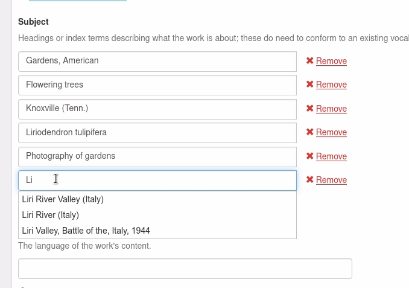

6. Questioning Authority
========================

The `Linked Data for Libraries Project <https://ld4l.org/ld4l-2014/overview>`_ has helped fund the development of tooling
to facilitate the adoption of linked data in libraries and the Samvera community specifically. One example of this is
the `Questioning Authority <https://github.com/samvera/questioning_authority>`_ (QA) ruby gem.

This gem ...

    Provides a set of uniform RESTful routes to query **any controlled vocabulary** or **any** set of authority terms.

    Results are returned in JSON and can be used within the context of a Rails application or any other Ruby environment.

Hyrax comes equipped to leverage QA out-of-the-box.

Connecting to Authorities
-------------------------

`QA <https://github.com/samvera/questioning_authority/wiki>`_ is designed to be authority agnostic and allow you to
connect to whatever authority you want.

Checkout `the QA wiki <https://github.com/samvera/questioning_authority/wiki>`_ for instructions on how to connect to
specific authorities.

While I'm struggling to figure out why I did this or how I knew to do this, I first defined a YAML file at
`config/authorities/linked_data/loc.yml` that looked like this:

.. code-block:: yaml
    :linenos:

    {
      "QA_CONFIG_VERSION": "2.1",
      "prefixes": {
        "loc":     "http://id.loc.gov/vocabulary/identifiers/",
        "madsrdf": "http://www.loc.gov/mads/rdf/v1#"
      },
      "term": {
        "url": {
          "@context": "http://www.w3.org/ns/hydra/context.jsonld",
          "@type":    "IriTemplate",
          "template": "http://id.loc.gov/authorities/{subauth}/{term_id}",
          "variableRepresentation": "BasicRepresentation",
          "mapping": [
            {
              "@type":    "IriTemplateMapping",
              "variable": "term_id",
              "property": "hydra:freetextQuery",
              "required": true
            },
            {
              "@type":    "IriTemplateMapping",
              "variable": "subauth",
              "property": "hydra:freetextQuery",
              "required": false,
              "default":  "names"
            }
          ]
        },
        "qa_replacement_patterns": {
          "term_id": "term_id",
          "subauth": "subauth"
        },
        "term_id": "ID",
        "language": ["en"],
        "results": {
          "id_ldpath":       "loc:lccn | madsrdf:code",
          "label_ldpath":    "skos:prefLabel :: xsd:string",
          "altlabel_ldpath": "skos:altLabel :: xsd:string",
          "sameas_ldpath":   "skos:exactMatch | owl:sameAs :: xsd:anyURI",
          "narrower_ldpath": "madsrdf:hasNarrowerAuthority :: xsd:anyURI",
          "broader_ldpath":  "madsrdf:hasBroaderAuthority :: xsd:anyURI"
        },
        "subauthorities": {
          "subjects":          "subjects",
          "names":             "names",
          "classification":    "classification",
          "child_subject":     "childrensSubjects",
          "genre":             "genreForms",
          "demographic":       "demographicTerms",
          "music_performance": "performanceMediums"
        }
      },
      "search": {}
    }

I'm not 100% sure if I had to do this and I need to redo to see if this was a necessity or something I did because
I was unaware that QA was already in Hyrax.

I also have a file at `config/initializers/oclcts-authorities.yml` that looks like this:

.. code-block:: yaml
    :linenos:

    url-pattern:
      prefix-query: http://tspilot.oclc.org/{authority-id}/?query=oclcts.rootHeading+exact+%22{query}*%22&version=1.1&operation=searchRetrieve&recordSchema=http%3A%2F%2Fzthes.z3950.org%2Fxml%2F1.0%2F&maximumRecords=10&startRecord=1&resultSetTTL=300&recordPacking=xml&recordXPath=&sortKeys=
      id-lookup: http://tspilot.oclc.org/{authority-id}/?query=dc.identifier+exact+%22{id}%22&version=1.1&operation=searchRetrieve&recordSchema=http%3A%2F%2Fzthes.z3950.org%2Fxml%2F1.0%2F&maximumRecords=10&startRecord=1&resultSetTTL=300&recordPacking=xml&recordXPath=&sortKeys=
    authorities:
      lcgft:
        name: Library of Congress Genre/Form Terms for Library and Archival Materials (LCGFT)
      bisacsh:
        name: Book Industry Study Group Subject Headings (BISAC®). Used with permission.
      fast:
        name: Faceted Application of Subject Terminology (FAST subject headings)
      gsafd:
        name: Form and genre headings for fiction and drama
      lcshac:
        name: Library of Congress AC Subject Headings
      lcsh:
        name: Library of Congress Subject Headings
      mesh:
        name: Medical Subject Headings (MeSH®)
      lctgm:
        name: "Thesaurus for graphic materials: TGM I, Subject terms"
      gmgpc:
        name: "Thesaurus for graphic materials: TGM II, Genre terms"
      meta:
        name: Controlled Vocabulary Metadata

Again, not sure if that's there because I didn't understand QA was already there.  I need to test.

Enabling Autocomplete
---------------------

Now, let's look at one of the ways to use QA: autocomplete.

Let's say we wanted to query **LCSH** when anyone is adding a new subject. To do this, let's create a new partial at
`app/views/records/edit_fields/_subject.html.erb`.

In the partial, we will specify our data source:

.. code-block:: ruby
    :linenos:
    :emphasize-lines: 5

    <%= f.input key,
    as: :multi_value,
    input_html: {
      class: 'form-control',
      data: { 'autocomplete-url' => "/authorities/search/loc/subjects",
              'autocomplete' => key }
    },
    required: f.object.required?(key) %>

Now, when you add a new subject, it will **question** LCSH:

