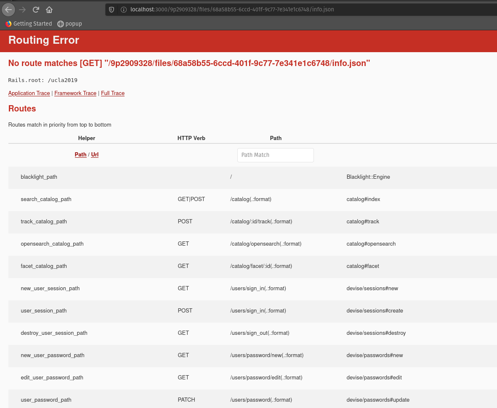

7. Troubleshooting IIIF, rIIIF, and Universal Viewer
====================================================

Since demo 1, Universal Viewer has not been working.  This is my attempt to document steps taken to figure out what's
going on with IIIF in my test Hyrax environment so that if I can figure it out, I can fix things so it's not a problem
in the future.

Reminders
---------

`riiif <https://github.com/curationexperts/riiif>`_ is a gem for installing a simple `IIIF <http://iiif.io/>`_ server
into your rails application.

Ensure rIIIF is Running
-----------------------

First, let's make sure the rIIIF information service is running.  At `config/initializers/hyrax.rb`, we should have
something like this (mine was on line 149):

.. code-block:: ruby

    # Returns a URL that resolves to an info.json file provided by a IIIF image server
    config.iiif_info_url_builder = lambda do |file_id, base_url|
        uri = Riiif::Engine.routes.url_helpers.info_url(file_id, host: base_url)
        uri.sub(%r{/info\.json\Z}, '')
    end

From rails console, let's make sure iiif_info_url_builder is returning something for the expected FileSet (or in my case
**any FileSet**):

.. code-block:: sh

    irb(main):001:0> fs = FileSet.find("9p2909328")
    => #<FileSet id: "9p2909328", head: [], tail: [], depositor: "mbagget1@utk.edu", title: ["638.jpg"], date_uploaded: "2020-05-12 21:59:21", date_modified: "2020-05-12 21:59:21", label: "638.jpg", relative_path: nil, import_url: nil, resource_type: [], creator: ["mbagget1@utk.edu"], contributor: [], description: [], keyword: [], license: [], rights_statement: [], publisher: [], date_created: [], subject: [], language: [], identifier: [], based_near: [], related_url: [], bibliographic_citation: [], source: [], access_control_id: "4f9f76e5-8073-4278-b746-038c57ada57d", embargo_id: nil, lease_id: nil>
    irb(main):002:0> Riiif::Engine.routes.url_helpers.info_url(fs.files.first.id, host: "http://localhost:3000")
    => "http://localhost:3000/9p2909328%2Ffiles%2F68a58b55-6ccd-401f-9c77-7e341e1c6748/info.json"

Now we should have a URL that should retrieve a IIIF image manifest. Let's it into a browser and see what that URL
returns. According to Hyrax documentation, it should look like this:

.. code-block:: json

    {
      "width": 960,
      "height": 720,
      "@context": "http://iiif.io/api/image/2/context.json",
      "@id": "http://localhost:3000/images/cz30ps64c%2Ffiles%2F2ae0fa37-9052-460c-a56b-ab4603403f11",
      "protocol": "http://iiif.io/api/image",
      "profile": ["http://iiif.io/api/image/2/level1.json", {
        "formats": ["jpg", "png"]
      }]
    }

In my case, I'm getting this:

So, we have a Rails routing problem.

Still, Hyrax docs tells us to try some things, so let's do them any way. The first thing they say is to run the
`CharacterizeJob` on the `FileSet`.  Let's see what happens:

.. code-block:: sh

    irb(main):003:0> CharacterizeJob.perform_now(fs, fs.files.first.id)

We still have a routing problem.

Next, they suggest looking at Solr.  Let's look at the response section for our FileSet request:

.. code-block:: json
    :linenos:
    :emphasize-lines: 21

    {"response":{"numFound":1,"start":0,"maxScore":4.6287756,"docs":[
          {
            "system_create_dtsi":"2020-05-12T21:59:21Z",
            "system_modified_dtsi":"2020-05-12T21:59:26Z",
            "has_model_ssim":["FileSet"],
            "id":"9p2909328",
            "accessControl_ssim":["4f9f76e5-8073-4278-b746-038c57ada57d"],
            "depositor_ssim":["mbagget1@utk.edu"],
            "depositor_tesim":["mbagget1@utk.edu"],
            "title_tesim":["638.jpg"],
            "date_uploaded_dtsi":"2020-05-12T21:59:21Z",
            "date_modified_dtsi":"2020-05-12T21:59:21Z",
            "creator_tesim":["mbagget1@utk.edu"],
            "thumbnail_path_ss":"/downloads/9p2909328?file=thumbnail",
            "hasRelatedMediaFragment_ssim":["9p2909328"],
            "hasRelatedImage_ssim":["9p2909328"],
            "label_tesim":["638.jpg"],
            "label_ssi":"638.jpg",
            "file_format_tesim":["jpeg (JPEG File Interchange Format)"],
            "file_size_lts":3842,
            "height_is":112,
            "width_is":112,
            "visibility_ssi":"open",
            "mime_type_ssi":"image/jpeg",
            "digest_ssim":["urn:sha1:8d76c0eb5965d75e9f95ce36fe66cfdbea3c7732"],
            "original_checksum_tesim":["a43b89c8a1948133ad9a466cff007a2b"],
            "read_access_group_ssim":["public"],
            "edit_access_group_ssim":["admin"],
            "edit_access_person_ssim":["mbagget1@utk.edu"],
            "human_readable_type_tesim":["File"],
            "_version_":1668483483254652928,
            "timestamp":"2020-06-03T13:10:45.327Z",
            "score":4.6287756}]
      }}

In the docs, it says to check if there is a `height_is` key value pair.  There is as you can see on line 21.

Is the iiif_manifest gem a thing?
---------------------------------

This isn't in the Hyrax docs, but I noticed some groups (VT) have a `iiif_manifest <https://github.com/samvera/iiif_manifest>`_
gem in their Gemfile.  Let's add that and see if we get a route.

As normal, let's add the gem to our `Gemfile`:

.. code-block:: ruby

    gem 'iiif_manifest'

Now, let's install it:

.. code-block:: sh

    bundle exec rake install

This doesn't work.

Back to Hyrax Docs
------------------

Apparently, I skipped the main chunk of IIIF docs in the Hyrax documentation:

    By default, as of version 2.1.0, Hyrax generates a working ruby IIIF ('RIIIF') configuration into your application but will not turn on the image server or use the UniversalViewer-enabled work show page. To enable both, you have two options. You can either use the built-in RIIIF server or you can use your own IIIF image server.

    Note that in order to use the UniversalViewer in Hyrax, you will need to enable the public file server (which is very likely turned off in RAILS_ENV=production). This is a requirement of the pul_uv_rails dependency that we rely upon for the UniversalViewer: see https://github.com/pulibrary/pul_uv_rails/issues/8.

================================================
Let's try to use the Built-In RIIIF image server
================================================

According to the docs:

    To use the embedded image server, RIIIF, set config.iiif_image_server to true in config/initializers/hyrax.rb and restart your application. This assumes you have the RIIIF files Hyrax generates into your application. If you skipped this step earlier or missed it, run rails g hyrax:riiif. (Not sure if this has been done? Check to see that config/initializers/riiif.rb exists. If not, run the generator. If so, you should be good to go.)

We have an riiif.rb and I set `config.iiif_image_server` to `true`.  Still nothing.

================================
Let's turn on public file server
================================

In the config/environments directory, turn on public file server:

.. code-block:: ruby

    # Mark turning on the file server
    config.public_file_server.enabled = true

Still nothing.

====================================================================================
Wait! What happens if I try to find the path to the manifest from the console again?
====================================================================================

Wait!  We haven't really gone back and see if our route is still the same.  Let's check

.. code-block:: sh

    irb(main):001:0> fs = FileSet.find("9p2909328")
    => #<FileSet id: "9p2909328", head: [], tail: [], depositor: "mbagget1@utk.edu", title: ["638.jpg"], date_uploaded: "2020-05-12 21:59:21", date_modified: "2020-05-12 21:59:21", label: "638.jpg", relative_path: nil, import_url: nil, resource_type: [], creator: ["mbagget1@utk.edu"], contributor: [], description: [], keyword: [], license: [], rights_statement: [], publisher: [], date_created: [], subject: [], language: [], identifier: [], based_near: [], related_url: [], bibliographic_citation: [], source: [], access_control_id: "4f9f76e5-8073-4278-b746-038c57ada57d", embargo_id: nil, lease_id: nil>
    irb(main):002:0> Riiif::Engine.routes.url_helpers.info_url(fs.files.first.id, host: "http://localhost:3000")
    => "http://localhost:3000/images/9p2909328%2Ffiles%2F68a58b55-6ccd-401f-9c77-7e341e1c6748/info.json"

Guess what?  It works!

.. code-block:: json
    :linenos:

    {
        "width": 112,
        "height": 112,
        "format": null,
        "channels": null,
        "@context": "http://iiif.io/api/image/2/context.json",
        "@id": "http://localhost:3000/images/9p2909328%2Ffiles%2F68a58b55-6ccd-401f-9c77-7e341e1c6748",
        "protocol": "http://iiif.io/api/image",
        "profile": ["http://iiif.io/api/image/2/level1.json", {
            "formats": ["jpg", "png"]
        }]
    }

Uh oh!  So we fixed publishing our manifest, but what actually fixed it? I do not know.

===========================================
What actually fixed it and How to Replicate
===========================================

The most important thing is to make sure your rIIIF server is running.  To do this, in **config/initializers/hyrax.rb**
change the following line to **true**:

.. code-block:: ruby

    # Default is false
    config.iiif_image_server = true
