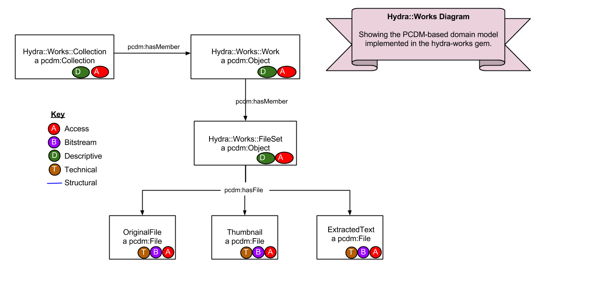
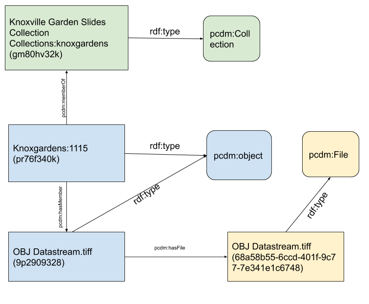

Content Modeling in Hyrax
=========================

Work Types aka "Curation Concerns"
----------------------------------

In Hyrax, types of digital repository objects are referred to as work types.  In Islandora 7, we referred to these as
content models with associated "solution packs."  It's also worth noting that these were previously referred to as
curation concerns, which is where the old front-end solution for Hydra go its name.

In Hyrax, all repositories have at least one work type that you establish with a rails generator tool after installation.

Here's an example:

.. code-block:: sh

    rails generate hyrax:work Work

You can have as many "work types" as you need, but there are few rules. The type must be camel-cased:

.. code-block:: sh

    rails generate hyrax:work MovingImage

You can namespace these if necessary by using a forward slash:

.. code-block:: sh

    rails generate hyrax:work Marks/MovingImage

Also, it's important to note that these work types often have pluralized forms that are used in routing.  Rather than
simply adding an "s", Rails attempts to guess what the route should be. If this route doesn't meet expectations you can
override it in the `config/initializers/inflections.rb` file:

.. code-block:: ruby

    ActiveSupport::Inflector.inflections(:en) do |inflect|
        inflect.irregular 'atlas', 'atlases'
    end

Work Types, Fedora, and Portland Common Data Model
--------------------------------------------------

Hyrax, like most modern Fedora stacks, uses the `Portland Common Data Model <https://github.com/duraspace/pcdm/wiki>`_.
From the PCDM wiki:

    The Portland Common Data Model (PCDM) is a flexible, extensible domain model that is intended to underlie a wide array of repository and DAMS applications. The primary objective of this model is to establish a framework that developers of tools (e.g., Samvera-based engines, such as Hyrax, Hyku, Sufia, and Avalon; Islandora; custom Fedora sites) can use for working with models in a general way, allowing adopters to easily use custom models with any tool. Given this interoperability goal, the initial work has been focused on structural metadata and access control, since these are the key actionable metadata.

    To encourage adoption, this model must support the most complex use cases, which include rich hierarchies of inter-related collections and works, but also elegantly support the simplest use cases, such as a single user-contributed file with a few fields of metadata. It must provide a compact interface that tool developers can easily implement, but also be extensible enough for adopters to customize to their local needs.

    As the community migrates to Fedora 4, much of our metadata is migrating to RDF. This model encourages linked data best practices, such as using URIs to identify all resources, using widely-used vocabularies where possible, and subclassing existing classes and properties when creating new terms.

Hydra::Works implements PCDM like this:

Using one of our objects, here is an overview of how this work and its collection is modeled with PCDM in Hyrax:

Taking Hydra::Works and PCDM,  one TIFF from `Knoxville Gardens Slides` would look something like this in Fedora.

.. image:: ../images/hydra-works-example.png

The following ttl shows how the object `knoxgardens:115` from our Fedora 3.8 instance looks migrated to Hyrax and its
relationship with its parent collection and its preservation Tiff.

.. code-block:: turtle
    :linenos:
    :caption: knoxgardens:115 in Hyrax as ttl and using PCDM, highlight structural metadata, with only core descriptive metadata
    :name:  knoxgardens:115 in Hyrax as ttl and using PCDM with only core metadata
    :emphasize-lines: 16-17, 24, 44

    @prefix pcdm:  <http://pcdm.org/models#> .
    @prefix dct: <http://purl.org/dc/terms/> .
    @prefix rdf:  <http://www.w3.org/1999/02/22-rdf-syntax-ns#> .
    @prefix relators: <http://id.loc.gov/vocabulary/relators/> .
    @prefix pcdmuse:  <http://pcdm.org/use#> .
    @prefix hydra:  <http://projecthydra.org/works/models#> .
    @prefix fedora:  <http://fedora.info/definitions/v4/repository#> .
    @prefix iana:  <http://www.iana.org/assignments/relation/> .
    @prefix faccess:  <http://fedora.info/definitions/1/0/access/ObjState#> .
    @prefix fmodels:  <info:fedora/fedora-system:def/model#> .
    @prefix ebucore:  <http://www.ebu.ch/metadata/ontologies/ebucore/ebucore#> .
    @prefix acl:  <http://www.w3.org/ns/auth/acl#> .
    @prefix ldp:  <http://www.w3.org/ns/ldp#> .

    <http://localhost:8984/rest/dev/pr/76/f3/40/pr76f340k>
        rdf:type pcdm:Object ;
        rdf:type hydra:Work ;
        rdf:type fedora:Container;
        rdf:type fedora:Resource;
        dct:title "Tulip Tree"^^<http://www.w3.org/2001/XMLSchema#string> ;
        relators:dpt "mbagget1@utk.edu"^^<http://www.w3.org/2001/XMLSchema#string> ;
        dct:dateSubmitted "2020-05-12T21:59:19.647826267+00:00"^^<http://www.w3.org/2001/XMLSchema#dateTime> ;
        dct:modified "2020-05-12T21:59:19.65408406+00:00"^^<http://www.w3.org/2001/XMLSchema#dateTime> ;
        pcdm:memberOf <http://localhost:8984/rest/dev/gm/80/hv/32/gm80hv32k> ;
        iana:last <http://localhost:8984/rest/dev/pr/76/f3/40/pr76f340k/list_source#g47218150558240> ;
        faccess:objState faccess:active ;
        fmodels:hasModel "Image"^^<http://www.w3.org/2001/XMLSchema#string> ;
        ebucore:hasRelatedMediaFragment <http://localhost:8984/rest/dev/9p/29/09/32/9p2909328> ;
        fedora:createdBy "bypassAdmin"^^<http://www.w3.org/2001/XMLSchema#string> ;
        fedora:created "2020-05-12T21:59:19.736Z"^^<http://www.w3.org/2001/XMLSchema#dateTime> ;
        fedora:lastModified "2020-05-12T21:59:26.707Z"^^<http://www.w3.org/2001/XMLSchema#dateTime> ;
        dct:isPartOf <http://localhost:8984/rest/dev/ad/mi/n_/se/admin_set/default> ;
        dct:modified "2020-05-12T21:59:19.65408406+00:00"^^<http://www.w3.org/2001/XMLSchema#dateTime> ;
        acl:accessControl <http://localhost:8984/rest/dev/97/60/cf/c7/9760cfc7-b141-451c-84a1-ff7cb2223180> ;
        ebucore:hasRelatedImage <http://localhost:8984/rest/dev/9p/29/09/32/9p2909328> ;
        iana:first <http://localhost:8984/rest/dev/pr/76/f3/40/pr76f340k/list_source#g47218150558240> ;
        rdf:type ldp:RDFSource ;
        rdf:type ldp:Container ;
        fedora:writable "true"^^<http://www.w3.org/2001/XMLSchema#boolean> ;
        fedora:hasParent <http://localhost:8984/rest/dev> ;
        ldp:contains <http://localhost:8984/rest/dev/pr/76/f3/40/pr76f340k/member_of_collections> ;
        ldp:contains <http://localhost:8984/rest/dev/pr/76/f3/40/pr76f340k/members> ;
        ldp:contains <http://localhost:8984/rest/dev/pr/76/f3/40/pr76f340k/list_source> ;
        pcdm:hasMember <http://localhost:8984/rest/dev/9p/29/09/32/9p2909328> .

Here is a ttl representation of the "Knoxville Garden Slides" Collection object:

.. code-block:: turtle
    :linenos:
    :caption: Knoxville Garden Slides Collection Object with Minimal Descriptive Metadata modeled as RDF
    :name: Knoxville Garden Slides Collection Object with Minimal Descriptive Metadata modeled as RDF
    :emphasize-lines: 24, 26

    @prefix premis:  <http://www.loc.gov/premis/rdf/v1#> .
    @prefix rdfs:  <http://www.w3.org/2000/01/rdf-schema#> .
    @prefix hydra:  <http://projecthydra.org/works/models#> .
    @prefix webacl:  <http://www.w3.org/ns/auth/acl#> .
    @prefix dct:  <http://purl.org/dc/terms/> .
    @prefix fedora:  <info:fedora/fedora-system:def/model#> .
    @prefix xsi:  <http://www.w3.org/2001/XMLSchema-instance> .
    @prefix xmlns:  <http://www.w3.org/2000/xmlns/> .
    @prefix pcdm:  <http://pcdm.org/models#> .
    @prefix relators:  <http://id.loc.gov/vocabulary/relators/> .
    @prefix xml:  <http://www.w3.org/XML/1998/namespace> .
    @prefix fedoraconfig:  <http://fedora.info/definitions/v4/config#> .
    @prefix foaf:  <http://xmlns.com/foaf/0.1/> .
    @prefix test:  <info:fedora/test/> .
    @prefix schema:  <http://schema.org/> .
    @prefix rdf:  <http://www.w3.org/1999/02/22-rdf-syntax-ns#> .
    @prefix fedora:  <http://fedora.info/definitions/v4/repository#> .
    @prefix ebucore:  <http://www.ebu.ch/metadata/ontologies/ebucore/ebucore#> .
    @prefix ldp:  <http://www.w3.org/ns/ldp#> .
    @prefix xs:  <http://www.w3.org/2001/XMLSchema> .
    @prefix dc:  <http://purl.org/dc/elements/1.1/> .

    <http://localhost:8984/rest/dev/gm/80/hv/32/gm80hv32k>
            rdf:type pcdm:Collection ;
            rdf:type fedora:Container ;
            rdf:type hydra:Collection ;
            rdf:type fedora:Resource ;
            fedora:lastModifiedBy "bypassAdmin"^^<http://www.w3.org/2001/XMLSchema#string> ;
            fedora:hasModel "Collection"^^<http://www.w3.org/2001/XMLSchema#string> ;
            fedora:createdBy "bypassAdmin"^^<http://www.w3.org/2001/XMLSchema#string> ;
            relators:dpt "mbagget1@utk.edu"^^<http://www.w3.org/2001/XMLSchema#string> ;
            fedora:created "2020-05-12T21:56:09.247Z"^^<http://www.w3.org/2001/XMLSchema#dateTime> ;
            fedora:lastModified "2020-05-12T21:56:26.349Z"^^<http://www.w3.org/2001/XMLSchema#dateTime> ;
            webacl:accessControl <http://localhost:8984/rest/dev/3c/7a/9a/39/3c7a9a39-1eee-49b2-a78a-06bcf57adcc6> ;
            schema:additionalType "gid://ucla2019/hyrax-collectiontype/1"^^<http://www.w3.org/2001/XMLSchema#string> ;
            dct:title "Knoxville Garden Slides"^^<http://www.w3.org/2001/XMLSchema#string> ;
            dc:description "This collection of hand-colored lantern slides dates from the late 1920s and early 1930s. The slides depict ornamental gardens in the Knoxville, Tennessee, area and feature a variety of garden styles, plants, flowers, and foliage."^^<http://www.w3.org/2001/XMLSchema#string> ;
            rdf:type ldp:RDFSource ;
            rdf:type ldp:Container ;
            fedora:writable "true"^^<http://www.w3.org/2001/XMLSchema#boolean> ;
            fedora:hasParent <http://localhost:8984/rest/dev> .

Here is the TIF that is associated with knoxgardens:115 modeled as RDF:

.. code-block:: turtle
    :linenos:
    :caption: The TIF belonging to knoxgardens:115 modeled as RDF in Fedora
    :name: The TIF belonging to knoxgardens:115 modeled as RDF in Fedora
    :emphasize-lines: 24, 26, 44

    @prefix premis:  <http://www.loc.gov/premis/rdf/v1#> .
    @prefix rdfs:  <http://www.w3.org/2000/01/rdf-schema#> .
    @prefix hydra:  <http://projecthydra.org/works/models#> .
    @prefix webacl:  <http://www.w3.org/ns/auth/acl#> .
    @prefix dct:  <http://purl.org/dc/terms/> .
    @prefix fedora:  <info:fedora/fedora-system:def/model#> .
    @prefix xsi:  <http://www.w3.org/2001/XMLSchema-instance> .
    @prefix xmlns:  <http://www.w3.org/2000/xmlns/> .
    @prefix pcdm:  <http://pcdm.org/models#> .
    @prefix relators:  <http://id.loc.gov/vocabulary/relators/> .
    @prefix xml:  <http://www.w3.org/XML/1998/namespace> .
    @prefix fedoraconfig:  <http://fedora.info/definitions/v4/config#> .
    @prefix foaf:  <http://xmlns.com/foaf/0.1/> .
    @prefix test:  <info:fedora/test/> .
    @prefix rdf:  <http://www.w3.org/1999/02/22-rdf-syntax-ns#> .
    @prefix fedora:  <http://fedora.info/definitions/v4/repository#> .
    @prefix ebucore:  <http://www.ebu.ch/metadata/ontologies/ebucore/ebucore#> .
    @prefix ldp:  <http://www.w3.org/ns/ldp#> .
    @prefix xs:  <http://www.w3.org/2001/XMLSchema> .
    @prefix dc:  <http://purl.org/dc/elements/1.1/> .

    <http://localhost:8984/rest/dev/9p/29/09/32/9p2909328>
            rdf:type fedora:Container ;
            rdf:type hydra:FileSet ;
            rdf:type fedora:Resource ;
            rdf:type pcdm:Object ;
            fedora:lastModifiedBy "bypassAdmin"^^<http://www.w3.org/2001/XMLSchema#string> ;
            fedora:downloadFilename "OBJ Datastream.tiff"^^<http://www.w3.org/2001/XMLSchema#string> ;
            fedora:hasModel "FileSet"^^<http://www.w3.org/2001/XMLSchema#string> ;
            dct:dateSubmitted "2020-05-12T21:59:21.995548515+00:00"^^<http://www.w3.org/2001/XMLSchema#dateTime> ;
            fedora:createdBy "bypassAdmin"^^<http://www.w3.org/2001/XMLSchema#string> ;
            relators:dpt "mbagget1@utk.edu"^^<http://www.w3.org/2001/XMLSchema#string> ;
            fedora:created "2020-05-12T21:59:21.831Z"^^<http://www.w3.org/2001/XMLSchema#dateTime> ;
            fedora:lastModified "2020-05-12T21:59:26.063Z"^^<http://www.w3.org/2001/XMLSchema#dateTime> ;
            dct:modified "2020-05-12T21:59:21.995548515+00:00"^^<http://www.w3.org/2001/XMLSchema#dateTime> ;
            dc:creator "mbagget1@utk.edu"^^<http://www.w3.org/2001/XMLSchema#string> ;
            webacl:accessControl <http://localhost:8984/rest/dev/4f/9f/76/e5/4f9f76e5-8073-4278-b746-038c57ada57d> ;
            dct:title "OBJ Datastream.tiff"^^<http://www.w3.org/2001/XMLSchema#string> ;
            rdf:type ldp:RDFSource ;
            rdf:type ldp:Container ;
            fedora:writable "true"^^<http://www.w3.org/2001/XMLSchema#boolean> ;
            fedora:hasParent <http://localhost:8984/rest/dev> ;
            ldp:contains <http://localhost:8984/rest/dev/9p/29/09/32/9p2909328/files> ;
            pcdm:hasFile <http://localhost:8984/rest/dev/9p/29/09/32/9p2909328/files/68a58b55-6ccd-401f-9c77-7e341e1c6748> .

Now the actual file:

.. code-block:: turtle
    :linenos:
    :caption: The Actual File
    :name: The Actual File
    :emphasize-lines: 24

    @prefix premis:  <http://www.loc.gov/premis/rdf/v1#> .
    @prefix rdfs:  <http://www.w3.org/2000/01/rdf-schema#> .
    @prefix xsi:  <http://www.w3.org/2001/XMLSchema-instance> .
    @prefix xmlns:  <http://www.w3.org/2000/xmlns/> .
    @prefix pcdm:  <http://pcdm.org/models#> .
    @prefix xml:  <http://www.w3.org/XML/1998/namespace> .
    @prefix pcdmuse:  <http://pcdm.org/use#> .
    @prefix fedoraconfig:  <http://fedora.info/definitions/v4/config#> .
    @prefix foaf:  <http://xmlns.com/foaf/0.1/> .
    @prefix test:  <info:fedora/test/> .
    @prefix hydramix:  <http://projecthydra.org/ns/mix/> .
    @prefix nepomuk:  <http://www.semanticdesktop.org/ontologies/2007/03/22/nfo#> .
    @prefix iana:  <http://www.iana.org/assignments/relation/> .
    @prefix exif:  <http://www.w3.org/2003/12/exif/ns#> .
    @prefix rdf:  <http://www.w3.org/1999/02/22-rdf-syntax-ns#> .
    @prefix fedora:  <http://fedora.info/definitions/v4/repository#> .
    @prefix ebucore:  <http://www.ebu.ch/metadata/ontologies/ebucore/ebucore#> .
    @prefix ldp:  <http://www.w3.org/ns/ldp#> .
    @prefix xs:  <http://www.w3.org/2001/XMLSchema> .
    @prefix dc:  <http://purl.org/dc/elements/1.1/> .

    <http://localhost:8984/rest/dev/9p/29/09/32/9p2909328/files/68a58b55-6ccd-401f-9c77-7e341e1c6748>
            rdf:type ldp:NonRDFSource ;
            rdf:type pcdm:File ;
            rdf:type pcdmuse:OriginalFile ;
            rdf:type fedora:Binary ;
            rdf:type fedora:Resource ;
            fedora:lastModifiedBy "bypassAdmin"^^<http://www.w3.org/2001/XMLSchema#string> ;
            premis:hasFormatName "TIFF EXIF"^^<http://www.w3.org/2001/XMLSchema#string> ;
            ebucore:width "2106"^^<http://www.w3.org/2001/XMLSchema#string> ;
            ebucore:fileSize "17765536"^^<http://www.w3.org/2001/XMLSchema#string> ;
            premis:hasSize "17765536"^^<http://www.w3.org/2001/XMLSchema#long> ;
            exif:orientation "normal*"^^<http://www.w3.org/2001/XMLSchema#string> ;
            fedora:createdBy "bypassAdmin"^^<http://www.w3.org/2001/XMLSchema#string> ;
            fedora:created "2020-05-17T13:20:03.252Z"^^<http://www.w3.org/2001/XMLSchema#dateTime> ;
            premis:hasMessageDigest <urn:sha1:3fe991ef65c061f65233cd7eb9353b8ca109ea2c> ;
            hydramix:colorProfileVersion "2.1.0"^^<http://www.w3.org/2001/XMLSchema#string> ;
            ebucore:filename "OBJ_Datastream.tiff"^^<http://www.w3.org/2001/XMLSchema#string> ;
            exif:software "Adobe Photoshop CS2 Windows"^^<http://www.w3.org/2001/XMLSchema#string> ;
            hydramix:colorProfileName "Adobe RGB (1998)"^^<http://www.w3.org/2001/XMLSchema#string> ;
            nepomuk:hashValue "99d14ee8c28517e10c637e0e0a675b94"^^<http://www.w3.org/2001/XMLSchema#string> ;
            ebucore:dateCreated "2010:01:28 17:33:15-05:00"^^<http://www.w3.org/2001/XMLSchema#string> ;
            exif:colorSpace "RGB"^^<http://www.w3.org/2001/XMLSchema#string> ;
            ebucore:hasMimeType "image/tiff"^^<http://www.w3.org/2001/XMLSchema#string> ;
            fedora:lastModified "2020-05-17T13:20:07.078Z"^^<http://www.w3.org/2001/XMLSchema#dateTime> ;
            ebucore:height "2808"^^<http://www.w3.org/2001/XMLSchema#string> ;
            hydramix:compressionScheme "Uncompressed"^^<http://www.w3.org/2001/XMLSchema#string> ;
            ebucore:dateModified "2010:01:28 17:38:53"^^<http://www.w3.org/2001/XMLSchema#string> ;
            rdf:type ldp:NonRDFSource ;
            fedora:writable "true"^^<http://www.w3.org/2001/XMLSchema#boolean> ;
            iana:describedby <http://localhost:8984/rest/dev/9p/29/09/32/9p2909328/files/68a58b55-6ccd-401f-9c77-7e341e1c6748/fcr:metadata> ;
            fedora:hasParent <http://localhost:8984/rest/dev/9p/29/09/32/9p2909328/files> ;
            fedora:hasFixityService <http://localhost:8984/rest/dev/9p/29/09/32/9p2909328/files/68a58b55-6ccd-401f-9c77-7e341e1c6748/fcr:fixity> ;
            fedora:hasVersions <http://localhost:8984/rest/dev/9p/29/09/32/9p2909328/files/68a58b55-6ccd-401f-9c77-7e341e1c6748/fcr:versions> .
