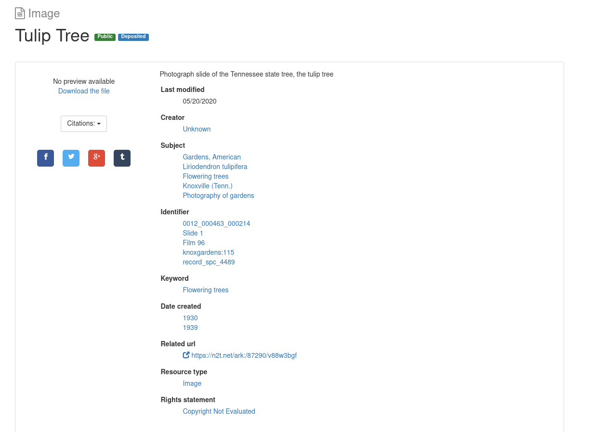

V. Content Modeling in Hyrax
----------------------------

Remember from earlier:

    Hyrax is the community-developed Ruby gem that allows users **to design and build their own**, customized installation
    of our software.

Because of this, it may be surprising to hear that content modelling works very differently in Hyrax as opposed to how
things worked in Islandora 7.

In Islandora 7, you had content models and solution packs. Content models were ideas defined in your RELS-EXT and each
had solution packs that determined how it looked and displayed to users.

This is different in Hyrax. In Hyrax, digital respository objects are referred to as **work types**. For you trivia
buffs, they were historically called **curation concerns**, hence the name of the popular Samvera variant.

While all Hyrax implementations require at least one work type, it ships with **NONE!!!!** Because of this, your first
activity in Hyrax will be to generate a work type with a rails generator tool.  Some examples might be:

.. code-block:: sh
    :caption: A generic work type called Work
    :name: A generic work type called Work

    rails generate hyrax:work Work

.. code-block:: sh
    :caption: A work type for Images!
    :name: A work type for Images!

    rails generate hyrax:work Image

.. code-block:: sh
    :caption: A work type for Moving Images!
    :name: A work type for Moving Images!

    rails generate hyrax:work MovingImage

So **what the heck** is the generator doing and why do you have to do this?  Remember, Samvera / Hyrax is based on Ruby
on Rails. Rails has a concept called **scaffolding**.  I don't want to get into this too much right now, but I stole
this definition from someone on the internet:

    **Scaffolding** in Ruby on Rails refers to the auto-generation of a set of a model, views, and a controller usually
    used for a single database table.

In other words, instead of having to write the initial code for your model, controller, and views for this work type,
the generator creates all this for you to save you time.

Here is a sample of what an Image work type that **has NOT been configured to work properly with Universal Viewer (Sorry!)**
might look like:

