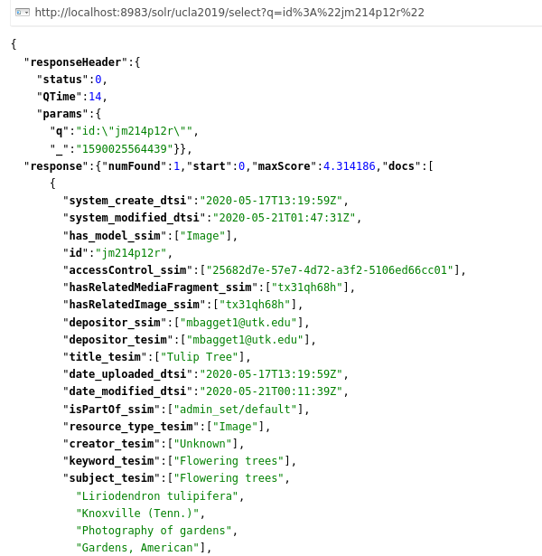
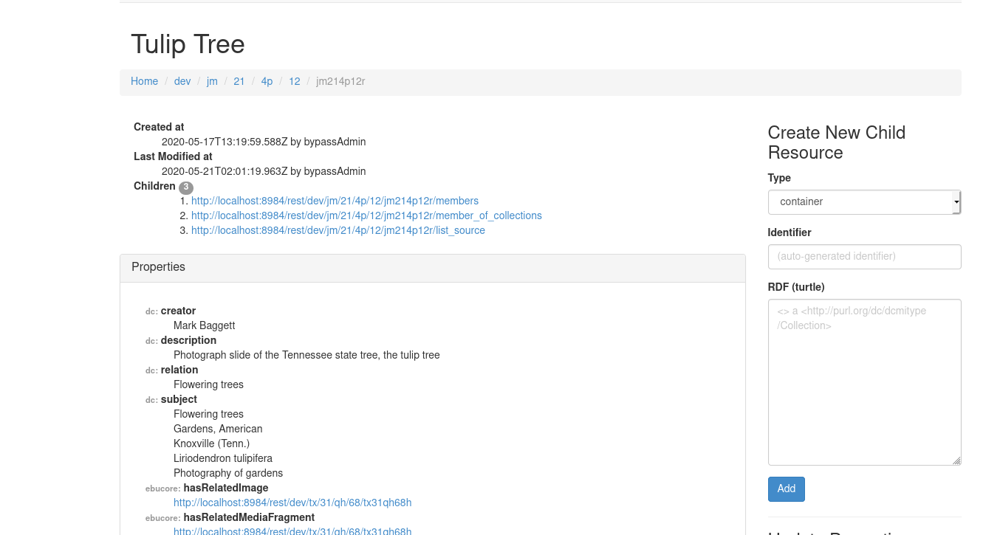
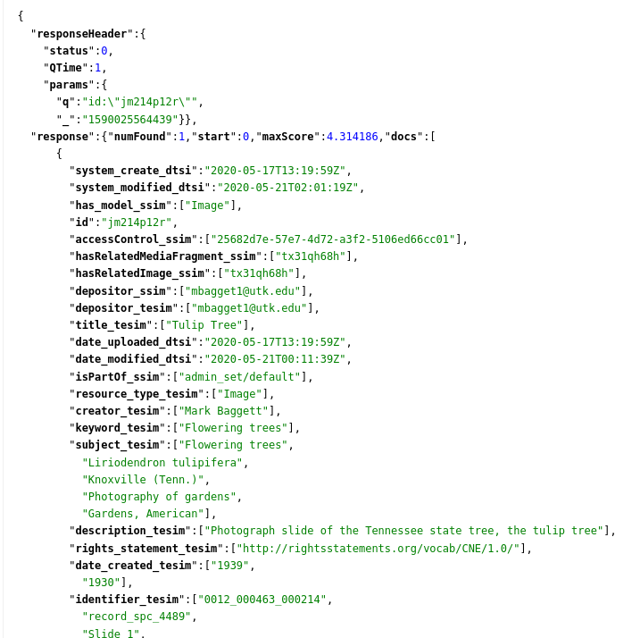

IX. Playing with Metadata with Rails Console & ActiveFedora
-----------------------------------------------------------

For fun, let's change some metadata for a record in Rails and make the data persist to Fedora and Solr.

To start off, let's connect to bash in our docker container:

.. code-block:: sh

    docker-compose run web bash

Now let's start rails console:

.. code-block:: sh

    rails console

Now, lets find an item and store it to a variable.  First we need an image id from the Solr record or Web UI.

Now, let's find it.  Remember, my generic work in my Hyrax instance is "Image."

.. code-block:: ruby

    i = Image.find("jm214p12r")

This should return this:

.. code-block:: ruby

    #<Image id: "jm214p12r", head: [#<ActiveTriples::Resource:0x2aedcb6104e8 ID:<http://fedora:8080/rest/dev/jm/21/4p/12/jm214p12r/list_source#g70258357781060>>], tail: [#<ActiveTriples::Resource:0x2aedcb5fe75c ID:<http://fedora:8080/rest/dev/jm/21/4p/12/jm214p12r/list_source#g70258357781060>>], depositor: "mbagget1@utk.edu", title: ["Tulip Tree"], date_uploaded: "2020-05-17 13:19:59", date_modified: "2020-05-21 00:11:39", state: #<ActiveTriples::Resource:0x2aedcb5e18a0 ID:<http://fedora.info/definitions/1/0/access/ObjState#active>>, proxy_depositor: nil, on_behalf_of: nil, arkivo_checksum: nil, owner: nil, year: [], note: ["Mrs. A. C. Bruner donated this collection to the University of Tennessee. Creation dates were inferred from the dates associated with the archival collection and the activity dates of the Jim Thompson Company."], label: nil, relative_path: nil, import_url: nil, resource_type: ["Image"], creator: ["Unknown"], contributor: [], description: ["Photograph slide of the Tennessee state tree, the tulip tree"], keyword: ["Flowering trees"], license: [], rights_statement: ["http://rightsstatements.org/vocab/CNE/1.0/"], publisher: [], date_created: ["1939", "1930"], subject: ["Flowering trees", "Liriodendron tulipifera", "Knoxville (Tenn.)", "Photography of gardens", "Gardens, American"], language: [], identifier: ["0012_000463_000214", "record_spc_4489", "Slide 1", "knoxgardens:115", "Film  96"], based_near: [], related_url: ["https://n2t.net/ark:/87290/v88w3bgf"], bibliographic_citation: [], source: [], access_control_id: "25682d7e-57e7-4d72-a3f2-5106ed66cc01", representative_id: "tx31qh68h", thumbnail_id: "tx31qh68h", rendering_ids: [], admin_set_id: "admin_set/default", embargo_id: nil, lease_id: nil>

Now, that we've found something, let's change a value.

.. code-block:: ruby

    i.creator = ["Mark Baggett"]

If we look at the Rails object, you can see that our value has changed, but it's not yet "persisted" to Fedora or Solr.

.. code-block:: ruby

    i.save

Now let's checkout Fedora:

Now let's checkout Solr:

