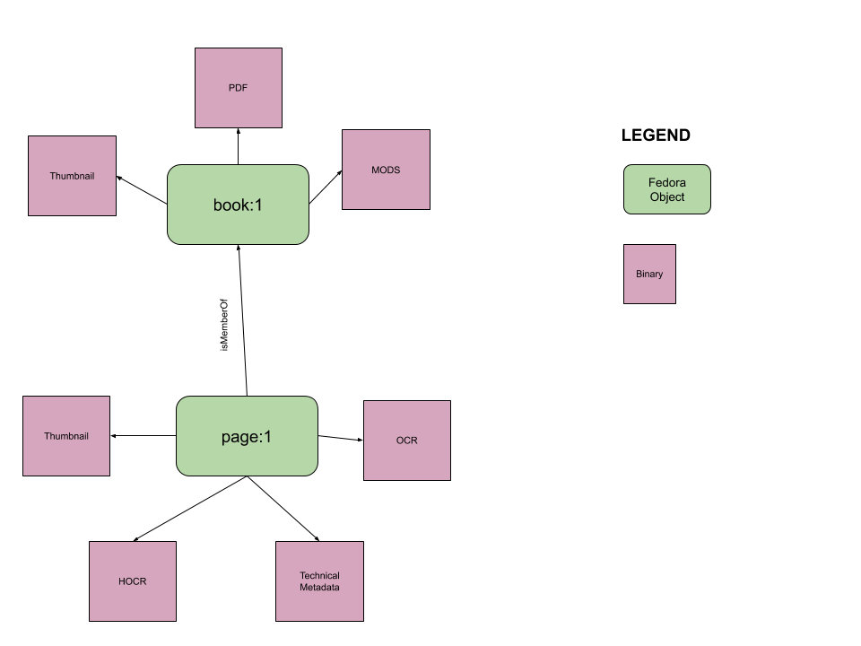
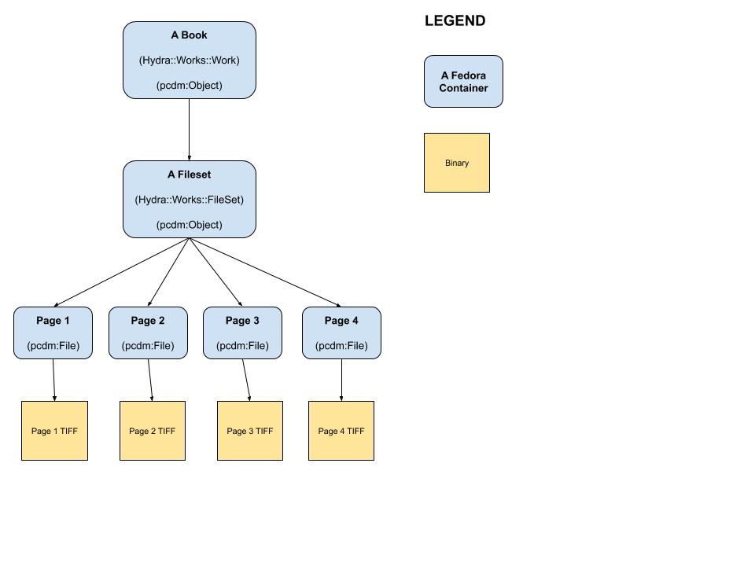
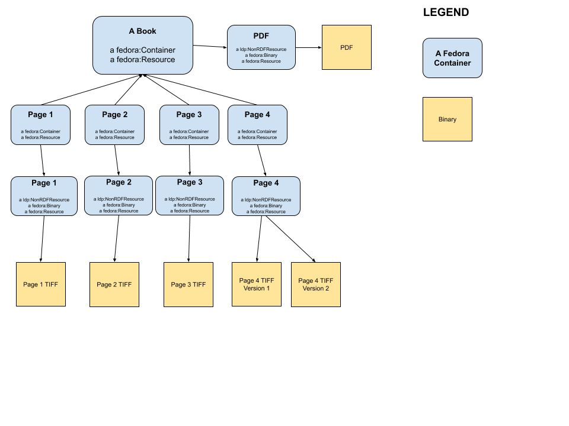

III. Designing the UT Libraries Path to Hyrax from Islandora
============================================================

The findings of this grant are interesting and thought-provoking particularly for our use case. In the environtmental
scanning and institutional profiling of the grant, the team doesn't review or cover institutions who would be jumping
from Islandora and Fedora 3 to Samvera and Fedora 4 or later.  Because of this, niether the Samvera or Islandora profiles
would fit our use case.  Our case would likely be closest to the custom solution category.

This is because our Fedora 3 objects are tightly-bound with Islandora 7. In Fedora 3 and our version of Islandora, there
is no Portland Common Data Model.  Simply migrating these objects from Fedora 3 to Fedora 4 would not make them
interoperable with Hyrax because certain elements would be missing and our objects would be quite different than what
Hyrax would expect.

Thinking about Migration
------------------------

Let's start by thinking about a book in Islandora 7 / Fedora 3:

Now what might that same book look like in Hyrax?

I promised some of you that I would not show any |:turtle:| this time, but as a concession let's have a quick quiz just
to make sure we are all on the same page |:smiling_imp:|:

====
Quiz
====

|:star:| What are some differences between a pcdm:Object and a pcdm:File?

|:star:| I left out the technical metadata datastream in the Hyrax book image?  If I added the contents back to this image, where would it be?

=====================
Using migration-utils
=====================

Remember from the previous page, we would not be like most Islandora or Samvera instituions. We would be more akin to
custom Fedora shops.  For that reason, `migration-utils` would make most sense to us if we care about migrating our data
from our custom Fedora instance instead of exporting it.

Also, remember some other findings:

    The primary advantage of migration-utils is its agnosticism toward front-end applications. It is designed to maintain the basic structure of Fedora 3.x data in Fedora 4.x with some XML to RDF transformations where appropriate. The application also has a number of configuration options and supports customization via plugins that could be written for specific use cases. The tool could potentially save institutions the effort of writing custom data migration scripts, particularly if they are using a custom front-end environment that would not be able to take advantage of either of the other two tools.

    Of the three available tools, migration-utils would be the most useful to the custom Fedora 3.x repositories (National Library of Medicine, University of Wisconsin-Madison, UNC Chapel Hill, Amherst College). While it won’t address any of their front-end applications, migration-utils could be helpful in simply getting the data from Fedora 3.x to Fedora 4.x. In each case this would require some configuration and likely customization via plug-ins, but it would save the effort required to write custom migration scripts. However, the tool has not had any releases since Fedora 4.6.x so it would need to be updated to support Fedora 5.x and higher.

    Migration-utils is a useful tool in principle, but it is hampered by a lack of updates and its support for generic migration use cases. However, this represents a potential opportunity for the Fedora community to improve the tool based on the migration needs of those with custom front-end implementations. While it wouldn’t be possible to develop a tool that will work out-of-the-box in every scenario, a focus on configurable property mappings and data transformations could make the tool much more useful to the community.

==================================
But migration-utils is abandonware
==================================

*Not so fast*!  The findings above are from **Spring 2019**. Since then, `migration-utils <https://github.com/fcrepo4-exts/migration-utils>`_
has received more than 62 commits (it only has 130 in total). This is mostly because of **OCFL** and helping institutions
migrate from Fedora 2 or Fedora 3 to Fedora 6.

So what might a Fedora object migrated from Fedora 3 to Fedora 4, 5, or 6 look like (hold
`ModeShape <https://www.google.com/url?sa=t&rct=j&q=&esrc=s&source=web&cd=&cad=rja&uact=8&ved=2ahUKEwjw7ODMhoXqAhUuQjABHYkuAF0QFjAAegQIBBAB&url=https%3A%2F%2Fmodeshape.jboss.org%2F&usg=AOvVaw1kQsl-29WwZojhweuet2C1>`_
/ `OCFL <https://ocfl.io/>`_ discussion and questions for later):

-------
Discuss
-------

|:star:| What is different from the Hyrax book?

|:star:| What is missing?

|:star:| What work would need to be done post-Fedora migration?
