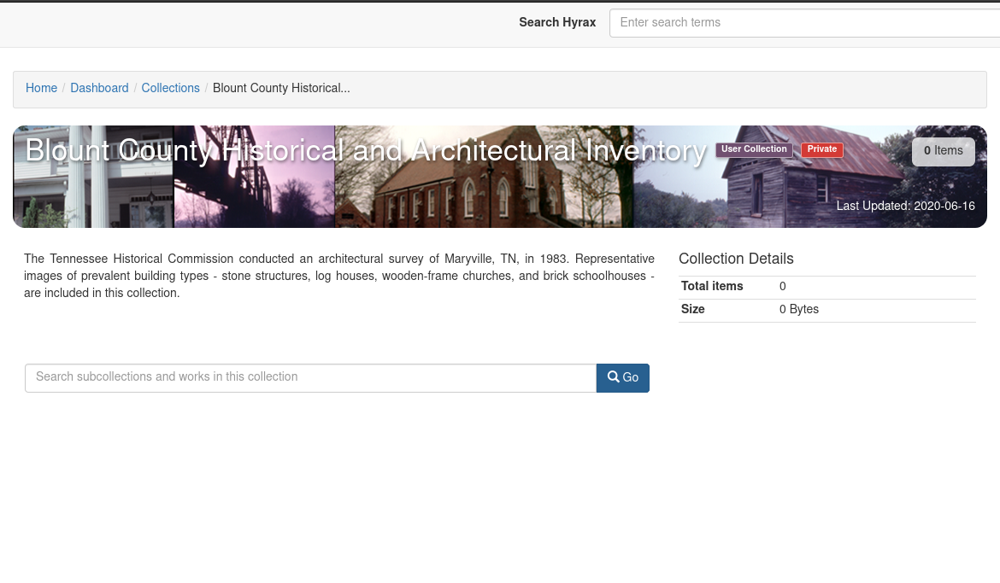
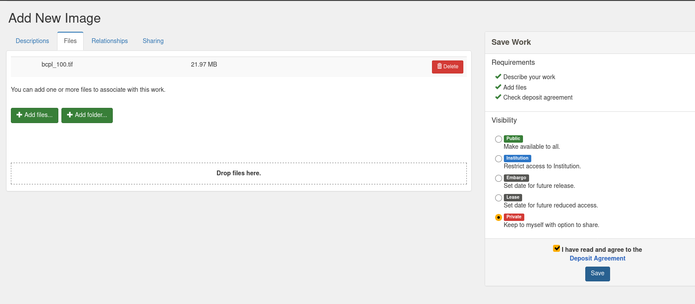

V. Adding Content via the GUI
=============================

Creating a Collection
---------------------

In order to create a collection, let's start by `navigating to Collections <http://localhost:3000/dashboard/my/collections?locale=en>`_
and clicking `New Collection`.

Next, let's add some metadata:

Now that we have a collection, we can use the out-of-the-box branding:

If we take a look at this as a private collection and the creator logged in, it'd look something like this:

Uploading a File or Fileset
---------------------------

Now let's add a work to the collection:

.. image:: ../images/bcpl_100.png

As you can see, when you upload a work via the GUI you can one or more files.  The way the item will be interpretted in
the user interface is based on `work type`.

Let's look at our collection now:

