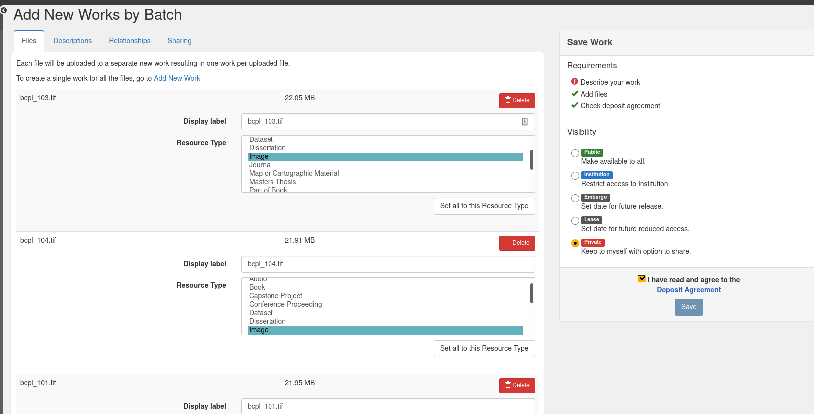
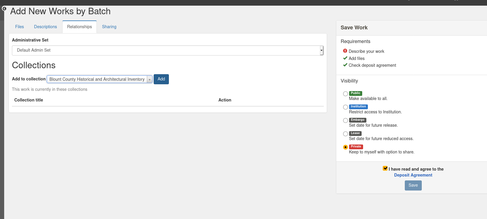

VI. Batch Ingest
================

A Brief History of Batch Ingest in Hyrax Land
---------------------------------------------

As you can imagine, there are a **myriad** of ways to batch upload content into Hyrax.  Everyone seems to do it
differently based on their own use cases, work types, and environments.

For instance, Northwestern's `"Donut" <https://github.com/nulib/donut>`_ (|:doughnut:|) is tightly bound to their work
types and their use of Amazon S3 and buckets. UCSB's `"Alexandria" <https://gitlab.com/ucsb-library/alexandria>`_ has
numerous batch features including ingest based on MODS. Buffalo and Boston Public Library have batch ingests based on
CSVs. George Washington has a batch importer that takes a ZIP from Proquest, expands it, takes an XML file, converts that
data to JSON, and passes it to Rake and Rails for ingest into their Hyrax application and Fedora. Curation Experts
created a tool called `Darlingtonia <https://github.com/curationexperts-deprecated/darlingtonia>`_ that originally
focused on making it easier to move from Digital Commons and Digital Commons workflows to Hyrax.  I should say that this
has now been replaced by something called `Zizia <https://github.com/curationexperts/zizia>`_.

I can't really do this justice, so I'm going to point at a somewhat old `thread <https://groups.google.com/forum/#!topic/samvera-tech/a7P4Y2TY590>`_
(over 2 years old) on batch in Hyrax in general.  Eben English sums up things quite nicely in the original post:

    Has there been any attempt within the Samvera community to standardize (or define a community-informed pattern for) batch ingests?

    By "batch ingest" I'm referring to the ingest of multiple Work objects, rather than a single Work with multiple files.

    Or more specifically, has there been any attempt at standardizing the formatting of structural and descriptive metadata in the form of a "manifest" document that is used to drive a batch ingest process?

    I know a lot of different institutions have implemented this in a number of different ways, some using spreadsheets, CSV files, YAML files, etc. (We use spreadsheets here at BPL.) I think these are often very specific to the implementing institution, however. This isn't surprising since we all have different legacy data formats, metadata profiles, etc.

    But I'm wondering if there's a way to build on common use cases to develop a template for batch ingest manifests that could be more widely used in Hyrax. Or if this exists already, maybe somebody could point me to it?

    Thanks,
    Eben / BPL

This discussion led to a `working group <https://wiki.lyrasis.org/display/samvera/Hyrax+Batch+Import-Export+WG>`_ and
`an application <https://github.com/samvera-labs/hyrax-batch_ingest>`_,

If this topic is interesting to you, I highly recommend looking at the notes from the `Hyrax Batch Import Working Group's Unconference <https://docs.google.com/document/d/14uzO2RonKNaBkfKgi9iPI05BDQdelUTmGMka5h4KvvE/edit#heading=h.yll6isylpdk9>`_.
It's fascinating to look at all the use cases and also see work and importers that already existed to do the thing people
wanted.

I also feel like this is is an interesting way of thinking about Hyrax. The focus on the community here is to not always
to create **one batch importer to rule them all** but instead to create an elegant API and models that can easily interact
with Rails so that institutions can develop their own batch workflows to fit their environments and use cases.

A Quick Demo
------------

I've been using the Hyrax 3.0 release candidate with the community batch importer doesn't work with yet so it's going to
be difficult to demonstrate how I plan to migrate our content for the final demo.

That being said, I feel I should show the out-of-the-box batch ingester that's really for repository managers and less
technical people use to upload content to their Hyrax repositories.

Associating with a collection:

