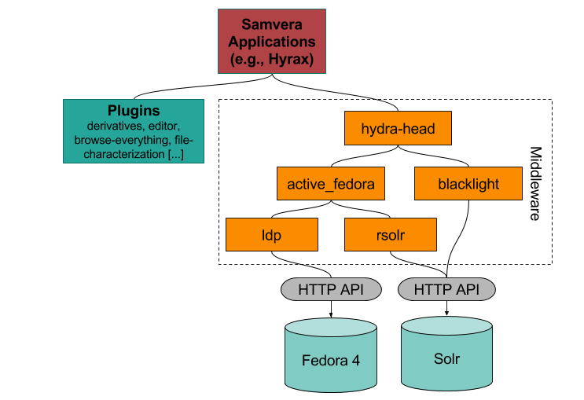

Demo 1: Content Models, Metadata, and the Stack
===============================================

I. Overview, Goals, and Outcomes
--------------------------------

========================================================
Topic from Project Charter: Content Models and Solutions
========================================================

Week of Monday, May 18, 2020. ​ Topic: Content Models and Solutions

a. Content modeling and PCDM
b. MODS to RDF
c. Explanation of underlying technologies used in the stack

===============
Goals of Demo 1
===============

1. Explain Samvera and its Philosophy
2. Explain Hyrax, its Origins, and why I'm Focusing on it for this Project
3. Explain Hyrax and its Underlying Technologies
4. Explain and Demonstrated Content Modeling in Hyrax and How it Works
5. Explain PCDM and how it is used in Hyrax
6. Explain Metadata in Hyrax, What's Out of the Box, and Demo how you Customize it

II. Samvera and its Philosophy
------------------------------

As taken from `its website <https://samvera.org/>`_,

    Samvera™ is a vibrant and welcoming **community** of information and technology professionals who share challenges,
    build expertise, and create sustainable, best-in-class solutions, making the world’s digital collections accessible
    now and into the future.

    Samvera’s suite of repository software tools offers flexible and rich user interfaces tailored to distinct content
    types on top of a robust back end – giving adopters the best of both worlds.

To be clear, Samvera is more of a **community** than it is a software solution.

    Samvera software was conceived as an open source repository framework.  That is to say that we set out to create a
    series of free-to-use software **“building blocks”** that could put together in various combinations to achieve the
    repository system that an institution needed – as opposed to building a **“one size fits all”** solution.

The building blocks here are what you often hear referred to as **"hydra heads."**

    The framework as it exists today consists of a number of Ruby gems that can be combined, configured and adapted to
    serve a wide variety of digital repository needs.

This is very different from how Islandora 7 worked.  While Islandora 7 is extensible and you can add or create modules
to add functionality to it, it is still a discrete thing. All institutions running Islandora 7 are running more or less
the same thing.  That is not necessarily the case in *"Samvera-land"*.

In the early days of Samvera (Hydra), adopters started with basic building blocks to build the repository solution they
needed.

    Eventually, the more common approach became to find another institution whose use case was similar, clone their
    Samvera variant and then adapt it to more closely fit local needs.

Today, this is a little different.  About five years ago, the two biggest *Samvera variants*, **Curation Concerns**
and **Sufia**, merged into a common solution called **Hyrax**.

    Hyrax is the community-developed Ruby gem that allows users **to design and build their own**, customized installation
    of our software.

Again, this is a very different approach than Islandora 7. The Samvera community believes this approach:

    ... allows an institution to build for themselves a repository solution closely fitted to their needs ...

However, the Samvera community also recognizes that the:

    ... building process and later the maintenance of such a customized system can be resource intensive ...

Because of this, the Samvera Community has seen an emerging need for some off-the-shelf “solution bundles”,
addressing particular needs, that can be installed and maintained with fewer local resources – or that can be deployed
as a hosted, cloud service. Some examples of this are:

1. `Avalon <http://www.avalonmediasystem.org/project>`_: a time-based media solution
2. `Hyku <https://hyku.samvera.org/>`_: , which is based on Hyrax, allows users to build, bundle, and promote a feature-rich, robust, flexible
digital repository that is easy to install, configure, and maintain. Hyku can be installed locally or run in the cloud;
a number of service providers offer cloud-based, hosted versions.

III. Hyrax Origins and Why I'm Looking at It and not something else
-------------------------------------------------------------------

For many years, the Hydra / Samvera community had two major *variants*:

1. `CurationConcerns <https://github.com/samvera-deprecated/curation_concerns>`_
2. `Sufia <https://github.com/samvera-deprecated/sufia>`_

These solutions were built on the Hydra (Samvera) framework and geared at separate needs. CurationConcerns' main focus
was on digital collections.  Sufia on the other hand was built for institutional repositories and had functionality to
support features like self-deposit, proxy deposit, mediated deposit, and embargoing.

As both solutions matured, they got their own unique features to fit their specialties and continued to diverge on
separate courses.

In 2015, PCDM was realized and adopted by the Samvera community as a shared way to model content. This adoption steered
both platforms towards a common way of modeling objects.

At Hydra Connect 2016, a session was held based on a circulating white paper called
`"Should Sufia and CurationConcerns Merge?" <https://docs.google.com/document/d/1bkc2Cik1T3KXFQdS5UrU2XE3Kywd7di2IIjyo-T_Atc/edit>`_.
The results of the session and its discussion resulted in a decision to merge the Sufia and Curation Concerns code bases
into a single solution called `Hyrax <https://github.com/samvera/hyrax>`_.

If you're wondering why on earth we would be looking at Hyrax as opposed to a more out-of-the-box solution like Hyku, I
think that's a fair question.  The primary reasons I chose to focus on Hyrax were:

1. I'm brand new to Samvera and there is no way I could inverstigate all solutions in depth simultaneously in a six week period
2. Our diverse use cases (ETD submission, digital collections, audio, video, etc.)
3. Educate myself about what it would take to run a Hyrax solution locally
4. Determine questions that would need to be answered for thinking about SaaS solutions for Hyrax

IV. The Hyrax Stack
-------------------

Samvera stacks broadly look like this:

I say broadly because some of the middleware is changing (i.e. Valkyrie vs. ActiveFedora), but we aren't getting there
today.

========
The Core
========

At the core of Hyrax are **Fedora** and **Solr**. Hyrax currently uses **Fedora 4** as its persistence layer. These two
services are is where the actual content and its associated metadata **(or pointers to them)** are stored.

Interaction with Fedora happens via an HTTP API. Fedora 4 stores its content as linked data. We'll look at this more
later.

Apache Solr is used as the basis for search. Content from Fedora is indexed into Solr via **ActiveFedora**, a Ruby gem.

Interaction with Solr also happens via an HTTP API.

==========
Middleware
==========

1. `hydra-head <https://github.com/projecthydra/hydra-head>`_:  This is one of those things I've heard about for years
but never really understood.  This is a Ruby-on-Rails gem containing the core code for a web application using the full
stack of Samvera building blocks. This is maybe similar to the old `islandora/islandora <https://github.com/islandora/islandora>`_
from Islandora 7.
2. active-fedora: Ruby on Rails normally follows the Active Record pattern to persist objects to its database. In
Hyrax, an alternative pattern called ActiveFedora to persist objects to Fedora.
3. ldp: A ruby gem called ldp is used to implement the LDP (Linked Data Platform) interaction patterns for interaction
containers in Fedora.
4. rsolr: Rsolr is a ruby client for interacting with Solr.
5. blacklight:  Most search and display behavior in Hyrax is inherited from Blacklight. Many Samvera institutions also
run Blacklight applications separately from Samvera itself, to provide search and discovery for their other collections
(think about our use of Ex Libris Primo). The Blacklight Project also has many of its own plugins, such as Spotlight for
building virtual exhibits, and GeoBlacklight which enhances Blacklight for use with geospatial data.

============
Other things
============

1. Queuing System and Redis: Hyrax does not package a default queuing back-end. There are a lot flavors here (Sidekiq,
Resque, and DelayedJob) but they all have Redis as a dependency.  `Sidekiq <https://github.com/samvera/hyrax/wiki/Using-Sidekiq-with-Hyrax>`_
is most popular.
2. Postgres: You of course need a database layer of some kind and most of the Rails world prefers Postgres over Maria /
MySQL.
3. An External Triple Store?: You may be wondering, where is the triple store!? Hyrax does not package one and it is entirely
optional based on your needs.
