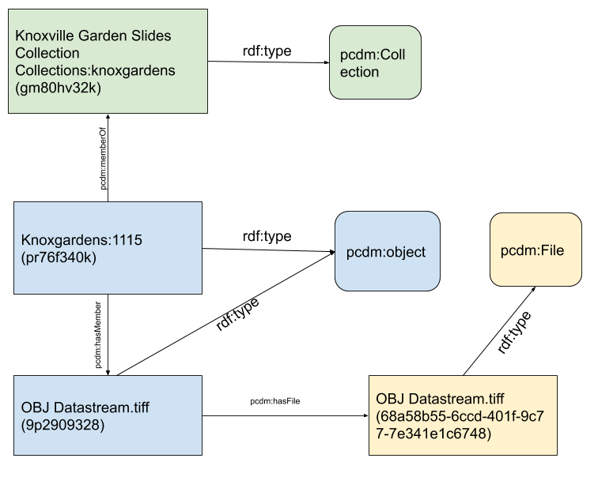
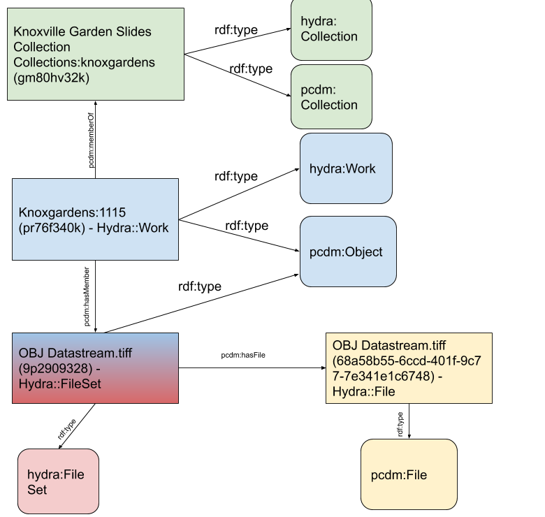

Demo 1: Content Models, Metadata, and the Stack
===============================================

I. Overview, Goals, and Outcomes
--------------------------------

========================================================
Topic from Project Charter: Content Models and Solutions
========================================================

Week of Monday, May 18, 2020. ​ Topic: Content Models and Solutions

a. Content modeling and PCDM
b. MODS to RDF
c. Explanation of underlying technologies used in the stack

===============
Goals of Demo 1
===============

1. Explain Samvera and its Philosophy
2. Explain Hyrax, its Origins, and why We're Focusing on it for this Project
3. Explain Hyrax and its Underlying Technologies
4. Explain and Demonstrate Content Modeling in Hyrax and How it Works
5. Explain PCDM and how it is used in Hyrax
6. Explain Metadata in Hyrax, What's Out of the Box, and Demo how you Customize it

II. Samvera and its Philosophy
------------------------------

As taken from `its website <https://samvera.org/>`_,

    Samvera™ is a vibrant and welcoming **community** of information and technology professionals who share challenges,
    build expertise, and create sustainable, best-in-class solutions, making the world’s digital collections accessible
    now and into the future.

    Samvera’s suite of repository software tools offers flexible and rich user interfaces tailored to distinct content
    types on top of a robust back end – giving adopters the best of both worlds.

To be clear, Samvera is more of a **community** than it is a discrete software solution.

    Samvera software was conceived as an open source repository framework.  That is to say that we set out to create a
    series of free-to-use software **“building blocks”** that could put together in various combinations to achieve the
    repository system that an institution needed – as opposed to building a **“one size fits all”** solution.

The building blocks here are Ruby Gems.

    The Samvera framework as it exists today consists of a number of Ruby gems that can be combined, configured and adapted to
    serve a wide variety of digital repository needs.

This is very different from how Islandora 7 works.  While Islandora 7 is extensible and you can add or create modules
to add functionality to it, it is still a discrete thing. All institutions running Islandora 7 are running more or less
the same thing.  That is not necessarily the case in *"Samvera-land"* and definitely has not been the case historically.

In the early days of Samvera (Hydra), adopters started with basic building blocks to build the repository solution they
needed.

    Eventually, the more common approach became to find another institution whose use case was similar, clone their
    Samvera variant and then adapt it to more closely fit local needs.

Today, this is a little different.  About five years ago, the two biggest *Samvera variants*, **Curation Concerns**
and **Sufia**, merged into a common solution called **Hyrax**.

    Hyrax is the community-developed Ruby gem that allows users **to design and build their own**, customized installation
    of our software.

Again, this is a very different approach than Islandora 7. The Samvera community believes this approach:

    ... allows an institution to build for themselves a repository solution closely fitted to their needs ...

However, the Samvera community also recognizes that the:

    ... building process and later the maintenance of such a customized system can be resource intensive ...

Because of this, the Samvera Community has seen an emerging need for some off-the-shelf “solution bundles”,
addressing particular needs, that can be installed and maintained with fewer local resources – or that can be deployed
as a hosted, cloud service. Some examples of this are:

1. `Avalon <http://www.avalonmediasystem.org/project>`_: a time-based media solution
2. `Hyku <https://hyku.samvera.org/>`_: , which is based on Hyrax, allows users to build, bundle, and promote a feature-rich, robust, flexible digital repository that is easy to install, configure, and maintain. Hyku can be installed locally or run in the cloud; a number of service providers offer cloud-based, hosted versions.

III. Hyrax Origins and Why I'm Looking at It and not something else
-------------------------------------------------------------------

For many years, the Hydra / Samvera community had two major *variants*:

1. `CurationConcerns <https://github.com/samvera-deprecated/curation_concerns>`_
2. `Sufia <https://github.com/samvera-deprecated/sufia>`_

These solutions were built on the Hydra (Samvera) framework and geared at separate needs. CurationConcerns' main focus
was on digital collections.  Sufia on the other hand was built for institutional repositories and had functionality to
support features like self-deposit, proxy deposit, mediated deposit, and embargoing.

As both solutions matured, they got their own unique features to fit their specialties and continued to diverge on
separate courses.

In 2015, PCDM was realized and adopted by the Samvera community as a shared way to model content. This adoption steered
both platforms towards a common way of modeling objects.

At Hydra Connect 2016, a session was held based on a circulating white paper called
`"Should Sufia and CurationConcerns Merge?" <https://docs.google.com/document/d/1bkc2Cik1T3KXFQdS5UrU2XE3Kywd7di2IIjyo-T_Atc/edit>`_.
The results of the session and its discussion resulted in a decision to merge the Sufia and Curation Concerns code bases
into a single solution called `Hyrax <https://github.com/samvera/hyrax>`_.

If you're wondering why on earth we would be looking at Hyrax as opposed to a more out-of-the-box solution like Hyku, I
think that's a fair question.  The primary reasons I chose to focus on Hyrax were:

1. I'm brand new to Samvera and there is no way I could inverstigate all solutions in depth simultaneously in a six week period
2. Our diverse use cases (ETD submission, digital collections, audio, video, etc.)
3. Educate myself about what it would take to run a Hyrax solution locally
4. Determine questions that would need to be answered for thinking about SaaS solutions for Hyrax

IV. The Hyrax Stack
-------------------

Samvera stacks broadly look like this:

.. image:: ../images/Samvera-Components-Diagram.png

I say broadly because some of the middleware is changing (i.e. Valkyrie vs. ActiveFedora), but we aren't getting there
today.

========
The Core
========

At the core of Hyrax are **Fedora** and **Solr**. Hyrax currently uses **Fedora 4** as its persistence layer. These two
services are is where the actual content and its associated metadata **(or pointers to them)** are stored.

Interaction with Fedora happens via an HTTP API. Fedora 4 stores its content as linked data. We'll look at this more
later.

Apache Solr is used as the basis for search. Content from Fedora is indexed into Solr via **ActiveFedora**, a Ruby gem.

Interaction with Solr also happens via an HTTP API.

==========
Middleware
==========

1. `hydra-head <https://github.com/projecthydra/hydra-head>`_:  This is one of those things I've heard about for years but never really understood.  This is a Ruby-on-Rails gem containing the core code for a web application using the full stack of Samvera building blocks. This is maybe similar to the old `islandora/islandora <https://github.com/islandora/islandora>`_ from Islandora 7.
2. active-fedora: Ruby on Rails normally follows the Active Record pattern to persist objects to its database. In Hyrax, an alternative pattern called ActiveFedora is used to persist objects to Fedora.
3. ldp: A ruby gem called ldp is used to implement the LDP (Linked Data Platform) interaction patterns for interaction with containers in Fedora.
4. rsolr: Rsolr is a ruby client for interacting with Solr.
5. blacklight:  Most search and display behavior in Hyrax is inherited from Blacklight. Many Samvera institutions also run Blacklight applications separately from Samvera itself, to provide search and discovery for their other collections (think our use of Ex Libris Primo). The Blacklight Project also has many of its own plugins, such as Spotlight for building virtual exhibits, and GeoBlacklight which enhances Blacklight for use with geospatial data.

============
Other things
============

1. Queuing System and Redis: Hyrax does not package a default queuing back-end. There are a lot flavors here (Sidekiq, Resque, and DelayedJob) but they all have Redis as a dependency.  `Sidekiq <https://github.com/samvera/hyrax/wiki/Using-Sidekiq-with-Hyrax>`_ is most popular.
2. Postgres: You of course need a database layer of some kind and most of the Rails world prefers Postgres over Maria / MySQL. In my investigation, I haven't found any institutions not using PostGres except for testing.
3. An External Triple Store?: You may be wondering, where is the triple store!? Hyrax does not package one and it is entirely optional based on your needs.

V. Content Modeling in Hyrax
----------------------------

Remember from earlier:

    Hyrax is the community-developed Ruby gem that allows users **to design and build their own**, customized installation
    of our software.

Because of this, it may be surprising to hear that content modelling works very differently in Hyrax as opposed to how
things worked in Islandora 7.

In Islandora 7, you had content models and solution packs. Content models were ideas defined in your RELS-EXT and each
had solution packs that determined how it looked and displayed to users.

This is different in Hyrax. In Hyrax, digital respository objects are referred to as **work types**. For you trivia
buffs, they were historically called **curation concerns**, hence the name of the popular Samvera variant.

While all Hyrax implementations require at least one work type, it ships with **NONE!!!!** Because of this, your first
activity in Hyrax will be to generate a work type with a rails generator tool.  Some examples might be:

.. code-block:: sh
    :caption: A generic work type called Work
    :name: A generic work type called Work

    rails generate hyrax:work Work

.. code-block:: sh
    :caption: A work type for Images!
    :name: A work type for Images!

    rails generate hyrax:work Image

.. code-block:: sh
    :caption: A work type for Moving Images!
    :name: A work type for Moving Images!

    rails generate hyrax:work MovingImage

So **what the heck** is the generator doing and why do you have to do this?  Remember, Samvera / Hyrax is based on Ruby
on Rails. Rails has a concept called **scaffolding**.  I don't want to get into this too much right now, but I stole
this definition from someone on the internet:

    **Scaffolding** in Ruby on Rails refers to the auto-generation of a set of a model, views, and a controller usually
    used for a single database table.

In other words, instead of having to write the initial code for your model, controller, and views for this work type,
the generator creates all this for you to save you time.

Here is a sample of what an Image work type that **has NOT been configured to work properly with Universal Viewer (Sorry!)**
might look like:

.. image:: ../images/bad_tulip_tree.png
    :name: Bad Last Minute Tulip Tree

VI. PCDM and PCDM in Hyrax and Samvera
--------------------------------------

Hyrax, like most modern Fedora stacks, leverages the `Portland Common Data Model (PCDM) <https://github.com/duraspace/pcdm/wiki>`_.
As explained in the PCDM wiki:

    The Portland Common Data Model (PCDM) is a flexible, extensible domain model that is intended to underlie a wide
    array of repository and DAMS applications. The primary objective of this model is to establish a framework that
    developers of tools (e.g., Samvera-based engines, such as Hyrax, Hyku, Sufia, and Avalon; Islandora; custom Fedora
    sites) can use for working with models in a general way, allowing adopters to easily use custom models with any
    tool. Given this interoperability goal, the initial work has been focused on structural metadata and access control,
    since these are the key actionable metadata.

    To encourage adoption, this model must support the most complex use cases, which include rich hierarchies of
    inter-related collections and works, but also elegantly support the simplest use cases, such as a single
    user-contributed file with a few fields of metadata. It must provide a compact interface that tool developers can
    easily implement, but also be extensible enough for adopters to customize to their local needs.

    As the community migrates to Fedora 4, much of our metadata is migrating to RDF. This model encourages linked data
    best practices, such as using URIs to identify all resources, using widely-used vocabularies where possible, and
    subclassing existing classes and properties when creating new terms.

=======================================
A Brief Description of the PCDM Classes
=======================================

-----------
pcdm:Object
-----------

About:

    An Object is an intellectual entity, sometimes called a "work", "digital object", etc. Objects have descriptive
    metadata, access metadata, may contain files and other Objects as member "parts" or "components". Each level of a
    work is therefore represented by an Object instance, and is capable of standing on its own, being linked to from
    Collections and other Objects. Member Objects can be ordered using the ORE Proxy class.

---------------
pcdm:Collection
---------------

About:

    A Collection is a group of resources. Collections have descriptive metadata, access metadata, and may link to
    Objects and/or Collections. By default, member Objects and Collections are an unordered set, but can be ordered
    using the ORE Proxy class

---------
pcdm:File
---------

About:

    A File is a sequence of binary data and is described by some accompanying metadata. The metadata typically includes
    at least basic technical metadata (size, content type, modification date, etc.), but can also include properties
    related to preservation, digitization process, provenance, etc. Files MUST be contained by exactly one Object.

==========================
Membership vs. Aggregation
==========================

In PCDM, membership and aggregation express different relationships between Collections and Objects:

    pcdm:hasMember indicates that a resource is a constituent part of the parent resource, such as a page within a book,
    or a song within an album. This is the typical relationship between these entities.

    pcdm:hasRelatedObject indicates a different kind of relationship, typically around documenting the parent entity.
    For example, the cover image within the book or album.

=================
PCDM and Web ACLs
=================

In PCDM, WebACLs are used to specify what actions users can perform on resources. Each ACL is created as its own resource
which links to the users, resources, and actions allowed. Users and resources can both be identified individually or
using classes. The WebACL ontology includes several actions (read, write, append, control).

Each Collection, Object and File instance can be assigned its own Web ACL. For example, an Object and its thumbnail
image might be assigned a public ACL, but the high-resolution master image might be limited to a specific group of users.

=============
PCDM in Hyrax
=============

While PCDM is used across the Fedora community and it was built with the intent that everyone would want to use it, the
diversity of use cases:

    means that we don't expect every adopter to implement this model in the same way or with the same tools.
    We expect implementers to extend this model to fit their local needs, and hope that the model will help provide a
    framework for implementers to share RDF vocabularies and implementations.

So while Hyrax uses PCDM, it uses it in its own way. Like all modern Samvera variants, Hyrax relies on
Hydra::Works to implement PCDM:

.. image:: ../images/hydra-works.png

In order to get a better sense of what this means, let's look at how some example objects from our collection look
modeled in PCDM and Hydra::Works. Here we can see a diagram of the Knoxville Garden Slides Collection and a random object
from Knoxville Garden Slides modeled with PCDM:

This is a bit odd.  We have four containers with PCDM relationships, but in our example we're starting with a colleciton,
an object, and a file from that object. **What the heck is happening?** Let's look an additional diagram that shows
these same relationships but with additional works to Hydra works models:

In the diagram, you can see our fourth odd object has this concept of a FileSet. As we saw above, in Hydra Work's
implementation of PCDM, all objects have a fileset, and each file belongs to the set -- not the object.

=====================================
A Quick Look at Our Fedora Containers
=====================================

We've looked at diagrams, but what's actually in Fedora?  In Fedora 3.8, we have this concept of object, but that idea
does not exist in a post Fedora 3.8 world. Instead, we have containers and binaries.  Let's look at the containers for
the things diagrammed above.

**PLEASE NOTE:** For your viewing pleasure, I've stripped away most descriptive metadata and other non structural metadata
in order to make things easier to understand.  We'll get to look at some of that later.

Here is a ttl representation of the "Knoxville Garden Slides" Collection object:

.. code-block:: turtle
    :linenos:
    :caption: Knoxville Garden Slides Collection Object with Minimal Descriptive Metadata modeled as RDF
    :name: Knoxville Garden Slides Collection Object with Minimal Descriptive Metadata modeled as RDF
    :emphasize-lines: 24, 26

    @prefix premis:  <http://www.loc.gov/premis/rdf/v1#> .
    @prefix rdfs:  <http://www.w3.org/2000/01/rdf-schema#> .
    @prefix hydra:  <http://projecthydra.org/works/models#> .
    @prefix webacl:  <http://www.w3.org/ns/auth/acl#> .
    @prefix dct:  <http://purl.org/dc/terms/> .
    @prefix fedora:  <info:fedora/fedora-system:def/model#> .
    @prefix xsi:  <http://www.w3.org/2001/XMLSchema-instance> .
    @prefix xmlns:  <http://www.w3.org/2000/xmlns/> .
    @prefix pcdm:  <http://pcdm.org/models#> .
    @prefix relators:  <http://id.loc.gov/vocabulary/relators/> .
    @prefix xml:  <http://www.w3.org/XML/1998/namespace> .
    @prefix fedoraconfig:  <http://fedora.info/definitions/v4/config#> .
    @prefix foaf:  <http://xmlns.com/foaf/0.1/> .
    @prefix test:  <info:fedora/test/> .
    @prefix schema:  <http://schema.org/> .
    @prefix rdf:  <http://www.w3.org/1999/02/22-rdf-syntax-ns#> .
    @prefix fedora:  <http://fedora.info/definitions/v4/repository#> .
    @prefix ebucore:  <http://www.ebu.ch/metadata/ontologies/ebucore/ebucore#> .
    @prefix ldp:  <http://www.w3.org/ns/ldp#> .
    @prefix xs:  <http://www.w3.org/2001/XMLSchema> .
    @prefix dc:  <http://purl.org/dc/elements/1.1/> .

    <http://localhost:8984/rest/dev/gm/80/hv/32/gm80hv32k>
            rdf:type pcdm:Collection ;
            rdf:type fedora:Container ;
            rdf:type hydra:Collection ;
            rdf:type fedora:Resource ;
            fedora:lastModifiedBy "bypassAdmin"^^<http://www.w3.org/2001/XMLSchema#string> ;
            fedora:hasModel "Collection"^^<http://www.w3.org/2001/XMLSchema#string> ;
            fedora:createdBy "bypassAdmin"^^<http://www.w3.org/2001/XMLSchema#string> ;
            relators:dpt "mbagget1@utk.edu"^^<http://www.w3.org/2001/XMLSchema#string> ;
            fedora:created "2020-05-12T21:56:09.247Z"^^<http://www.w3.org/2001/XMLSchema#dateTime> ;
            fedora:lastModified "2020-05-12T21:56:26.349Z"^^<http://www.w3.org/2001/XMLSchema#dateTime> ;
            webacl:accessControl <http://localhost:8984/rest/dev/3c/7a/9a/39/3c7a9a39-1eee-49b2-a78a-06bcf57adcc6> ;
            schema:additionalType "gid://ucla2019/hyrax-collectiontype/1"^^<http://www.w3.org/2001/XMLSchema#string> ;
            dct:title "Knoxville Garden Slides"^^<http://www.w3.org/2001/XMLSchema#string> ;
            dc:description "This collection of hand-colored lantern slides dates from the late 1920s and early 1930s. The slides depict ornamental gardens in the Knoxville, Tennessee, area and feature a variety of garden styles, plants, flowers, and foliage."^^<http://www.w3.org/2001/XMLSchema#string> ;
            rdf:type ldp:RDFSource ;
            rdf:type ldp:Container ;
            fedora:writable "true"^^<http://www.w3.org/2001/XMLSchema#boolean> ;
            fedora:hasParent <http://localhost:8984/rest/dev> .

The following ttl shows how the object `knoxgardens:115` from our Fedora 3.8 instance looks migrated to Hyrax and its
relationship with its parent collection and its preservation Tiff.

.. code-block:: turtle
    :linenos:
    :caption: knoxgardens:115 in Hyrax as ttl and using PCDM, highlight structural metadata, with only core descriptive metadata
    :name:  knoxgardens:115 in Hyrax as ttl and using PCDM with only core metadata
    :emphasize-lines: 16-17, 24, 44

    @prefix pcdm:  <http://pcdm.org/models#> .
    @prefix dct: <http://purl.org/dc/terms/> .
    @prefix rdf:  <http://www.w3.org/1999/02/22-rdf-syntax-ns#> .
    @prefix relators: <http://id.loc.gov/vocabulary/relators/> .
    @prefix pcdmuse:  <http://pcdm.org/use#> .
    @prefix hydra:  <http://projecthydra.org/works/models#> .
    @prefix fedora:  <http://fedora.info/definitions/v4/repository#> .
    @prefix iana:  <http://www.iana.org/assignments/relation/> .
    @prefix faccess:  <http://fedora.info/definitions/1/0/access/ObjState#> .
    @prefix fmodels:  <info:fedora/fedora-system:def/model#> .
    @prefix ebucore:  <http://www.ebu.ch/metadata/ontologies/ebucore/ebucore#> .
    @prefix acl:  <http://www.w3.org/ns/auth/acl#> .
    @prefix ldp:  <http://www.w3.org/ns/ldp#> .

    <http://localhost:8984/rest/dev/pr/76/f3/40/pr76f340k>
        rdf:type pcdm:Object ;
        rdf:type hydra:Work ;
        rdf:type fedora:Container;
        rdf:type fedora:Resource;
        dct:title "Tulip Tree"^^<http://www.w3.org/2001/XMLSchema#string> ;
        relators:dpt "mbagget1@utk.edu"^^<http://www.w3.org/2001/XMLSchema#string> ;
        dct:dateSubmitted "2020-05-12T21:59:19.647826267+00:00"^^<http://www.w3.org/2001/XMLSchema#dateTime> ;
        dct:modified "2020-05-12T21:59:19.65408406+00:00"^^<http://www.w3.org/2001/XMLSchema#dateTime> ;
        pcdm:memberOf <http://localhost:8984/rest/dev/gm/80/hv/32/gm80hv32k> ;
        iana:last <http://localhost:8984/rest/dev/pr/76/f3/40/pr76f340k/list_source#g47218150558240> ;
        faccess:objState faccess:active ;
        fmodels:hasModel "Image"^^<http://www.w3.org/2001/XMLSchema#string> ;
        ebucore:hasRelatedMediaFragment <http://localhost:8984/rest/dev/9p/29/09/32/9p2909328> ;
        fedora:createdBy "bypassAdmin"^^<http://www.w3.org/2001/XMLSchema#string> ;
        fedora:created "2020-05-12T21:59:19.736Z"^^<http://www.w3.org/2001/XMLSchema#dateTime> ;
        fedora:lastModified "2020-05-12T21:59:26.707Z"^^<http://www.w3.org/2001/XMLSchema#dateTime> ;
        dct:isPartOf <http://localhost:8984/rest/dev/ad/mi/n_/se/admin_set/default> ;
        dct:modified "2020-05-12T21:59:19.65408406+00:00"^^<http://www.w3.org/2001/XMLSchema#dateTime> ;
        acl:accessControl <http://localhost:8984/rest/dev/97/60/cf/c7/9760cfc7-b141-451c-84a1-ff7cb2223180> ;
        ebucore:hasRelatedImage <http://localhost:8984/rest/dev/9p/29/09/32/9p2909328> ;
        iana:first <http://localhost:8984/rest/dev/pr/76/f3/40/pr76f340k/list_source#g47218150558240> ;
        rdf:type ldp:RDFSource ;
        rdf:type ldp:Container ;
        fedora:writable "true"^^<http://www.w3.org/2001/XMLSchema#boolean> ;
        fedora:hasParent <http://localhost:8984/rest/dev> ;
        ldp:contains <http://localhost:8984/rest/dev/pr/76/f3/40/pr76f340k/member_of_collections> ;
        ldp:contains <http://localhost:8984/rest/dev/pr/76/f3/40/pr76f340k/members> ;
        ldp:contains <http://localhost:8984/rest/dev/pr/76/f3/40/pr76f340k/list_source> ;
        pcdm:hasMember <http://localhost:8984/rest/dev/9p/29/09/32/9p2909328> .

And here is our `fileset` for the container based on `knoxgardens:115`:

.. code-block:: turtle
    :linenos:
    :caption: The fileset belonging to knoxgardens:115 modeled as RDF in Fedora
    :name: The fileset belonging to knoxgardens:115 modeled as RDF in Fedora
    :emphasize-lines: 24, 26, 44

    @prefix premis:  <http://www.loc.gov/premis/rdf/v1#> .
    @prefix rdfs:  <http://www.w3.org/2000/01/rdf-schema#> .
    @prefix hydra:  <http://projecthydra.org/works/models#> .
    @prefix webacl:  <http://www.w3.org/ns/auth/acl#> .
    @prefix dct:  <http://purl.org/dc/terms/> .
    @prefix fedora:  <info:fedora/fedora-system:def/model#> .
    @prefix xsi:  <http://www.w3.org/2001/XMLSchema-instance> .
    @prefix xmlns:  <http://www.w3.org/2000/xmlns/> .
    @prefix pcdm:  <http://pcdm.org/models#> .
    @prefix relators:  <http://id.loc.gov/vocabulary/relators/> .
    @prefix xml:  <http://www.w3.org/XML/1998/namespace> .
    @prefix fedoraconfig:  <http://fedora.info/definitions/v4/config#> .
    @prefix foaf:  <http://xmlns.com/foaf/0.1/> .
    @prefix test:  <info:fedora/test/> .
    @prefix rdf:  <http://www.w3.org/1999/02/22-rdf-syntax-ns#> .
    @prefix fedora:  <http://fedora.info/definitions/v4/repository#> .
    @prefix ebucore:  <http://www.ebu.ch/metadata/ontologies/ebucore/ebucore#> .
    @prefix ldp:  <http://www.w3.org/ns/ldp#> .
    @prefix xs:  <http://www.w3.org/2001/XMLSchema> .
    @prefix dc:  <http://purl.org/dc/elements/1.1/> .

    <http://localhost:8984/rest/dev/9p/29/09/32/9p2909328>
            rdf:type fedora:Container ;
            rdf:type hydra:FileSet ;
            rdf:type fedora:Resource ;
            rdf:type pcdm:Object ;
            fedora:lastModifiedBy "bypassAdmin"^^<http://www.w3.org/2001/XMLSchema#string> ;
            fedora:downloadFilename "OBJ Datastream.tiff"^^<http://www.w3.org/2001/XMLSchema#string> ;
            fedora:hasModel "FileSet"^^<http://www.w3.org/2001/XMLSchema#string> ;
            dct:dateSubmitted "2020-05-12T21:59:21.995548515+00:00"^^<http://www.w3.org/2001/XMLSchema#dateTime> ;
            fedora:createdBy "bypassAdmin"^^<http://www.w3.org/2001/XMLSchema#string> ;
            relators:dpt "mbagget1@utk.edu"^^<http://www.w3.org/2001/XMLSchema#string> ;
            fedora:created "2020-05-12T21:59:21.831Z"^^<http://www.w3.org/2001/XMLSchema#dateTime> ;
            fedora:lastModified "2020-05-12T21:59:26.063Z"^^<http://www.w3.org/2001/XMLSchema#dateTime> ;
            dct:modified "2020-05-12T21:59:21.995548515+00:00"^^<http://www.w3.org/2001/XMLSchema#dateTime> ;
            dc:creator "mbagget1@utk.edu"^^<http://www.w3.org/2001/XMLSchema#string> ;
            webacl:accessControl <http://localhost:8984/rest/dev/4f/9f/76/e5/4f9f76e5-8073-4278-b746-038c57ada57d> ;
            dct:title "OBJ Datastream.tiff"^^<http://www.w3.org/2001/XMLSchema#string> ;
            rdf:type ldp:RDFSource ;
            rdf:type ldp:Container ;
            fedora:writable "true"^^<http://www.w3.org/2001/XMLSchema#boolean> ;
            fedora:hasParent <http://localhost:8984/rest/dev> ;
            ldp:contains <http://localhost:8984/rest/dev/9p/29/09/32/9p2909328/files> ;
            pcdm:hasFile <http://localhost:8984/rest/dev/9p/29/09/32/9p2909328/files/68a58b55-6ccd-401f-9c77-7e341e1c6748> .

And our Tiff:

.. code-block:: turtle
    :linenos:
    :caption: The Actual File
    :name: The Actual File
    :emphasize-lines: 24

    @prefix premis:  <http://www.loc.gov/premis/rdf/v1#> .
    @prefix rdfs:  <http://www.w3.org/2000/01/rdf-schema#> .
    @prefix xsi:  <http://www.w3.org/2001/XMLSchema-instance> .
    @prefix xmlns:  <http://www.w3.org/2000/xmlns/> .
    @prefix pcdm:  <http://pcdm.org/models#> .
    @prefix xml:  <http://www.w3.org/XML/1998/namespace> .
    @prefix pcdmuse:  <http://pcdm.org/use#> .
    @prefix fedoraconfig:  <http://fedora.info/definitions/v4/config#> .
    @prefix foaf:  <http://xmlns.com/foaf/0.1/> .
    @prefix test:  <info:fedora/test/> .
    @prefix hydramix:  <http://projecthydra.org/ns/mix/> .
    @prefix nepomuk:  <http://www.semanticdesktop.org/ontologies/2007/03/22/nfo#> .
    @prefix iana:  <http://www.iana.org/assignments/relation/> .
    @prefix exif:  <http://www.w3.org/2003/12/exif/ns#> .
    @prefix rdf:  <http://www.w3.org/1999/02/22-rdf-syntax-ns#> .
    @prefix fedora:  <http://fedora.info/definitions/v4/repository#> .
    @prefix ebucore:  <http://www.ebu.ch/metadata/ontologies/ebucore/ebucore#> .
    @prefix ldp:  <http://www.w3.org/ns/ldp#> .
    @prefix xs:  <http://www.w3.org/2001/XMLSchema> .
    @prefix dc:  <http://purl.org/dc/elements/1.1/> .

    <http://localhost:8984/rest/dev/9p/29/09/32/9p2909328/files/68a58b55-6ccd-401f-9c77-7e341e1c6748>
            rdf:type ldp:NonRDFSource ;
            rdf:type pcdm:File ;
            rdf:type pcdmuse:OriginalFile ;
            rdf:type fedora:Binary ;
            rdf:type fedora:Resource ;
            fedora:lastModifiedBy "bypassAdmin"^^<http://www.w3.org/2001/XMLSchema#string> ;
            premis:hasFormatName "TIFF EXIF"^^<http://www.w3.org/2001/XMLSchema#string> ;
            ebucore:width "2106"^^<http://www.w3.org/2001/XMLSchema#string> ;
            ebucore:fileSize "17765536"^^<http://www.w3.org/2001/XMLSchema#string> ;
            premis:hasSize "17765536"^^<http://www.w3.org/2001/XMLSchema#long> ;
            exif:orientation "normal*"^^<http://www.w3.org/2001/XMLSchema#string> ;
            fedora:createdBy "bypassAdmin"^^<http://www.w3.org/2001/XMLSchema#string> ;
            fedora:created "2020-05-17T13:20:03.252Z"^^<http://www.w3.org/2001/XMLSchema#dateTime> ;
            premis:hasMessageDigest <urn:sha1:3fe991ef65c061f65233cd7eb9353b8ca109ea2c> ;
            hydramix:colorProfileVersion "2.1.0"^^<http://www.w3.org/2001/XMLSchema#string> ;
            ebucore:filename "OBJ_Datastream.tiff"^^<http://www.w3.org/2001/XMLSchema#string> ;
            exif:software "Adobe Photoshop CS2 Windows"^^<http://www.w3.org/2001/XMLSchema#string> ;
            hydramix:colorProfileName "Adobe RGB (1998)"^^<http://www.w3.org/2001/XMLSchema#string> ;
            nepomuk:hashValue "99d14ee8c28517e10c637e0e0a675b94"^^<http://www.w3.org/2001/XMLSchema#string> ;
            ebucore:dateCreated "2010:01:28 17:33:15-05:00"^^<http://www.w3.org/2001/XMLSchema#string> ;
            exif:colorSpace "RGB"^^<http://www.w3.org/2001/XMLSchema#string> ;
            ebucore:hasMimeType "image/tiff"^^<http://www.w3.org/2001/XMLSchema#string> ;
            fedora:lastModified "2020-05-17T13:20:07.078Z"^^<http://www.w3.org/2001/XMLSchema#dateTime> ;
            ebucore:height "2808"^^<http://www.w3.org/2001/XMLSchema#string> ;
            hydramix:compressionScheme "Uncompressed"^^<http://www.w3.org/2001/XMLSchema#string> ;
            ebucore:dateModified "2010:01:28 17:38:53"^^<http://www.w3.org/2001/XMLSchema#string> ;
            rdf:type ldp:NonRDFSource ;
            fedora:writable "true"^^<http://www.w3.org/2001/XMLSchema#boolean> ;
            iana:describedby <http://localhost:8984/rest/dev/9p/29/09/32/9p2909328/files/68a58b55-6ccd-401f-9c77-7e341e1c6748/fcr:metadata> ;
            fedora:hasParent <http://localhost:8984/rest/dev/9p/29/09/32/9p2909328/files> ;
            fedora:hasFixityService <http://localhost:8984/rest/dev/9p/29/09/32/9p2909328/files/68a58b55-6ccd-401f-9c77-7e341e1c6748/fcr:fixity> ;
            fedora:hasVersions <http://localhost:8984/rest/dev/9p/29/09/32/9p2909328/files/68a58b55-6ccd-401f-9c77-7e341e1c6748/fcr:versions> .

Finally, you're probably wondering, what about those **ACLs**? Isn't that related to PCDM and structural metadata? Are
those not containers? Of course they are, but I haven't done much with them yet (what's an embargoed item look like
versus a public item.)

.. code-block:: turtle
    :linenos:
    :caption: A Web ACL
    :name: A Web ACL

    @prefix premis:  <http://www.loc.gov/premis/rdf/v1#> .
    @prefix rdfs:  <http://www.w3.org/2000/01/rdf-schema#> .
    @prefix ns004:  <http://projecthydra.org/works/models#> .
    @prefix ns003:  <http://www.w3.org/ns/auth/acl#> .
    @prefix ns002:  <http://purl.org/dc/terms/> .
    @prefix ns001:  <info:fedora/fedora-system:def/model#> .
    @prefix xsi:  <http://www.w3.org/2001/XMLSchema-instance> .
    @prefix ns008:  <http://fedora.info/definitions/1/0/access/ObjState#> .
    @prefix ns007:  <http://www.europeana.eu/schemas/edm/> .
    @prefix xmlns:  <http://www.w3.org/2000/xmlns/> .
    @prefix ns006:  <http://pcdm.org/models#> .
    @prefix ns005:  <http://id.loc.gov/vocabulary/relators/> .
    @prefix xml:  <http://www.w3.org/XML/1998/namespace> .
    @prefix ns009:  <http://pcdm.org/use#> .
    @prefix fedoraconfig:  <http://fedora.info/definitions/v4/config#> .
    @prefix foaf:  <http://xmlns.com/foaf/0.1/> .
    @prefix test:  <info:fedora/test/> .
    @prefix ns011:  <http://projecthydra.org/ns/mix/> .
    @prefix ns010:  <http://www.semanticdesktop.org/ontologies/2007/03/22/nfo#> .
    @prefix ns015:  <http://projecthydra.org/ns/fits/> .
    @prefix ns014:  <http://www.iana.org/assignments/relation/> .
    @prefix ns013:  <http://www.openarchives.org/ore/terms/> .
    @prefix ns012:  <http://www.w3.org/2003/12/exif/ns#> .
    @prefix ns018:  <http://www.w3.org/2011/content#> .
    @prefix ns017:  <http://schema.org/> .
    @prefix ns016:  <http://sweet.jpl.nasa.gov/2.2/reprDataFormat.owl#> .
    @prefix rdf:  <http://www.w3.org/1999/02/22-rdf-syntax-ns#> .
    @prefix fedora:  <http://fedora.info/definitions/v4/repository#> .
    @prefix ebucore:  <http://www.ebu.ch/metadata/ontologies/ebucore/ebucore#> .
    @prefix ldp:  <http://www.w3.org/ns/ldp#> .
    @prefix xs:  <http://www.w3.org/2001/XMLSchema> .
    @prefix dc:  <http://purl.org/dc/elements/1.1/> .

    <http://localhost:8984/rest/dev/4f/9f/76/e5/4f9f76e5-8073-4278-b746-038c57ada57d>
            rdf:type               fedora:Container ;
            rdf:type               fedora:Resource ;
            fedora:lastModifiedBy  "bypassAdmin"^^<http://www.w3.org/2001/XMLSchema#string> ;
            fedora:createdBy       "bypassAdmin"^^<http://www.w3.org/2001/XMLSchema#string> ;
            fedora:created         "2020-05-12T21:59:21.795Z"^^<http://www.w3.org/2001/XMLSchema#dateTime> ;
            fedora:lastModified    "2020-05-12T21:59:21.969Z"^^<http://www.w3.org/2001/XMLSchema#dateTime> ;
            ns001:hasModel         "Hydra::AccessControl"^^<http://www.w3.org/2001/XMLSchema#string> ;
            rdf:type               ldp:RDFSource ;
            rdf:type               ldp:Container ;
            fedora:writable        "true"^^<http://www.w3.org/2001/XMLSchema#boolean> ;
            fedora:hasParent       <http://localhost:8984/rest/dev> ;
            ldp:contains           <http://localhost:8984/rest/dev/4f/9f/76/e5/4f9f76e5-8073-4278-b746-038c57ada57d/b5/c4/a0/37/b5c4a037-5259-4974-826a-64dadf3cf382> ;
            ldp:contains           <http://localhost:8984/rest/dev/4f/9f/76/e5/4f9f76e5-8073-4278-b746-038c57ada57d/63/e0/63/f0/63e063f0-b661-412f-9352-11c38df46582> ;
            ldp:contains           <http://localhost:8984/rest/dev/4f/9f/76/e5/4f9f76e5-8073-4278-b746-038c57ada57d/d1/b4/cb/2a/d1b4cb2a-599d-490f-97f1-f2faec657c47> .

VII. Goodbye MODS, Hello RDF!
-----------------------------

=====
About
=====

One of the biggest changes in our move to a next generation digital repository system will be saying goodbye to MODS
and XML for descriptive metadata.

Instead, our descriptive metadata will be serialized as `RDF <https://www.w3.org/RDF/>`_.

This is an incredibly important certainty as it will:

1. Determine how interoperability works between objects in the system and external services
2. Dictate how we will describe new objects
3. Influence how we go about migration
4. Force us to make decisions about future description and if we drop anything that we currently describe

In this section, I will talk about:

1. An explanation of Hyrax’s default MAP
2. How some of our sample MODS records would map to Hyrax out-of-the-box
3. What we would lose
4. Alternative mappings based on the Samvera Working Group Document (Simple and Complex)

======================================
Hyrax 2.0 Metadata Application Profile
======================================

Hyrax ships with a default Metadata Application Profile. The MAP is divided into two sections: Core Metadata and Basic
Metadata. Core metadata cannot be changed and is required for Hyrax to function properly.  Basic Metadata is customizable.

It's important to note that while the Hyrax MAP is influenced by the
`Final Recommendation of the Samvera MODS to RDF Description Subgroup Report <https://wiki.duraspace.org/download/attachments/87460857/MODS-RDF-Mapping-Recommendations_SMIG_v1_2019-01.pdf?api=v2>`_,
it does not follow it for simple or complex minting. Because of this, we would likely need to:

1. Selectively lose metadata
2. Define our own mapping

----------
Namespaces
----------

+------------------+----------------------------+----------------------------------------+
| Predicate Prefix | Rdf-vocab Predicate Prefix | Namespace                              |
+==================+============================+========================================+
| dce:             | DC11:                      | http://purl.org/dc/elements/1.1/       |
+------------------+----------------------------+----------------------------------------+
| dct:             | DC:                        | http://purl.org/dc/terms/              |
+------------------+----------------------------+----------------------------------------+
| edm:             | EDM:                       | http://www.europeana.eu/schemas/edm/   |
+------------------+----------------------------+----------------------------------------+
| foaf:            | FOAF:                      | http://xmlns.com/foaf/0.1/             |
+------------------+----------------------------+----------------------------------------+
| rdfs:            | RDFS:                      | http://www.w3.org/2000/01/rdf-schema#  |
+------------------+----------------------------+----------------------------------------+
| xsd:             |                            | http://www.w3.org/2001/XMLSchema#      |
+------------------+----------------------------+----------------------------------------+
| mrel:            |                            | http://id.loc.gov/vocabulary/relators/ |
+------------------+----------------------------+----------------------------------------+

Local controlled vocabularies can be pulled in from
`here <https://github.com/samvera/hyrax/blob/4fd8d9ad3c32db7deffc3b5246af5d1459a4b046/lib/generators/hyrax/config_generator.rb>`_.

-------------
Core Metadata
-------------

Core metadata should never be removed and can be found in `core_metadata.rb <https://github.com/samvera/hyrax/blob/2.0-stable/app/models/concerns/hyrax/core_metadata.rb>`_.

+------------------+-------------------+-------------------------------------------------------------+-----------------+----------------------------+------------------------------------+----------+------------+
| Property (Field) | Predicate         | Rdf-vocab Predicate                                         | Recommendation  | Expected Value (Data Type) | Expected Value (Controlled Source) | Multiple | Obligation |
+==================+===================+=============================================================+=================+============================+====================================+==========+============+
| title            | dct:title         | ::RDF::Vocab::DC.title                                      | MUST (Required) | xsd:string (Literal)       | n/a                                | TRUE     | {1,n}      |
+------------------+-------------------+-------------------------------------------------------------+-----------------+----------------------------+------------------------------------+----------+------------+
| depositor        | mrel:dpt          | ::RDF::URI.new(‘http://id.loc.gov/vocabulary/relators/dpt’) | MUST (Required) | user                       | n/a                                | FALSE    | {1}        |
+------------------+-------------------+-------------------------------------------------------------+-----------------+----------------------------+------------------------------------+----------+------------+
| date_uploaded    | dct:dateSubmitted | ::RDF::Vocab::DC.dateSubmitted                              | MUST (Required) | Literal                    | n/a                                | FALSE    | {1}        |
+------------------+-------------------+-------------------------------------------------------------+-----------------+----------------------------+------------------------------------+----------+------------+
| date_modified    | dct:modified      | ::RDF::Vocab::DC.modified                                   | MUST (Required) | Literal                    | n/a                                | FALSE    | {1}        |
+------------------+-------------------+-------------------------------------------------------------+-----------------+----------------------------+------------------------------------+----------+------------+

--------------
Basic Metadata
--------------

Basic metadata properties are defined in `basic_metadata.rb <https://github.com/samvera/hyrax/blob/2.0-stable/app/models/concerns/hyrax/basic_metadata.rb>`_.

**MUSTs** are required for form validation.

+------------------+-----------------+--------------------------------+-----------------+-----------------------------------------------+-------------------------------------+----------+------------+
| Property (Field) | Predicate       | Rdf-vocab Predicate            | Recommendation  | Expected Value (Data Type)                    | Expected Value (Controlled Source)  | Multiple | Obligation |
+==================+=================+================================+=================+===============================================+=====================================+==========+============+
| creator          | dce:creator     | ::RDF::Vocab::DC11.creator     | MUST (Required) | xsd:string (Literal)                          | n/a                                 | TRUE     | {1,n}      |
+------------------+-----------------+--------------------------------+-----------------+-----------------------------------------------+-------------------------------------+----------+------------+
| keyword          | dce:relation    | ::RDF::Vocab::DC11.relation    | MUST (Required) | xsd:string (Literal)                          | n/a                                 | TRUE     | {1,n}      |
+------------------+-----------------+--------------------------------+-----------------+-----------------------------------------------+-------------------------------------+----------+------------+
| rights_statement | edm:rights      | ::RDF::Vocab::EDM.rights       | MUST (Required) | xsd:anyUri                                    | Rights statements menu as YAML      | FALSE    | {1}        |
+------------------+-----------------+--------------------------------+-----------------+-----------------------------------------------+-------------------------------------+----------+------------+
| contributor      | dce:contributor | ::RDF::Vocab::DC11.contributor | MAY             | xsd:string (Literal)                          | n/a                                 | TRUE     | {0,n}      |
+------------------+-----------------+--------------------------------+-----------------+-----------------------------------------------+-------------------------------------+----------+------------+
| description      | dce:description | ::RDF::Vocab::DC11.description | MAY             | xsd:string (Literal)                          | n/a                                 | TRUE     | {0,n}      |
+------------------+-----------------+--------------------------------+-----------------+-----------------------------------------------+-------------------------------------+----------+------------+
| license          | dct:rights      | ::RDF::Vocab::DC.rights        | MAY             | xsd:anyURI                                    | License menu as YAML                | TRUE     | {0,n}      |
+------------------+-----------------+--------------------------------+-----------------+-----------------------------------------------+-------------------------------------+----------+------------+
| publisher        | dce:publisher   | ::RDF::Vocab::DC11.publisher   | MAY             | xsd:string (Literal)                          | n/a                                 | TRUE     | {0,n}      |
+------------------+-----------------+--------------------------------+-----------------+-----------------------------------------------+-------------------------------------+----------+------------+
| date_created     | dct:created     | ::RDF::Vocab::DC.created       | MAY             | xsd:date or xsd:dateTime xsd:string (Literal) | n/a                                 | TRUE     | {0,n}      |
+------------------+-----------------+--------------------------------+-----------------+-----------------------------------------------+-------------------------------------+----------+------------+
| subject          | dce:subject     | ::RDF::Vocab::DC11.subject     | MAY             | xsd:string (Literal)                          | n/a (but existing vocab encouraged) | TRUE     | {0,n}      |
+------------------+-----------------+--------------------------------+-----------------+-----------------------------------------------+-------------------------------------+----------+------------+
| language         | dce:language    | ::RDF::Vocab::DC11.language    | MAY             | xsd:string (Literal)                          | n/a                                 | TRUE     | {0,n}      |
+------------------+-----------------+--------------------------------+-----------------+-----------------------------------------------+-------------------------------------+----------+------------+
| identifier       | dct:identifier  | ::RDF::Vocab::DC.identifier    | MAY             | xsd:string (Literal)                          | n/a                                 | TRUE     | {0,n}      |
+------------------+-----------------+--------------------------------+-----------------+-----------------------------------------------+-------------------------------------+----------+------------+
| based_near       | foaf:basedNear  | ::RDF::Vocab::FOAF.based_near  | MAY             | xsd:anyURI                                    | GeoNames web service                | TRUE     | {0,n}      |
+------------------+-----------------+--------------------------------+-----------------+-----------------------------------------------+-------------------------------------+----------+------------+
| related_url      | rdfs:seeAlso    | ::RDF::RDFS.seeAlso            | MAY             | xsd:string or xsd:anyURI                      | n/a                                 | TRUE     | {0,n}      |
+------------------+-----------------+--------------------------------+-----------------+-----------------------------------------------+-------------------------------------+----------+------------+
| source           | dct:source      | ::RDF::Vocab::DC.source        | MAY             | xsd:string (Literal)                          | n/a                                 | TRUE     | {0,n}      |
+------------------+-----------------+--------------------------------+-----------------+-----------------------------------------------+-------------------------------------+----------+------------+
| resource_type    | dct:type        | ::RDF::Vocab::DC.type          | MAY             | xsd:string (Literal)                          | Type menu as YAML                   | TRUE     | {0,n}      |
+------------------+-----------------+--------------------------------+-----------------+-----------------------------------------------+-------------------------------------+----------+------------+

====================================================
Mapping UTK Metadata to Out-of-the-Box Hyrax MAP 2.0
====================================================

Now that we've seen the default MAP, how might our data *map* to it.

---------------------------------
Example 1: Knoxville Garden Slide
---------------------------------

This is a sample MODS record from the object from Knoxville Garden Slides that we saw earlier.

.. code-block:: xml
    :linenos:
    :caption: knoxgardens:115.xml
    :name: knoxgardens:115.xml

    <?xml version="1.0" encoding="UTF-8"?>
    <mods xmlns="http://www.loc.gov/mods/v3"
          xmlns:xsi="http://www.w3.org/2001/XMLSchema-instance"
          xmlns:xlink="http://www.w3.org/1999/xlink"
          xmlns:xs="http://www.w3.org/2001/XMLSchema"
          xsi:schemaLocation="http://www.loc.gov/mods/v3 http://www.loc.gov/standards/mods/v3/mods-3-5.xsd">
       <identifier type="local">0012_000463_000214</identifier>
       <identifier type="pid">knoxgardens:115</identifier>
       <identifier type="slide number">Slide 1</identifier>
       <identifier type="film number">Film  96</identifier>
       <identifier type="spc">record_spc_4489</identifier>
       <titleInfo>
          <title>Tulip Tree</title>
       </titleInfo>
       <abstract>Photograph slide of the Tennessee state tree, the tulip tree</abstract>
       <originInfo>
          <dateCreated qualifier="inferred">1930-1939</dateCreated>
          <dateCreated encoding="edtf"
                       point="start"
                       qualifier="inferred"
                       keyDate="yes">1930</dateCreated>
          <dateCreated encoding="edtf" point="end" qualifier="inferred">1939</dateCreated>
       </originInfo>
       <physicalDescription>
          <form authority="aat" valueURI="http://vocab.getty.edu/aat/300134977">lantern slides</form>
          <extent>3 1/4 x 5 inches</extent>
          <internetMediaType>image/jp2</internetMediaType>
       </physicalDescription>
       <name>
          <namePart>Unknown</namePart>
          <role>
             <roleTerm authority="marcrelator"
                       valueURI="http://id.loc.gov/vocabulary/relators/pht">Photographer</roleTerm>
          </role>
       </name>
       <subject authority="lcsh"
                valueURI="http://id.loc.gov/authorities/subjects/sh85101348">
          <topic>Photography of gardens</topic>
       </subject>
       <subject authority="lcsh"
                valueURI="http://id.loc.gov/authorities/subjects/sh85053123">
          <topic>Gardens, American</topic>
       </subject>
       <subject authority="lcsh"
                valueURI="http://id.loc.gov/authorities/subjects/sh85077428">
          <topic>Liriodendron tulipifera</topic>
       </subject>
       <subject authority="lcsh"
                valueURI="http://id.loc.gov/authorities/subjects/sh85049328">
          <topic>Flowering trees</topic>
       </subject>
       <subject authority="naf"
                valueURI="http://id.loc.gov/authorities/names/n79109786">
          <geographic>Knoxville (Tenn.)</geographic>
          <cartographics>
             <coordinates>35.96064, -83.92074</coordinates>
          </cartographics>
       </subject>
       <note>Mrs. A. C. Bruner donated this collection to the University of Tennessee. Creation dates were inferred from the dates associated with the archival collection and the activity dates of the Jim Thompson Company.</note>
       <relatedItem displayLabel="Project" type="host">
          <titleInfo>
             <title>Knoxville Garden Slides</title>
          </titleInfo>
       </relatedItem>
       <typeOfResource>still image</typeOfResource>
       <relatedItem displayLabel="Collection" type="host">
          <titleInfo>
             <title>Knoxville Gardens Slides</title>
          </titleInfo>
          <identifier>MS.1324</identifier>
          <location>
             <url>https://n2t.net/ark:/87290/v88w3bgf</url>
          </location>
       </relatedItem>
       <location>
          <physicalLocation valueURI="http://id.loc.gov/authorities/names/no2014027633">University of Tennessee, Knoxville. Special Collections</physicalLocation>
       </location>
       <recordInfo>
          <recordContentSource valueURI="http://id.loc.gov/authorities/names/n87808088">University of Tennessee, Knoxville. Libraries</recordContentSource>
          <languageOfCataloging>
             <languageTerm type="text" authority="iso639-2b">English</languageTerm>
          </languageOfCataloging>
       </recordInfo>
       <accessCondition type="use and reproduction"
                        xlink:href="http://rightsstatements.org/vocab/CNE/1.0/">Copyright Not Evaluated</accessCondition>
    </mods>

Following the metadata application profile above, here's how that metadata record would look as TTL in Fedora and feed
the front end / Solr in Hyrax.

Notice how an identifier is now just a dcterms identifier.

.. code-block:: turtle
    :linenos:
    :caption: TTL representation of knoxgardens:115.xml mapping to Hyrax MAP 2.0 Out-of-the-Box
    :name: TTL representation of knoxgardens:115.xml mapping to Hyrax MAP 2.0 Out-of-the-Box

    @prefix fedoraObject: <http://[LocalFedoraRepository]/>.
    @prefix dct: <http://purl.org/dc/terms/> .
    @prefix dce: <http://purl.org/dc/elements/1.1/> .
    @prefix edm: <http://www.europeana.eu/schemas/edm/> .
    @prefix foaf: <http://xmlns.com/foaf/0.1/> .
    @prefix rdfs: <http://www.w3.org/2000/01/rdf-schema#> .
    @prefix xsd: <http://www.w3.org/2001/XMLSchema#> .
    @prefix mrel: <http://id.loc.gov/vocabulary/relators/> .

    <fedoraObject:tq/57/nr/06/tq57nr067>
        dct:title "Tulip Tree" ;
        dct:identifier "0012_000463_000214", "knoxgardens:115", "Slide 1", "Film  96", "record_spc_4489" ;
        dce:description "Photograph slide of the Tennessee state tree, the tulip tree" ;
        dct:created "1930-1939", "1930", "1939" ;
        dce:creator "Unknown" ;
        dce:subject "Photography of gardens", "Gardens, American", "Liriodendron tulipifera", "Flowering trees", "Knoxville (Tenn.)" ;
        dct:type "still image" ;
        rdfs:seeAlso <https://n2t.net/ark:/87290/v88w3bgf> ;
        edm:rights <http://rightsstatements.org/vocab/CNE/1.0/> .

**Notice**: The highlighted metadata elements below are now gone!

.. code-block:: xml
    :emphasize-lines: 24-28, 31-34, 36-37, 40-41, 44-45, 48-49, 52-53, 55-57, 59 - 64, 66-71, 73 - 83
    :linenos:
    :caption: Illustrating lost data from knoxgardens:115.xml
    :name: Illustrating lost data from knoxgardens:115.xml

    <?xml version="1.0" encoding="UTF-8"?>
    <mods xmlns="http://www.loc.gov/mods/v3"
          xmlns:xsi="http://www.w3.org/2001/XMLSchema-instance"
          xmlns:xlink="http://www.w3.org/1999/xlink"
          xmlns:xs="http://www.w3.org/2001/XMLSchema"
          xsi:schemaLocation="http://www.loc.gov/mods/v3 http://www.loc.gov/standards/mods/v3/mods-3-5.xsd">
       <identifier type="local">0012_000463_000214</identifier>
       <identifier type="pid">knoxgardens:115</identifier>
       <identifier type="slide number">Slide 1</identifier>
       <identifier type="film number">Film  96</identifier>
       <identifier type="spc">record_spc_4489</identifier>
       <titleInfo>
          <title>Tulip Tree</title>
       </titleInfo>
       <abstract>Photograph slide of the Tennessee state tree, the tulip tree</abstract>
       <originInfo>
          <dateCreated qualifier="inferred">1930-1939</dateCreated>
          <dateCreated encoding="edtf"
                       point="start"
                       qualifier="inferred"
                       keyDate="yes">1930</dateCreated>
          <dateCreated encoding="edtf" point="end" qualifier="inferred">1939</dateCreated>
       </originInfo>
       <physicalDescription>
          <form authority="aat" valueURI="http://vocab.getty.edu/aat/300134977">lantern slides</form>
          <extent>3 1/4 x 5 inches</extent>
          <internetMediaType>image/jp2</internetMediaType>
       </physicalDescription>
       <name>
          <namePart>Unknown</namePart>
          <role>
             <roleTerm authority="marcrelator"
                       valueURI="http://id.loc.gov/vocabulary/relators/pht">Photographer</roleTerm>
          </role>
       </name>
       <subject authority="lcsh"
                valueURI="http://id.loc.gov/authorities/subjects/sh85101348">
          <topic>Photography of gardens</topic>
       </subject>
       <subject authority="lcsh"
                valueURI="http://id.loc.gov/authorities/subjects/sh85053123">
          <topic>Gardens, American</topic>
       </subject>
       <subject authority="lcsh"
                valueURI="http://id.loc.gov/authorities/subjects/sh85077428">
          <topic>Liriodendron tulipifera</topic>
       </subject>
       <subject authority="lcsh"
                valueURI="http://id.loc.gov/authorities/subjects/sh85049328">
          <topic>Flowering trees</topic>
       </subject>
       <subject authority="naf"
                valueURI="http://id.loc.gov/authorities/names/n79109786">
          <geographic>Knoxville (Tenn.)</geographic>
          <cartographics>
             <coordinates>35.96064, -83.92074</coordinates>
          </cartographics>
       </subject>
       <note>Mrs. A. C. Bruner donated this collection to the University of Tennessee. Creation dates were inferred from the dates associated with the archival collection and the activity dates of the Jim Thompson Company.</note>
       <relatedItem displayLabel="Project" type="host">
          <titleInfo>
             <title>Knoxville Garden Slides</title>
          </titleInfo>
       </relatedItem>
       <typeOfResource>still image</typeOfResource>
       <relatedItem displayLabel="Collection" type="host">
          <titleInfo>
             <title>Knoxville Gardens Slides</title>
          </titleInfo>
          <identifier>MS.1324</identifier>
          <location>
             <url>https://n2t.net/ark:/87290/v88w3bgf</url>
          </location>
       </relatedItem>
       <location>
          <physicalLocation valueURI="http://id.loc.gov/authorities/names/no2014027633">University of Tennessee, Knoxville. Special Collections</physicalLocation>
       </location>
       <recordInfo>
          <recordContentSource valueURI="http://id.loc.gov/authorities/names/n87808088">University of Tennessee, Knoxville. Libraries</recordContentSource>
          <languageOfCataloging>
             <languageTerm type="text" authority="iso639-2b">English</languageTerm>
          </languageOfCataloging>
       </recordInfo>
       <accessCondition type="use and reproduction"
                        xlink:href="http://rightsstatements.org/vocab/CNE/1.0/">Copyright Not Evaluated</accessCondition>
    </mods>

====================
Alternative Mappings
====================

As I mentioned earlier, Hyrax Map 2.0 is influenced by, but does not follow, the
`Final Recommendation of the Samvera MODS to RDF Description Subgroup Report <https://wiki.duraspace.org/download/attachments/87460857/MODS-RDF-Mapping-Recommendations_SMIG_v1_2019-01.pdf?api=v2>`_.

This document provides two mappings for MODS to RDF:

1. Direct Mappings (Simple Option)

    This option provides mappings from MODS XML elements to RDF statements
    (subject, predicate, object) and do not require creating or maintaining local objects for concepts such as
    subjects, people, events, or places. All statements either end in a URI sourced from an external
    vocabulary (LCSH, for example) or in a literal value (text string). These RDF statements can be stored,
    maintained, and updated directly with the digital object being described. However, as the examples
    provided below demonstrate, while this is a simpler method for mapping, there are cases where
    granularity and detail from MODS records is lost because not every data point is directly mappable to
    an RDF property.

2. Minted Objects Mappings (Complex Option)

    This option creates a local concept object (which must be maintained
    by the local repository system) for that MODS element (a title object, a name object, etc.). These
    objects substitute for the use of blank nodes, which are problematic to manage in many data stores.
    The local object then has single-level RDF statements (subject, predicate, object) that provide either a
    URI sourced from an external vocabulary, URI for a local object, or a literal value (text string). The RDF
    statements stored with the digital object being described are pointers to these local concept objects.

    These local objects can be re-used for describing multiple digital objects (the same name concept
    object or subject concept object can be used to describe many objects in a repository). Any updates to
    that single concept object update the descriptive information for all digital objects described using that
    concept object. This option also allows for all details from MODS records to be serialized as RDF for
    complicated MODS elements such as names and subjects.

    Minted Objects increase the complexity of the data model, but descriptive bibliographic metadata is
    inherently complex. Many RDF predicates used in bibliographic or cultural heritage ontologies have a
    defined ​ range ​ (the class of acceptable values) of a URI or other RDF object type that is not a string
    literal. The mappings in this document strive to adhere to the defined ranges in all examples, which
    necessitates the need for creating local objects for concepts, titles, persons, places, collections, or
    organizations that are not represented by an existing URI.

----------------------
Direct Mappings Option
----------------------

Here is an example mapping from MODS to the Direct Mappings Option.

.. code-block:: turtle
    :linenos:
    :caption: TTL representation of knoxgardens:115.xml mapping to the Samvera MODS to RDF Description Subgroup's Direct Mapping
    :name: TTL representation of knoxgardens:115.xml mapping to the Samvera MODS to RDF Description Subgroup's Direct Mapping

    @prefix fedoraObject: <http://[LocalFedoraRepository]/> .
    @prefix identifiers: <http://id.loc.gov/vocabulary/identifiers> .
    @prefix dcterms: <http://purl.org/dc/terms/> .
    @prefix skos: <http://www.w3.org/2004/02/skos/core#> .
    @prefix edm: <http://www.europeana.eu/schemas/edm/> .
    @prefix rdau: <http://rdaregistry.info/Elements/u/#> .
    @prefix dce: <http://purl.org/dc/elements/1.1/> .
    @prefix relators: <http://id.loc.gov/vocabulary/relators> .
    @prefix bf: <http://id.loc.gov/ontologies/bibframe/> .

    <fedoraObject:tq/57/nr/06/tq57nr067>
        identifiers:local "0012_000463_000214", "record_spc_4489", "Slide 1", "Film 96" ;
        dcterms:identifier "knoxgardens:115" ;
        dcterms:title "Tulip Tree" ;
        dcterms:abstract "Photograph slide of the Tennessee state tree, the tulip tree" ;
        dcterms:created "1930-1939", "1930", "1939" ;
        skos:note "Date: Inferred" ;
        edm:hastype <http://vocab.getty.edu/aat/300134977> ;
        rdau:extent "3 1/4 x 5 inches" ;
        dce:format "image/jp2" ;
        relators:pht "Unknown" ;
        dce:subject <http://id.loc.gov/authorities/subjects/sh85101348>, <http://id.loc.gov/authorities/subjects/sh85053123>, <http://id.loc.gov/authorities/subjects/sh85077428>, <http://id.loc.gov/authorities/subjects/sh85049328>;
        dce:coverage <http://id.loc.gov/authorities/names/n79109786>, "35.96064, -83.92074" ;
        skos:note "Mrs. A. C. Bruner donated this collection to the University of Tennessee. Creation dates were inferred from the dates associated with the archival collection and the activity dates of the Jim Thompson Company." ;
        relators:rps <http://id.loc.gov/authorities/names/no2014027633> ;
        bf:physicalLocation "University of Tennessee, Knoxville. Special Collections" ;
        edm:rights <http://rightsstatements.org/vocab/CNE/1.0/> .

**Note**: I haven't gotten around to modelling or have things to look at related to these things:

    dce:coverage (cartographics), dcterms:created (inferred dates), dce:subjects. relatedItem project, skipped all
    relatedItems for now, skipped record info

-----------------------
Complex Mappings Option
-----------------------

.. code-block:: turtle
    :linenos:
    :caption: TTL representation of knoxgardens:115.xml mapping to the Samvera MODS to RDF Description Subgroup's Minted Object Mapping with associated Objects
    :name: TTL representation of knoxgardens:115.xml mapping to the Samvera MODS to RDF Description Subgroup's Minted Object Mapping with associated Objects

    @prefix fedoraObject: <http://[LocalFedoraRepository]/> .
    @prefix utkevents: <http://[address-to-triplestore]/events/> .
    @prefix utktitles: <http://[address-to-triplestore]/titles/> .
    @prefix utksubjects: <http://[address-to-triplestore]/subjects/> .
    @prefix utkspatial: <http://[address-to-triplestore]/spatial/> .
    @prefix utknotes: <http://[address-to-triplestore]/notes/> .
    @prefix utkphysicalcollections: <http://[address-to-triplestore]/physicalcollections/> .
    @prefix rdfs: <https://www.w3.org/TR/rdf-schema/> .
    @prefix skos: <http://www.w3.org/2004/02/skos/core#> .
    @prefix dcterms: <http://purl.org/dc/terms/> .
    @prefix bf: <http://id.loc.gov/ontologies/bibframe/> .
    @prefix relators: <http://id.loc.gov/vocabulary/relators> .
    @prefix skos: <http://www.w3.org/2004/02/skos/core#> .
    @prefix geojson: <https://purl.org/geojson/vocab#> .
    @prefix pcdm: <http://pcdm.org/models#> .
    @prefix dbo: <http://dbpedia.org/ontology/> .

    <fedoraObject:tq/57/nr/06/tq57nr067>
        dce:title <utktitles:1> ;
        identifiers:local "0012_000463_000214", "record_spc_4489", "Slide 1", "Film 96" ;
        dcterms:identifier "knoxgardens:115" ;
        dcterms:abstract "Photograph slide of the Tennessee state tree, the tulip tree" ;
        bf:provisionActivity <utkevents:1>, <utkevents:2>, <utkevents:3> ;
        edm:hastype <http://vocab.getty.edu/aat/300134977> ;
        rdau:extent "3 1/4 x 5 inches" ;
        dce:format "image/jp2" ;
        relators:pht <utknames:1> ;
        dcterms:subject <utksubjects:1>, <utksubjects:2>, <utksubjects:3>, <utksubjects:4> ;
        dcterms:spatial <utkspatial:1> ;
        bf:Note <utknotes:1> ;
        pcdm:memberOf <fedoraObject:jk/88/99/adklasd908ads> ;
        relators:rps <http://id.loc.gov/authorities/names/no2014027633> ;
        bf:physicalLocation "University of Tennessee, Knoxville. Special Collections" ;
        edm:rights <http://rightsstatements.org/vocab/CNE/1.0/> .

    <utktitles:1>
        a bf:title ;
        rdfs:label "Tulip Tree" .

    <utkevents:1>
        a bf:provisionActivity ;
        dcterms:created "1930" ;
        skos:note "Date: Inferred" .

    <utkevents:2>
        a bf:provisionActivity ;
        dcterms:created "1939" ;
        skos:note "Date: Inferred" .

    <utkevents:3>
        a bf:provisionActivity ;
        dcterms:created "1930-1939" ;
        skos:note "Date: Inferred" .

    <utknames:1>
        a foaf:person ;
        foaf:name "Unknown" .

    <utksubjects:1>
        a skos:Concept ;
        rdf:label "Photography of gardens";
        skos:exactMatch <http://id.loc.gov/authorities/subjects/sh85101348.html> .

    <utksubjects:2>
        a skos:Concept ;
        rdf:label "Gardens, American";
        skos:exactMatch <http://id.loc.gov/authorities/subjects/sh85101348.html> .

    <utksubjects:3>
        a skos:Concept ;
        rdf:label "Liriodendron tulipifera";
        skos:exactMatch <http://id.loc.gov/authorities/subjects/sh85077428.html> .

    <utksubjects:4>
        a skos:Concept ;
        rdf:label "Flowering trees";
        skos:exactMatch <http://id.loc.gov/authorities/subjects/sh85049328.tml> .

    <utkspatial:1>
        a edm:Place ;
        rdfs:label "Knoxville (Tenn.)" ;
        owl:sameAs <http://id.loc.gov/authorities/names/n79109786> ;
        geojson:coordinates "35.96064, -83.92074" .

    <utknotes:1>
        a bf:Note ;
        rdfs:label "Mrs. A. C. Bruner donated this collection to the University of Tennessee. Creation dates were inferred from the dates associated with the archival collection and the activity dates of the Jim Thompson Company." .

    <fedoraObject:jk/88/99/adklasd908ads>
        a pcdm:Collection ;
        rdfs:label "Knoxville Gardens Slides" .

    <utkphysicalcollections:1>
        a dcmitype:Collection ;
        rdfs:label "Knoxville Gardens Slides" ;
        owl:sameAs <https://n2t.net/ark:/87290/v88w3bgf> .

**Note**: I never got around to or need to think about these things:

    `@TODO` or talkabout: provision activities, name modeling, project, physicalcollections:1 owl:sameAs, skipped recordInfo.

VIII. Customizing Your Metadata
-------------------------------

========================
Exercise / Demo Overview
========================

If you're running Islandora 7, you don't necessarily need developers. This likely is not the case if you're using Hyrax.

A good example of this is metadata customization. Let's say we want to add a field in addition to the out-of-the-box
Hyrax fields. Let's demonstrate what the initial work here looks like.

Before we start, we need a field. You can't use these because I added them already as part of my exploration of Hyrax:

1. skos:Note (http://www.w3.org/2004/02/skos/core#note)
2. edm:Year (http://www.europeana.eu/schemas/edm/year)

Also, this is RDF / LDP. If we're adding a field, we need a predicate.

If you can't come up with one, here are a few you can choose from:

1. dct:extent (http://purl.org/dc/terms/extent)
2. relators:photographer (http://id.loc.gov/vocabulary/relators/pht)

=================================================
Capybara, Integration / Feature Tests, Unit Tests
=================================================

Hyrax uses `Capybara <https://teamcapybara.github.io/capybara/>`_ to automate integration tests and unit tests for the
entire application. Because we are adding a new metadata field, we **SHOULD** add integration tests and unit tests instead
of simply adding the field.

This will allow us to make certain that our Hyrax application does not have bugs that we cause.

When I'm talking about feature or integration tests, I mean tests that happen directly in the browser. Capybara uses
Selenium and Webkit to perform these.

To run all our tests, we're simply going to:

.. code-block:: sh

    rspec spec

If I only want to run tests in a specific file:

.. code-block:: sh

    rspec spec/features/create_image_spec.rb

========================
Step 1. Integration Test
========================

It may seem backwards, but you always start with your integration / feature request.

We do this because it forces us to decide what we expect should happen first.

Let's open `spec/features/create_image_spec.rb` which Hyrax provided for me when I created my work, `Image`. Let's add
some lines to tell Capybara what to do.

.. code-block:: ruby

    click_link("Additional fields")
    fill_in "Extent", with: "3 1/4 x 5 inches"

If we were to run `rspec` now, it will fail because we haven't updated our model yet.

==============================
Step 2. Unit Testing Our Model
==============================

Again, it may seem backwards, but we need to write a unit test for our change to our Image model in `spec/models/image_spec.rb`.

.. code-block:: ruby

      describe "#extent" do
        context "with a new Image" do
          it "has no extent value when it is first created" do
            image = Image.new
            expect(image.extent).to be_empty
          end
        end

        context "with an Image that has an extent defined" do
          it "can set and retrieve an extent value" do
            image = Image.new
            image.extent = ["3 1/4 x 5 inches"]
            expect(image.extent).to eq(["3 1/4 x 5 inches"])
          end
        end
      end

If you run tests now, you'll have even more fails! Let's start to fix these.

========================================================
Step 3. Add the New Field and its Predicate to our Model
========================================================

To add our new field and its predicate to our model, let's edit `app/models/image.rb` and add the following before
`include ::Hyrax::BasicMetadata`:

.. code-block:: ruby

    property :extent, predicate: "http://purl.org/dc/terms/extent"

This updates our model. Running rspec now will result in passing unit tests but failing integration tests.

====================================
Step 4. Add a Unit Test for our Form
====================================

Our integration tests will fail because we have no field! But before we add one, we need a unit test!

We can add our test to `spec/forms/hyrax/image_form_spec.rb`:

.. code-block:: ruby

      subject { form }
      let(:image)    { Image.new }
      let(:ability) { Ability.new(nil) }
      let(:request) { nil }
      let(:form)    { described_class.new(image, ability, request) }
      it "has the expected terms" do
        expect(form.terms).to include(:title)
        expect(form.terms).to include(:year)
        expect(form.terms).to include(:extent)
      end

=============================
Step 5. Add Field to our Form
=============================

Rspec will still fail until will modify `app/forms/hyrax/image_form.rb` and add our field:

.. code-block:: ruby

    self.terms += [:extent]

====================================
Step 6. Run Tests and Look at Things
====================================

1. Now run tests.  Everyone is happy!
2. Let's look at our form.
3. Let's look at our Fedora container.
