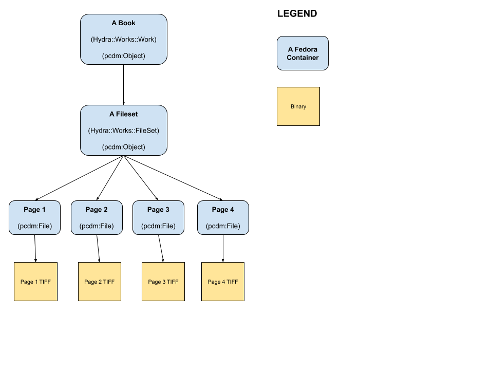

II. Migration Solutions
=======================

Designing a Migration Path Grant and Findings
-------------------------------------------------

In 2018, Fedora Commons Inc. (that's a thing?) and Duraspace received a `50,000 grant <https://www.imls.gov/grants/awarded/lg-72-18-0204-18>`_
to investigate barriers to upgrading unsupported versions of the Fedora repository platform to Fedora 4 or later.

The grant's description states that:

    DuraSpace will investigate barriers to upgrading unsupported versions of the Fedora repository platform used by approximately 240 libraries and archives in the United States. Use of unsupported versions puts the stability, security, and functionality of the content and services these institutions support at risk. This project will consult with an advisory board of stakeholders from the Islandora, Samvera, and Fedora communities; conduct an environmental scan of relevant community initiatives; and gather primary research data to inform recommendations for reducing barriers to upgrading. Project outputs will include user stories, an inventory of resources for upgrading, and recommendations for migration paths.

I want to talk about some of **the findings** from this grant and specifically how it relates specifically to **our use case for migration**.

======================
Environmental Profiles
======================

The grant first looked at environmental profiles for universities who had not yet moved to Fedora 4 or later.

For Samvera, the grant found:

    The Samvera (formerly Hydra) community takes a different approach compared to Islandora, with an ecosystem of many different applications and tools used by different institutions. There is **no single Samvera application stack**, but most applications and tools are written in the Ruby programming language and Rails web framework. **The most commonly used front-end application (Hyrax) has already been made compatible with Fedora 4.x and 5.x; in fact, the Samvera community was an early adopter of Fedora 4.x, and a previous version of Hyrax (Sufia) was the first application based on Fedora 4.x to be used in production**. This has allowed some institutions to migrate to the new platform, though the **diversity of community deployments and prevalence of local customizations** makes migrations more challenging.

    Stanford is an example of a founding Samvera community member that uses a diversity of applications and tools in a complex repository ecosystem. Many of these tools are customized to work within the local environment in particular ways, which makes a repository migration a daunting prospect. The level of customization and interdependency means that Stanford would likely need to **undertake a migration of their application framework in-house** using local resources; **no one else in the community has a similar enough system to work together on a migration**.

===================
Migration Utilities
===================

The grant also reviewed migration tools that existed as of Spring 2019. At the time, these were the three most prominent utilities:

1. `migration-utils <https://github.com/fcrepo4-exts/migration-utils>`_
2. `fedora-migrate <https://github.com/samvera-labs/fedora-migrate>`_
3. `migrate_7x_claw <https://github.com/Islandora-Devops/migrate_7x_claw>`_

Below are assessments from the `grant webpage <https://wiki.lyrasis.org/display/FF/Designing+a+Migration+Path+-+Migration+Tool+Review>`_
of each tool with focus on current migration use cases.

---------------
migration-utils
---------------

From Duraspace:

    First developed in early 2015, migration-utils is a Java-based command-line utility that **iterates over the FOXML resources in a Fedora 3.x repository** (either within the native filesystem or as exported content) and **transforms them into Fedora 4-compatible resources before ingesting them into a Fedora 4.x repository**. A Spring XML configuration file is used to define the source and destination repositories, as well as the nature of the Fedora 3.x content.

    This utility uses a default set of property mappings that can be found in the README. These mappings are based on community best practices, and they can be changed by editing configuration files. **XML content that can be easily mapped to RDF (e.g. Dublin Core metadata and the contents of the RELS-EXT datastream) are transformed into RDF properties** before being imported into Fedora 4.x. **Any managed datastreams are stored as binary resources** in Fedora 4.x, and external content can optionally be fetched and stored in this manner.

    The primary advantage of migration-utils is **its agnosticism toward front-end applications**. It is **designed to maintain the basic structure of Fedora 3.x data in Fedora 4.x** with some XML to RDF transformations where appropriate. The application also has a number of configuration options and supports customization via plugins that could be written for specific use cases. The tool could potentially save institutions the effort of writing custom data migration scripts, particularly if they are using a custom front-end environment that would not be able to take advantage of either of the other two tools.

--------------
fedora-migrate
--------------

From Duraspace:

    FedoraMigrate was developed within the Samvera community to **facilitate migrations between Fedora 3 and Fedora 4 repositories within the context of Sufia**, a popular Samvera institutional repository application. FedoraMigrate “iterates over your existing Fedora3 application using the Rubydora gem. For each object it finds, it creates a new object with the same id in Fedora4 and proceeds to migrate each datastream, including versions if they are defined, and verifies the checksum of each. Permissions and relationships are migrated as well but using different procedures due to the changes in Fedora4.” The migration process takes place in two steps: first, the resources are migrated, and then the relationships are added.

    FedoraMigrate is capable of transforming XML-based metadata in Fedora 3 to RDF properties in Fedora 4; however, the mappings for each metadata element must be defined in the tool’s configuration, which could be time consuming. In general, the tool is configurable, but this configuration must be done in Ruby code, so a developer with Ruby on Rails experience will need to configure and run the migration. FedoraMigrate was written with Sufia in mind, so it would need to be customized to support other Samvera applications.

---------------
migrate_7x_claw
---------------

From Duraspace:

    Islandora 8 (CLAW) makes use of the Drupal Migrate API to provide tooling for migrations from Fedora 3.x Islandora installations to Islandora 8.x. The Drupal Migrate API provides services for migrating data from different sources to Drupal 8; plug-ins can be written to support different migration use cases.  The Islandora community developed the migrate_7x_claw module based on this API, which includes plug-ins for different types of data stored by Fedora 3.x-based Islandora installations.

    While this module can be run from the command line using Drush, it can also be accessed via the user interface, making it easier for repository administrators to use. Configuration is relatively straight-forward - the user simply enters the base URLs for their Fedora and Solr instances, along with the username and password for Fedora, along with a Solr query to find and retrieve the objects to be migrated. These queries can be based on content model or anything else that might be indexed in Solr.

    The relative uniformity of Islandora installations will make this tool quite useful to the community. Users who have customized the defaults will need to make some configuration changes, but **in general this tool should help most Islandora 7.x users easily move their data into an Islandora 8.x repository**.

=============================
Comparing Tools with Profiles
=============================

Below are notes specifically thinking about Samvera:

-------
Samvera
-------

From the findings:

    The FedoraMigrate tool is specifically designed to work with the Sufia Samvera application, and therefore would only be useful to institutions making use of this application (which has since been superseded by the Hyrax application). While the migration tool could certainly be updated, it has not received any substantive code commits for over two years. Even if the tool were to be updated to work with Hyrax, which is similar to Sufia, it would not be useful to institutions like Stanford that have heavily customized both their Samvera applications and their data models. A migration to any new system would likely need to be done in a customized, in-house way at Stanford.

------
Custom
------

From the findings:

    Of the three available tools, migration-utils would be the most useful to the custom Fedora 3.x repositories (National Library of Medicine, University of Wisconsin-Madison, UNC Chapel Hill, Amherst College). While it won’t address any of their front-end applications, **migration-utils could be helpful in simply getting the data from Fedora 3.x to Fedora 4.x**. In each case this would require some configuration and likely customization via plug-ins, but it would save the effort required to write custom migration scripts. However, the tool has not had any releases since Fedora 4.6.x so it would need to be updated to support Fedora 5.x and higher.

Thinking about Migration
------------------------

Let's start by thinking about a book in Islandora 7 / Fedora 3:

.. image:: ../images/islandora7_book.png

Now what might that same book look like in Hyrax?

==========================================
How these findings relate to our situation
==========================================

The findings of this grant are interesting and thought-provoking particularly for our use case. In the environtmental
scanning and institutional profiling of the grant, the team **doesn't review or cover institutions who would be jumping
from Islandora and Fedora 3 to Samvera and Fedora 4 or later**.  Because of this, **niether** the Samvera or Islandora profiles
would fit our use case.  Our case would likely be closest to the custom solution category.

This is because our Fedora 3 objects are tightly-bound with Islandora 7. In Fedora 3 and our version of Islandora, there
is no Portland Common Data Model.  Simply migrating these objects from Fedora 3 to Fedora 4 would not make them
interoperable with Hyrax because certain elements would be missing and our objects would be quite different than what
Hyrax would expect.

=====================
Using migration-utils
=====================

Again, we would not be like most Islandora or Samvera instituions. We would be more akin to
custom Fedora shops.  For that reason, **migration-utils would make most sense to us** if we care about migrating our data
from our custom Fedora instance instead of exporting it.

Also, remember some other findings:

    The primary advantage of migration-utils is its agnosticism toward front-end applications. It is designed to maintain the basic structure of Fedora 3.x data in Fedora 4.x with some XML to RDF transformations where appropriate. The application also has a number of configuration options and supports customization via plugins that could be written for specific use cases. The tool could potentially save institutions the effort of writing custom data migration scripts, particularly if they are using a custom front-end environment that would not be able to take advantage of either of the other two tools.

    Of the three available tools, migration-utils would be the most useful to the custom Fedora 3.x repositories (National Library of Medicine, University of Wisconsin-Madison, UNC Chapel Hill, Amherst College). While it won’t address any of their front-end applications, migration-utils could be helpful in simply getting the data from Fedora 3.x to Fedora 4.x. In each case this would require some configuration and likely customization via plug-ins, but it would save the effort required to write custom migration scripts. However, the tool has not had any releases since Fedora 4.6.x so it would need to be updated to support Fedora 5.x and higher.

    Migration-utils is a useful tool in principle, but it is hampered by a lack of updates and its support for generic migration use cases. However, this represents a potential opportunity for the Fedora community to improve the tool based on the migration needs of those with custom front-end implementations. While it wouldn’t be possible to develop a tool that will work out-of-the-box in every scenario, a focus on configurable property mappings and data transformations could make the tool much more useful to the community.

==================================
But migration-utils is abandonware
==================================

*Not so fast*!  The findings above are from **Spring 2019**. Since then, `migration-utils <https://github.com/fcrepo4-exts/migration-utils>`_
has received more than 62 commits (it only has 130 in total). This is mostly because of **OCFL** and helping institutions
migrate from Fedora 2 or Fedora 3 to Fedora 6.

So what might a Fedora object migrated from Fedora 3 to Fedora 4, 5, or 6 look like (hold
`ModeShape <https://www.google.com/url?sa=t&rct=j&q=&esrc=s&source=web&cd=&cad=rja&uact=8&ved=2ahUKEwjw7ODMhoXqAhUuQjABHYkuAF0QFjAAegQIBBAB&url=https%3A%2F%2Fmodeshape.jboss.org%2F&usg=AOvVaw1kQsl-29WwZojhweuet2C1>`_
/ `OCFL <https://ocfl.io/>`_ discussion and questions for later):

.. image:: ../images/migration-utils_book.png

============
Another path
============

If we were to decide that keeping versions or audit and administrative metadata was not important to us, we could pursue
another path agnostic to Fedora.