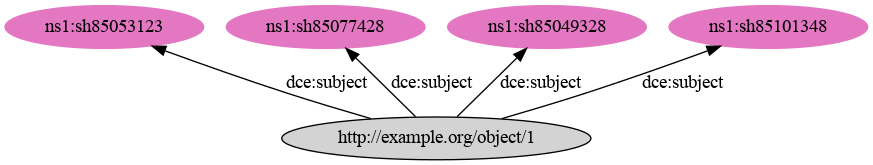
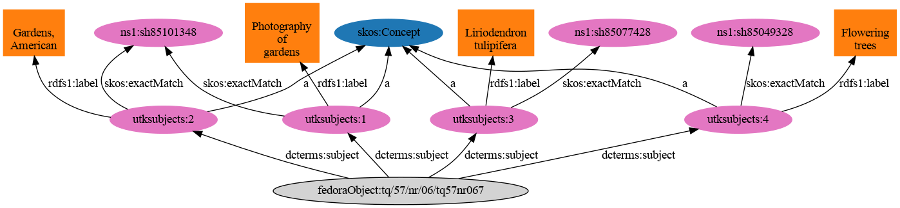

III. Migrating Our Linked Data Ready Metadata
=============================================

Introduction
------------

Since 2015, UT Libraries has worked diligently to make our metadata "linked data-ready." You can see this throughout our
MODS with the presence of URIS in `valueURI` and `xlink:href` URIs.

While we've worked to make our data "linked-data ready," this part of our migration will be complex because we have our
own practices that are different from other libraries.  This is because our needs are different and our metadata has been
influence from local requirements and the requirements of metadata sharing agreements with things like the Digital
Publice Library of America.

In this chapter I will focus on:

* An explanation and justification for what we must do prior to migration
* Demonstrate how we can leverage our "linked data-ready" elements during migration.

In the next chapter, I will describe in detail:

* Hyrax's default RDF metadata mapping
* What we lose if we use it out of the box
* Alternative mappings

Hyrax's Metadata Application Profile and Applying our MODS to RDF
-----------------------------------------------------------------

As you'll see in the next chapter, Hyrax's Default Metadata Mapping is extremely basic and to some extent bad.  To be
honest, it does not even adhere to Linked Data principles appropriately. Because of this we would need to do a few things
prior to moving to Hyrax:

1. Create our own MODS to RDF mapping based on our data and needs

    Over time, we have developed our own practices based on our needs.  To ensure our migration is not lossy, we must first
    develop a  MODS to RDF mapping and associated metadata application profile for RDF.

2. Determine if we need an external triple store

    Hyrax does not ship with an external triple store.  If we need one, we will need to select one and install it.

3. Modify the default metadata application profile to remove bad elements or one's that don't meet our needs

    As you'll see in the next chapter, Hyrax's MAP is bad.  We need to modify the bad elements to be good base on our MAP
    and removed the good but unneeded metadata elements.

4. Expand the models of our generated works to include other required elements

    Once we have determined what work types we need, we need to update their models to have our other elements.

5. If necessary, modify code so that Hyrax can "talk" to our external triple store

    More info can be found `here <https://wiki.lyrasis.org/display/samvera/Hydra+Triple+Store+Interest+Group>`_.

Leveraging our "Linked Data-Ready" Elements During Migration
------------------------------------------------------------

===================================
mods:subject/@valueURI/[mods:topic]
===================================

As you'll see in the next section, subjects are strings by default in Hyrax.  We'd need to modify this prior to migration
to migrate this data.

The `Final Recommendation of the Samvera MODS to RDF Description Subgroup Report <https://wiki.duraspace.org/download/attachments/87460857/MODS-RDF-Mapping-Recommendations_SMIG_v1_2019-01.pdf?api=v2>`_
describes multiple ways to do this. In reality, we need to develop our own MAP, but for the purposes of this document, I
will follow the recommendations blindly.

Let's say we had some XML that looked like this:

.. code-block:: xml

    <subject authority="lcsh"
        valueURI="http://id.loc.gov/authorities/subjects/sh85101348">
        <topic>
            Photography of gardens
        </topic>
    </subject>
    <subject authority="lcsh"
        valueURI="http://id.loc.gov/authorities/subjects/sh85053123">
        <topic>
            Gardens, American
        </topic>
    </subject>
    <subject authority="lcsh"
        valueURI="http://id.loc.gov/authorities/subjects/sh85077428">
        <topic>
            Liriodendron tulipifera
        </topic>
    </subject>
    <subject authority="lcsh"
        valueURI="http://id.loc.gov/authorities/subjects/sh85049328">
        <topic>
            Flowering trees
        </topic>
    </subject>

If we were to follow the direct mappings option, our RDF would look like this:

.. code-block:: turtle

    @prefix dce: <http://purl.org/dc/elements/1.1/> .

    <http://example.org/object/1>
        dce:subject <http://id.loc.gov/authorities/subjects/sh85101348>, <http://id.loc.gov/authorities/subjects/sh85053123>, <http://id.loc.gov/authorities/subjects/sh85077428>, <http://id.loc.gov/authorities/subjects/sh85049328> .

While this may look lossy, remember that the each URI has it's own RDF properties that we can "look up".  For instance,
let's look at the URI for "Flowering trees":

.. code-block:: turtle

    @prefix ns0: <http://id.loc.gov/ontologies/bflc/> .
    @prefix xsd: <http://www.w3.org/2001/XMLSchema#> .
    @prefix skos: <http://www.w3.org/2004/02/skos/core#> .
    @prefix ns1: <http://www.loc.gov/mads/rdf/v1#> .
    @prefix ns2: <http://id.loc.gov/vocabulary/identifiers/> .
    @prefix ns3: <http://id.loc.gov/ontologies/RecordInfo#> .
    @prefix owl: <http://www.w3.org/2002/07/owl#> .
    @prefix ns4: <http://purl.org/vocab/changeset/schema#> .

    <http://id.loc.gov/resources/works/17029713>
      a <http://id.loc.gov/ontologies/bibframe/Work> ;
      ns0:aap "Rogers, Walter E, 1890- Tree flowers of forest, park, and street"^^xsd:string .

    <http://id.loc.gov/resources/works/1695078>
      a <http://id.loc.gov/ontologies/bibframe/Work> ;
      ns0:aap "O'Gorman, Helen. Mexican flowering trees and plants"^^xsd:string .

    <http://id.loc.gov/resources/works/4575454>
      a <http://id.loc.gov/ontologies/bibframe/Work> ;
      ns0:aap "Whitehead, Stanley Bamford, 1908- Observer's book of flowering trees & shrubs for gardens"^^xsd:string .

    <http://id.loc.gov/resources/works/3384399>
      a <http://id.loc.gov/ontologies/bibframe/Work> ;
      ns0:aap "Bird, Richard, 1942- Flowering trees and shrubs :"^^xsd:string .

    <http://id.loc.gov/resources/works/8592293>
      a <http://id.loc.gov/ontologies/bibframe/Work> ;
      ns0:aap "Imai, Tetsurō, 1901- Hanagi saijiki"^^xsd:string .

    <http://id.loc.gov/resources/works/7507536>
      a <http://id.loc.gov/ontologies/bibframe/Work> ;
      ns0:aap "Clark, Robert B. Flowering trees"^^xsd:string .

    <http://id.loc.gov/authorities/subjects/sh85095707>
      a <http://www.loc.gov/mads/rdf/v1#Topic>, <http://www.loc.gov/mads/rdf/v1#Authority>, skos:Concept ;
      ns1:authoritativeLabel "Ornamental trees"@en ;
      ns1:elementList ( _:genid3 ) ;
      skos:prefLabel "Ornamental trees"@en .

    <http://id.loc.gov/resources/works/2166647>
      a <http://id.loc.gov/ontologies/bibframe/Work> ;
      ns0:aap "Menninger, Edwin A. (Edwin Arnold), 1896-1995. Flowering trees of the world for tropics and warm climates"^^xsd:string .

    <http://id.loc.gov/resources/works/10356131>
      a <http://id.loc.gov/ontologies/bibframe/Work> ;
      ns0:aap "Takhtadzhi︠a︡n, A. L. (Armen Leonovich) Sistema i filogenii︠a︡ t︠s︡vetkovykh rasteniĭ"^^xsd:string .

    <http://id.loc.gov/resources/works/12733507>
      a <http://id.loc.gov/ontologies/bibframe/Work> ;
      ns0:aap "Flint, Harrison L. (Harrison Leigh), 1929- Ortho's all about flowering trees & shrubs,"^^xsd:string .

    <http://id.loc.gov/authorities/subjects/sh85049324>
      a ns1:Authority, skos:Concept ;
      ns1:authoritativeLabel "Flowering dogwood"@en ;
      skos:prefLabel "Flowering dogwood"@en .

    <http://id.loc.gov/resources/works/4533150>
      a <http://id.loc.gov/ontologies/bibframe/Work> ;
      ns0:aap "Cowen, D. V. Flowering trees and shrubs in India,"^^xsd:string .

    <http://id.loc.gov/resources/works/4333139>
      a <http://id.loc.gov/ontologies/bibframe/Work> ;
      ns0:aap "Davis, Brian, 1943- Flowering trees & shrubs"^^xsd:string .

    <http://id.loc.gov/resources/works/1236113>
      a <http://id.loc.gov/ontologies/bibframe/Work> ;
      ns0:aap "Pearce, Sydney Albert. Flowering shrubs and tress,"^^xsd:string .

    <http://id.loc.gov/resources/works/278574>
      a <http://id.loc.gov/ontologies/bibframe/Work> ;
      ns0:aap "Randhawa, M. S. (Mohinder Singh), 1909-1986. Beautiful trees and gardens"^^xsd:string .

    <http://id.loc.gov/resources/works/4241957>
      a <http://id.loc.gov/ontologies/bibframe/Work> ;
      ns0:aap "Selsam, Millicent E. (Millicent Ellis), 1912-1996. Tree flowers"^^xsd:string .

    <http://id.loc.gov/authorities/subjects/sh85049325>
      a ns1:Authority, skos:Concept ;
      ns1:authoritativeLabel "Flowering plums"@en ;
      skos:prefLabel "Flowering plums"@en .

    <http://id.loc.gov/resources/works/1724145>
      a <http://id.loc.gov/ontologies/bibframe/Work> ;
      ns0:aap "Hersey, Jean, 1902- Flowering shrubs and small trees"^^xsd:string .

    <http://id.loc.gov/resources/works/15838029>
      a <http://id.loc.gov/ontologies/bibframe/Work> ;
      ns0:aap "Wang, Yicheng, 1936- Zui xin tu jie mu ben hua hui zai pei zhi nan"^^xsd:string .

    <http://id.loc.gov/resources/works/5924782>
      a <http://id.loc.gov/ontologies/bibframe/Work> ;
      ns0:aap "Macself, Albert James, 1878- Flowering trees and shurbs,"^^xsd:string .

    <http://id.loc.gov/authorities/subjects/sh85049328>
      a ns1:Topic, ns1:Authority, skos:Concept ;
      ns0:subjectOf <http://id.loc.gov/resources/works/563239>, <http://id.loc.gov/resources/works/306770>, <http://id.loc.gov/resources/works/17429063>, <http://id.loc.gov/resources/works/3384399>, <http://id.loc.gov/resources/works/7513667>, <http://id.loc.gov/resources/works/775595>, <http://id.loc.gov/resources/works/13241452>, <http://id.loc.gov/resources/works/7507536>, <http://id.loc.gov/resources/works/4533150>, <http://id.loc.gov/resources/works/4333139>, <http://id.loc.gov/resources/works/13410130>, <http://id.loc.gov/resources/works/12733507>, <http://id.loc.gov/resources/works/4652618>, <http://id.loc.gov/resources/works/1724145>, <http://id.loc.gov/resources/works/8592293>, <http://id.loc.gov/resources/works/9406857>, <http://id.loc.gov/resources/works/7970456>, <http://id.loc.gov/resources/works/5924782>, <http://id.loc.gov/resources/works/2166647>, <http://id.loc.gov/resources/works/1695078>, <http://id.loc.gov/resources/works/7075453>, <http://id.loc.gov/resources/works/1236113>, <http://id.loc.gov/resources/works/9381592>, <http://id.loc.gov/resources/works/278574>, <http://id.loc.gov/resources/works/6127643>, <http://id.loc.gov/resources/works/7949315>, <http://id.loc.gov/resources/works/17029713>, <http://id.loc.gov/resources/works/3108729>, <http://id.loc.gov/resources/works/4241957>, <http://id.loc.gov/resources/works/10356131>, <http://id.loc.gov/resources/works/15838029>, <http://id.loc.gov/resources/works/4575454> ;
      ns2:lccn "sh 85049328"^^xsd:string ;
      ns1:adminMetadata [
        a <http://id.loc.gov/ontologies/RecordInfo#RecordInfo> ;
        ns3:recordChangeDate "1986-02-11T00:00:00"^^xsd:dateTime ;
        ns3:recordContentSource <http://id.loc.gov/vocabulary/organizations/dlc> ;
        ns3:recordStatus "new"^^xsd:string
      ], [
        a ns3:RecordInfo ;
        ns3:recordChangeDate "1998-03-20T16:11:29"^^xsd:dateTime ;
        ns3:recordContentSource <http://id.loc.gov/vocabulary/organizations/dlc> ;
        ns3:recordStatus "revised"^^xsd:string
      ] ;
      ns1:authoritativeLabel "Flowering trees"@en ;
      ns1:elementList ( _:genid8 ) ;
      ns1:hasBroaderAuthority <http://id.loc.gov/authorities/subjects/sh85049329>, <http://id.loc.gov/authorities/subjects/sh85095707> ;
      ns1:hasCloseExternalAuthority <http://id.worldcat.org/fast/927862> ;
      ns1:hasNarrowerAuthority <http://id.loc.gov/authorities/subjects/sh85049324>, <http://id.loc.gov/authorities/subjects/sh85049323>, <http://id.loc.gov/authorities/subjects/sh85049325> ;
      ns1:isMemberOfMADSCollection <http://id.loc.gov/authorities/subjects/collection_LCSHAuthorizedHeadings>, <http://id.loc.gov/authorities/subjects/collection_LCSH_General>, <http://id.loc.gov/authorities/subjects/collection_SubdivideGeographically> ;
      ns1:isMemberOfMADSScheme <http://id.loc.gov/authorities/subjects> ;
      owl:sameAs <info:lc/authorities/sh85049328>, <http://id.loc.gov/authorities/sh85049328#concept> ;
      skos:broader <http://id.loc.gov/authorities/subjects/sh85049329>, <http://id.loc.gov/authorities/subjects/sh85095707> ;
      skos:changeNote [
        a <http://purl.org/vocab/changeset/schema#ChangeSet> ;
        ns4:changeReason "new"^^xsd:string ;
        ns4:createdDate "1986-02-11T00:00:00"^^xsd:dateTime ;
        ns4:creatorName <http://id.loc.gov/vocabulary/organizations/dlc> ;
        ns4:subjectOfChange <http://id.loc.gov/authorities/subjects/sh85049328>
      ], [
        a ns4:ChangeSet ;
        ns4:changeReason "revised"^^xsd:string ;
        ns4:createdDate "1998-03-20T16:11:29"^^xsd:dateTime ;
        ns4:creatorName <http://id.loc.gov/vocabulary/organizations/dlc> ;
        ns4:subjectOfChange <http://id.loc.gov/authorities/subjects/sh85049328>
      ] ;
      skos:closeMatch <http://id.worldcat.org/fast/927862> ;
      skos:inScheme <http://id.loc.gov/authorities/subjects> ;
      skos:narrower <http://id.loc.gov/authorities/subjects/sh85049324>, <http://id.loc.gov/authorities/subjects/sh85049323>, <http://id.loc.gov/authorities/subjects/sh85049325> ;
      skos:prefLabel "Flowering trees"@en .

    <http://id.loc.gov/resources/works/7513667>
      a <http://id.loc.gov/ontologies/bibframe/Work> ;
      ns0:aap "Catchpole, Nat. Flowering shrubs and small trees"^^xsd:string .

    <http://id.loc.gov/resources/works/4652618>
      a <http://id.loc.gov/ontologies/bibframe/Work> ;
      ns0:aap "Harris, Cyril Charles. Illustrated guide to flowering trees and shrubs"^^xsd:string .

    <http://id.loc.gov/resources/works/563239>
      a <http://id.loc.gov/ontologies/bibframe/Work> ;
      ns0:aap "Baker, Jerry. Flowering garden"^^xsd:string .

    <http://id.loc.gov/resources/works/306770>
      a <http://id.loc.gov/ontologies/bibframe/Work> ;
      ns0:aap "Baker, Jerry. Make friends with your flowering trees"^^xsd:string .

    <http://id.worldcat.org/fast/927862>
      a ns1:Authority, skos:Concept ;
      ns1:authoritativeLabel "Flowering trees"^^xsd:string ;
      skos:prefLabel "Flowering trees"^^xsd:string .

    <http://id.loc.gov/authorities/subjects/sh85049323>
      a ns1:Authority, skos:Concept ;
      ns1:authoritativeLabel "Flowering cherries"@en ;
      skos:prefLabel "Flowering cherries"@en .

    <http://id.loc.gov/resources/works/13410130>
      a <http://id.loc.gov/ontologies/bibframe/Work> ;
      ns0:aap "Duthie, Pam, 1942- Continuous color :"^^xsd:string .

    <http://id.loc.gov/resources/works/7075453>
      a <http://id.loc.gov/ontologies/bibframe/Work> ;
      ns0:aap "Oakman, Harry. Colourful trees for landscapes and gardens"^^xsd:string .

    <http://id.loc.gov/resources/works/13241452>
      a <http://id.loc.gov/ontologies/bibframe/Work> ;
      ns0:aap "Church, Glyn. Trees and shrubs for flowers"^^xsd:string .

    <http://id.loc.gov/resources/works/6127643>
      a <http://id.loc.gov/ontologies/bibframe/Work> ;
      ns0:aap "Randhawa, M. S. (Mohinder Singh), 1909-1986. Flowering trees"^^xsd:string .

    <http://id.loc.gov/resources/works/775595>
      a <http://id.loc.gov/ontologies/bibframe/Work> ;
      ns0:aap "Chadbund, Geoffrey. Flowering cherries"^^xsd:string .

    <http://id.loc.gov/resources/works/9381592>
      a <http://id.loc.gov/ontologies/bibframe/Work> ;
      ns0:aap "Puttock, A. G. Trees and shrubs for small gardens"^^xsd:string .

    <http://id.loc.gov/resources/works/17429063>
      a <http://id.loc.gov/ontologies/bibframe/Work> ;
      ns0:aap "Better homes and gardens trees & shrubs"^^xsd:string .

    <http://id.loc.gov/resources/works/9406857>
      a <http://id.loc.gov/ontologies/bibframe/Work> ;
      ns0:aap "Kinne, Jane S. Flowering tropical trees,"^^xsd:string .

    <http://id.loc.gov/resources/works/7970456>
      a <http://id.loc.gov/ontologies/bibframe/Work> ;
      ns0:aap "Li, Hui-Lin, 1911- origin and cultivation of shade and ornamental trees"^^xsd:string .

    <http://id.loc.gov/resources/works/7949315>
      a <http://id.loc.gov/ontologies/bibframe/Work> ;
      ns0:aap "Randhawa, M. S. (Mohinder Singh), 1909-1986. Flowering trees in India"^^xsd:string .

    <http://id.loc.gov/resources/works/3108729>
      a <http://id.loc.gov/ontologies/bibframe/Work> ;
      ns0:aap "Rogers, Walter E., 1890- Tree flowers of forest, park, and street,"^^xsd:string .

    <http://id.loc.gov/authorities/subjects/sh85049329>
      a ns1:Topic, ns1:Authority, skos:Concept ;
      ns1:authoritativeLabel "Flowering woody plants"@en ;
      ns1:elementList ( _:genid4 ) ;
      skos:prefLabel "Flowering woody plants"@en .

    _:genid3
      a ns1:TopicElement ;
      ns1:elementValue "Ornamental trees"@en .

    _:genid4
      a ns1:TopicElement ;
      ns1:elementValue "Flowering woody plants"@en .

    _:genid8
      a ns1:TopicElement ;
      ns1:elementValue "Flowering trees"@en .

If we were to follow the minted objects mapping option, our RDF would look like this:

.. code-block:: turtle

    @prefix fedoraObject: <http://[LocalFedoraRepository]/> .
    @prefix utksubjects: <http://[address-to-triplestore]/subjects/> .
    @prefix owl: <https://www.w3.org/2002/07/owl#> .
    @prefix rdfs: <https://www.w3.org/TR/rdf-schema/> .
    @prefix skos: <http://www.w3.org/2004/02/skos/core#> .

    <fedoraObject:tq/57/nr/06/tq57nr067>
        dcterms:subject <utksubjects:1>, <utksubjects:2>, <utksubjects:3>, <utksubjects:4> .

    <utksubjects:1>
        a skos:Concept ;
        rdfs:label "Photography of gardens";
        skos:exactMatch <http://id.loc.gov/authorities/subjects/sh85101348> .

    <utksubjects:2>
        a skos:Concept ;
        rdfs:label "Gardens, American";
        skos:exactMatch <http://id.loc.gov/authorities/subjects/sh85101348> .

    <utksubjects:3>
        a skos:Concept ;
        rdfs:label "Liriodendron tulipifera";
        skos:exactMatch <http://id.loc.gov/authorities/subjects/sh85077428> .

    <utksubjects:4>
        a skos:Concept ;
        rdfs:label "Flowering trees";
        skos:exactMatch <http://id.loc.gov/authorities/subjects/sh85049328> .

================================
mods:accessCondition/@xlink:href
================================

The `Final Recommendation of the Samvera MODS to RDF Description Subgroup Report <https://wiki.duraspace.org/download/attachments/87460857/MODS-RDF-Mapping-Recommendations_SMIG_v1_2019-01.pdf?api=v2>`_
describes multiple ways to do this. In reality, we need to develop our own MAP, but for the purposes of this document, I
will follow the recommendations blindly.

Let's say we had some XML that looked like this:

.. code-block:: xml

    <accessCondition type="use and reproduction" xlink:href="http://rightsstatements.org/vocab/CNE/1.0/">
        Copyright Not Evaluated
    </accessCondition>

If we were to follow either the Direct Objects of Minted Objects mapping, our RDF would look like this:

.. code-block:: turtle

    @prefix fedoraObject: <http://[LocalFedoraRepository]/> .
    @prefix edm: <http://www.europeana.eu/schemas/edm/> .

    <fedoraObject:tq/57/nr/06/tq57nr067>
        edm:rights <http://rightsstatements.org/vocab/CNE/1.0/> .

You may be thinking this is "lossy", but remember we are linking to another RDF object with even more data than what is
in our MODS. Here is the RDF that is available  with this URI:

.. code-block:: turtle

    @prefix cc:    <http://creativecommons.org/ns#> .
    @prefix schema: <http://schema.org/> .
    @prefix premiscopy: <http://id.loc.gov/vocabulary/preservation/copyrightStatus/> .
    @prefix owl:   <http://www.w3.org/2002/07/owl#> .
    @prefix xsd:   <http://www.w3.org/2001/XMLSchema#> .
    @prefix dcmitype: <http://purl.org/dc/dcmitype/> .
    @prefix skos:  <http://www.w3.org/2004/02/skos/core#> .
    @prefix rdfs:  <http://www.w3.org/2000/01/rdf-schema#> .
    @prefix p3p:   <http://www.w3.org/2002/01/p3prdfv1#> .
    @prefix edm:   <http://www.europeana.eu/schemas/edm/> .
    @prefix dcterms: <http://purl.org/dc/terms/> .
    @prefix odrl:  <http://www.w3c.org/community/odrl/two/vocab/2.1/> .
    @prefix foaf:  <http://xmlns.com/foaf/0.1/> .
    @prefix dc:    <http://purl.org/dc/elements/1.1/> .

    <http://rightsstatements.org/vocab/CNE/1.0/>
            a                    dcterms:RightsStatement , skos:Concept ;
            dc:identifier        "CNE" ;
            dcterms:creator      <http://rightsstatements.org/vocab/irswg> ;
            dcterms:description  "To oświadczenie prawne oznacza, że organizacja która udostępniła obiekt nie zbadała statusu obiektu w kontekście prawa autorskiego i praw pokrewnych."@pl , "Esta Declaración de Derechos indica que la organización que ha publicado el material no ha evaluado el estado del derecho de autor y derechos conexos del material."@es , "Dieser Rechtehinweis besagt, dass die Institution, die das Objekt zugänglich macht, den Urheberrechtsschutz und sonstigen Rechtsstatus des Objekts nicht bewertet hat."@de , "This Rights Statement indicates that the organization that has published the Item has not evaluated the copyright and related rights status of the Item."@en , "Tällä käyttöoikeuskuvauksella ilmaistaan, että Kohteen julkaissut organisaatio ei ole arvioinut kohteen tekijänoikeudellista ja lähioikeusstatusta."@fi , "यह न्‍यायसंगत कथन इंगित करता है कि जिस संगठन ने सामग्री को प्रकाशित किया है, उसने सामग्री के प्रतिलिप्यधिकार (कॉपीराइट) और संबंधित अधिकार स्थिति का मूल्यांकन नहीं किया है।"@hi , "La présente Déclaration des Droits indique que l'organisme qui a publié l'Objet n'a pas évalué le statut de l'Objet en ce qui concerne le droit d'auteur et les droits voisins."@fr , "See autoriõigusliku seisundi deklaratsioon näitab, et objekti avaldanud organisatsioon ei ole hinnanud objekti autoriõiguslikku ega sellega seotud õigustest tulenevat seisundit."@et , "Deze Rechtenverklaring geeft aan dat de organisatie die het Item heeft gepubliceerd de status betreffende het auteursrecht en de aanverwante rechten van het Item niet heeft onderzocht."@nl , "Ši Teisių pareikštis nurodo, jog Objektą paskelbusi institucija jo autorių nei gretutinių teisių būsenos nevertino."@lt , "Denna nyttjanderättsbeskrivning innebär att organisationen som har publicerat objektet inte har granskat objektets status för upphovsrätt och närstående rättigheter."@sv-fi ;
            dcterms:modified     "2019-04-18"^^xsd:date ;
            owl:versionInfo      "1.0" ;
            skos:closeMatch      <http://www.europeana.eu/rights/unknown/> ;
            skos:definition      "Detta Objekts upphovsrättsliga status och dess status enligt närstående rättigheter har ej bedömts.\n\n  För ytterligare upplysningar, ta kontakt med den organisation som har gjort Objektet tillgängligt.\n\n  Du kan använda Objektet på alla sätt som är tillåtna enligt lagstiftningen om upphovsrätt och närstående rättigheter som är tillämplig på din användning."@sv-fi , "Tämän Kohteen tekijänoikeudellista ja lähioikeusstatusta ei ole arvioitu.\n\n  Lisätietoja voit saada ottamalla yhteyttä Kohteen saataville saattaneeseen organisaatioon.\n\n  Voit käyttää Kohdetta käyttöösi sovellettavan tekijänoikeutta ja lähioikeuksia koskevan lainsäädännön sallimilla tavoilla."@fi , "Der Urheberrechtsschutz und sonstige Rechtsstatus des Objekts wurde nicht bewertet.\n\n  Bitte kontaktieren Sie für weitergehende Informationen die Institution, die das Werk zugänglich gemacht hat.\n\n  Sie sind berechtigt, das Objekt in jeder Form zu nutzen, die das Urheberrechtsgesetz und/oder einschlägige verwandte Schutzrechte gestatten."@de , "De status betreffende het auteursrecht en de aanverwante rechten van dit Item zijn niet onderzocht. \n\nVoor meer informatie, neem alsjeblieft contact op met  de organisatie die het Item beschikbaar heeft gesteld. \n\nJe bent vrij om dit Item te gebruiken op een manier die is toegestaan ​​door de wetgeving betreffende het auteursrecht en de aanverwante rechten die van toepassing is op je gebruik."@nl , "इस सामग्री के प्रतिलिप्यधिकार (कॉपीराइट) या संबंधित अधिकारों  का मूल्यांकन नहीं किया गया है। \n\nकृपया अधिक जानकारी के लिए उस संगठन का निर्देश लें जिसने सामग्री को उपलब्ध कराया है। \n\nआप इस सामग्री का उपयोग किसी भी तरह से प्रतिलिप्यधिकार (कॉपीराइट) और संबंधित अधिकार कानूनों द्वारा अनुमति के अंतर्गत अपने हेतु करने के लिए स्वतंत्र हैं।"@hi , "Status obiektu w kontekście prawa autorskiego i praw pokrewnych nie został zbadany.\n\n  W celu uzyskania dodatkowych informacji należy skontaktować się z organizacją, która udostępniła obiekt.\n\n  Można wykorzystywać ten obiekt w dowolny sposób dozwolony przez przepisy o prawie autorskim i prawach pokrewnych, które mają zastosowanie w kontekście planowanego wykorzystania."@pl , "Le statut de cet Objet en ce qui concerne le droit d'auteur et les droits voisins n'a pas été évalué.\n\n  Pour de plus amples informations, veuillez contacter l'organisme qui a rendu l'Objet accessible.\n\n  Vous avez le droit d'utiliser l'Objet de toutes les manières autorisées par la législation sur le droit d'auteur et les droits voisins applicable à votre utilisation."@fr , "Objekti autoriõiguslik ja sellega seotud õigustest tulenev seisund on hindamata.\n\n  Palun küsige täiendavat infot objekti kättesaadavaks teinud organisatsioonilt.\n\n  Objekti võib vabalt kasutada kõigil viisidel, mis on lubatud kavandatavale kasutusviisile kohalduvates autoriõigust ja sellega seotud õigusi puudutavates seadustes."@et , "El estado del derecho de autor y derechos conexos de este material no ha sido evaluado.\n\n  Por favor, refiérase a la organización que ha puesto el material a disposición para más información.\n\n  Usted es libre de utilizar este material de cualquier forma que esté permitida por la legislación de derecho de autor y derechos conexos que se aplique para el uso que pretende hacer."@es , "The copyright and related rights status of this Item has not been evaluated.\n\n  Please refer to the organization that has made the Item available for more information.\n\n  You are free to use this Item in any way that is permitted by the copyright and related rights legislation that applies to your use."@en , "Autorių nei gretutinės teisės į šį Objektą nebuvo vertintos.\n\nDaugiau informacijos galite gauti kreipęsi į instituciją, kuri Objektą padarė viešai prieinamu.\n\nJūs galite šį Objektą naudoti tokiais būdais, kuriuos leidžia tokiam panaudojimui taikytini autorių ir gretutines teises reglamentuojantys teisės aktai."@lt ;
            skos:inScheme        <http://rightsstatements.org/vocab/1.0/> ;
            skos:notation        "CNE" ;
            skos:note            "Może być również konieczne uzyskanie innych zgód w celu wykorzystania obiektu. Na przykład prawa związane z ochroną wizerunku i danych osobowych, prywatnością lub prawa osobiste mogą ograniczać możliwości wykorzystania obiektu."@pl , "Om inte annat uttryckligen sägs, ger organisationen som har gjort Objektet tillgängligt inga garantier rörande Objektet och den kan inte garantera att denna Nyttjanderättsbeskrivning är riktig. Du ansvarar själv för din egen användning."@sv-fi , "Objekti kättesaadavaks teinud organisatsiooni koduleht võib sisaldada täiendavat informatsiooni objekti autoriõigusliku seisundi kohta."@et , "Papildomos informacijos apie Objektą saugančių autorių teisių būseną galite rasti Objektą paviešinusios institucijos tinklalapyje."@lt , "Lisätietoja Kohteen tekijänoikeudellisesta statuksesta voi olla saatavissa Kohteen saataville saattaneen organisaation verkkosivuilta."@fi , "You may need to obtain other permissions for your intended use. For example, other rights such as publicity, privacy or moral rights may limit how you may use the material."@en , "Juhul kui ei ole otseselt öeldud teisiti, ei anna objekti kättesaadavaks teinud organisatsioon objekti kohta mingeid garantiisid ega taga käesoleva autoriõigusliku seisundi deklaratsiooni täpsust. Kasutusviisi õiguspärasuse eest vastutab kasutaja ise."@et , "Du kan hitta ytterligare information om Objektets upphovsrättsliga status på den organisations hemsida som har gjort Objektet tillgängligt."@sv-fi , "Mogelijk moet je andere vormen van toestemming verkrijgen voor het beoogde gebruik. Andere rechten, zoals het recht van mededeling aan het publiek, de bescherming van de privacy of de morele rechten, kunnen bijvoorbeeld de manier waarop je het materiaal kan gebruiken beperken."@nl , "Jei aiškiai nenurodyta priešingai, Objektą paviešinusi institucija neteikia dėl jo jokių garantijų ir negali užtikrinti šios Teisių pareikšties tikslumo. Už naudojimą atsakote patys."@lt , "Teie kavandatav kasutusviis võib nõuda täiendavate lubade hankimist. Näiteks võivad materjali kasutamist piirata muud õigused, nagu isiku-, eraelu puutumatuse ning moraalsed õigused."@et , "Saatat tarvita muita lupia aikomaasi käyttöä varten. Esimerkiksi moraaliset oikeudet, yksityisyyden suojaa koskevat oikeudet taikka henkilön oikeudet määrätä kuvansa tai henkilönsä tunnistettavan osan kaupallisesta käytöstä voivat rajoittaa aineiston käyttöä."@fi , "Usted puede encontrar información adicional sobre el estado del derecho de autor del material en el sitio web de la organización que puso a disposición el material."@es , "Ellei erikseen ole muuta nimenomaisesti ilmoitettu, tämän Kohteen saataville saattanut organisaatio ei anna mitään Kohdetta koskevaa takuuta eikä voi taata tämän Käyttöoikeuskuvauksen virheettömyyttä. Olet vastuussa omasta käytöstäsi."@fi , "Jeżeli wyraźnie nie zaznaczono inaczej, organizacja która udostępniła dany obiekt nie daje w związku z nim żadnych gwarancji i nie może zagwarantować poprawności oświadczenia prawnego. Sam odpowiadasz za własne działania."@pl , "Tenzij uitdrukkelijk anders vermeld, geeft de organisatie die dit Item beschikbaar heeft gesteld geen garanties over het Item, en kan ze de juistheid van deze Rechtenverklaring niet verzekeren. Je bent zelf verantwoordelijk voor je gebruik van dit Item."@nl , "Il est possible que l'utilisation que vous envisagez requière des autorisations supplémentaires. Il se peut par exemple que d'autres droits, comme les droits de la personnalité ou de la publicité, les droits liés à la protection de la vie privée ou les droits moraux, limitent vos possibilités d'utilisation."@fr , "Sauf mention expresse contraire, l'organisme qui a rendu cet Objet accessible ne donne aucune garantie concernant ce dernier ni ne garantit l'exactitude de la présente Déclaration des Droits. Vous êtes responsable de votre propre utilisation."@fr , "Il est possible que vous trouviez, sur le site Web de l'organisme ayant rendu l'Objet accessible, des informations supplémentaires concernant la protection de l'Objet par le droit d'auteur."@fr , "Möglicherweise benötigen Sie zusätzliche Erlaubnisse für die beabsichtigte Nutzung. Zum Beispiel weil andere Rechte wie Veröffentlichungs-, Persönlichkeits- oder Urheberpersönlichkeitsrechte den erlaubten Nutzungsumfang einschränken."@de , "आपको अपने इच्छित उपयोग के लिए अन्य अनुमतियाँ प्राप्त करने की आवश्यकता हो सकती है। उदाहरण के लिए, प्रचार, गोपनीयता या नैतिक अधिकार जैसे अन्य अधिकार इस बात को सीमित कर सकते हैं कि आप सामग्री का उपयोग कैसे कर सकते हैं।"@hi , "Je kan aanvullende informatie over de auteursrechtelijke status van het Item vinden op de website van de organisatie die het Item beschikbaar heeft gesteld."@nl , "Du kanske måste skaffa andra tillstånd för den användning som du avser. Till exempel moraliska rättigheter, rättigheter gällande skyddet för privatliv eller personens rättigheter att bestämma gällande kommersiell användning av en identifierbar del av sin bild eller sin person kan begränsa dina möjligheter att använda materialet."@sv-fi , "Unless expressly stated otherwise, the organization that has made this Item available makes no warranties about the Item and cannot guarantee the accuracy of this Rights Statement. You are responsible for your own use."@en , "Soweit nicht ausdrücklich an anderer Stelle ausgewiesen, macht die Institution, die das Objekt zugänglich macht, keine Zusicherungen in Bezug auf dieses und übernimmt keine Garantie für die Richtigkeit des gewählten Rechtehinweises. Sie sind für die eigene Nutzung selbst verantwortlich."@de , "Jūsų norimam Objekto panaudojimui gali tekti gauti papildomus leidimus. Pavyzdžiui, šios medžiagos panaudojimas gali būti ribojamas reikalavimų, taikomų viešai skelbiamai informacijai, teisių į privatų gyvenimą, neturtinių autorių/atlikėjų teisių."@lt , "जब तक स्पष्ट रूप से नहीं कहा जाता है कि जिस संगठन ने यह सामग्री उपलब्ध कराई है, वह उस विषय के बारे में कोई आश्वस्ति नहीं देता है और इस न्‍यायसंगत कथन की सटीकता की गारंटी नहीं दे सकता है, आप अपने उपयोग के लिए स्वयं उत्तरदायी है।"@hi , "Dodatkowe informacje o statusie prawnoautorskim obiektu mogą być dostępne na stronie internetowej organizacji, która ten obiekt udostępniła."@pl , "Usted quizás necesite obtener permiso para el uso que pretende hacer del material. Por ejemplo, otros derechos tales como el derecho a la publicidad, el derecho a la privacidad o los derechos morales pueden limitar la forma en que puede utilizar el material."@es , "Möglicherweise finden Sie zusätzliche Informationen zum Urheberrechtsschutz des Objekts auf der Website der Institution, die das Objekt verfügbar gemacht hat."@de , "A menos que se exprese lo contrario, la organización que ha puesto este material a disposición no otorga garantías sobre el material y no puede garantizar la exactitud de esta Declaración de Derechos. Usted es responsable por el uso que haga del material."@es , "आपको उस संगठन की वेबसाइट पर सामग्री कीप्रतिलिप्यधिकार (कॉपीराइट)स्थिति के बारे में अतिरिक्त जानकारी मिल सकती है, जिसने सामग्री उपलब्ध कराई है।"@hi , "You may find additional information about the copyright status of the Item on the website of the organization that has made the Item available."@en ;
            skos:prefLabel       "Niezbadany status prawnoautorski"@pl , "Derecho de autor sin evaluar"@es , "Copyright Not Evaluated"@en , "Urheberrechtsschutz nicht bewertet"@de , "Autorių teisių būsena netirta"@lt , "Tekijänoikeusstatusta ei arvioitu"@fi , "Autoriõiguslik seisund hindamata"@et , "Auteursrechtelijke status niet geëvalueerd"@nl , "Upphovsrättslig status ej bedömts"@sv-fi , "Droit d'auteur non évalué"@fr , "प्रतिलिप्यधिकार (कॉपीराइट) मूल्यांकन नहीं किया गया है"@hi ;
            skos:relatedMatch    premiscopy:unk ;
            skos:scopeNote       "This Rights Statement should be used for Items for which the copyright status is unknown and for which the organization that intends to make the Item available has not undertaken an effort to determine the copyright status of the underlying Work."@en , "Denna nyttjanderättsbeskrivning bör användas för objekt vars upphovsrättsliga status är okänd och när organisationen som avser att göra objektet tillgängligt inte har försökt fastställa underliggande verkets upphovsrättsliga status."@sv-fi , "Cette Déclaration des Droits devrait être utilisée pour les Objets dont le statut en matière de droit d'auteur est inconnu et pour lesquels l'organisme qui entend rendre l'Objet accessible n'a pas pris de mesures pour déterminer le statut de l'œuvre sous-jacente au vu du droit d'auteur."@fr , "Ši teisių pareikštis turėtų būti taikoma ženklinant Objektus, kurių autorių teisių būsena yra nežinoma, ir kuriuos prieinamais ketinanti padaryti institucija nesiėmė veiksmų įvertinti galiojančias autorių teises."@lt , "Esta Declaración de Derechos debe ser utilizada para materiales para los cuales el estado del derecho de autor es desconocido y para los cuales la organización que pretende poner a disposición el material no ha realizado un esfuerzo para determinar el estado del derecho de autor de la obra subyacente."@es , "यह  कथन उन सामग्री के लिए उपयोग किया जाना चाहिए जिनके लिए प्रतिलिप्यधिकार (कॉपीराइट) स्थिति अज्ञात है, जहां सामग्री उपलब्ध करने के इच्छुक संगठन ने अंतर्निहित कार्य की प्रतिलिप्यधिकार (कॉपीराइट) स्थिति का पता लगाने के लिए प्रयास नहीं किया है।"@hi , "See autoriõigusliku seisundi deklaratsioon on mõeldud selliste objektide märgistamiseks, mille autoriõiguslik seisund on teadmata ja mille puhul objekti kättesaadavaks teha kavatsev organisatsioon ei ole teinud pingutusi objekti aluseks oleva teose autoriõigusliku seisundi tuvastamiseks."@et , "Tätä käyttöoikeuskuvausta tulisi käyttää Kohteille, joiden tekijänoikeudellinen status on tuntematon, eikä organisaatio, joka aikoo saattaa Kohteen saataville, ole yrittänyt määrittää sitä."@fi , "Dieser Rechtehinweis sollte für Objekte genutzt werden, bei denen der Urheberrechtsschutz unbekannt ist und bei denen die Institution, die beabsichtigt, das Objekt zugänglich zu machen,  keine Anstrengungen unternommen hat, den Urheberrechtsschutz des zugrunde liegenden Werkes festzustellen."@de , "To oświadczenie prawne powinno być wykorzystywane dla obiektów, których status w kontekście prawa autorskiego i praw pokrewnych jest nieznany, a organizacja, która zamierza taki obiekt udostępnić nie podjęła działań mających na celu ustalenie takiego statusu dla utworu pierwotnego."@pl , "Deze Rechtenverklaring moet worden gebruikt voor Items waarvan de auteursrechtelijke status onbekend is, en waarvoor de organisatie die van plan is het Item beschikbaar te stellen geen inspanning heeft gedaan om de auteursrechtelijke status van het onderliggende Werk te bepalen."@nl .

=======================================
mods:name/mods:valueURI/[mods:namePart]
=======================================

The `Final Recommendation of the Samvera MODS to RDF Description Subgroup Report <https://wiki.duraspace.org/download/attachments/87460857/MODS-RDF-Mapping-Recommendations_SMIG_v1_2019-01.pdf?api=v2>`_
describes multiple ways to do this. In reality, we need to develop our own MAP, but for the purposes of this document, I
will follow the recommendations blindly.

Let's say we had some XML that looked like this:

.. code-block:: xml

    <name valueURI="http://id.loc.gov/authorities/names/no2018075078"
        authority="naf">
        <namePart>
            Jim Thompson Company
        </namePart>
        <role>
            <roleTerm authority="marcrelator"
                valueURI="http://id.loc.gov/vocabulary/relators/pht">
                Photographer
            </roleTerm>
        </role>
    </name>

Following the direct mappings option, we'd have RDF that looks like this:

.. code-block:: turtle

    @prefix fedoraObject: <http://[LocalFedoraRepository]/> .
    @prefix rel: <http://id.loc.gov/vocabulary/relators/> .

    <fedoraObject:tq/57/nr/06/tq57nr067>
        rel:pht <http://id.loc.gov/authorities/names/no2018075078> .

While this may look lossy, remember we're pointing to RDF properties that have much more metadata than we have here:

.. code-block:: turtle

    @prefix skos: <http://www.w3.org/2004/02/skos/core#> .
    @prefix ns0: <http://www.loc.gov/mads/rdf/v1#> .
    @prefix xsd: <http://www.w3.org/2001/XMLSchema#> .
    @prefix ns1: <http://id.loc.gov/vocabulary/identifiers/> .
    @prefix ns2: <http://id.loc.gov/ontologies/RecordInfo#> .
    @prefix ns3: <http://purl.org/vocab/changeset/schema#> .
    @prefix skosxl: <http://www.w3.org/2008/05/skos-xl#> .
    @prefix foaf: <http://xmlns.com/foaf/0.1/> .
    @prefix rdfs: <http://www.w3.org/2000/01/rdf-schema#> .

    <http://id.loc.gov/authorities/names/no2018075117>
      a <http://www.loc.gov/mads/rdf/v1#CorporateName>, <http://www.loc.gov/mads/rdf/v1#Authority>, skos:Concept ;
      ns0:authoritativeLabel "Thompson Brothers Commercial Photographers"^^xsd:string ;
      ns0:elementList ( _:genid2 ) ;
      skos:prefLabel "Thompson Brothers Commercial Photographers"^^xsd:string .

    <http://id.loc.gov/authorities/names/no2018075078>
      a ns0:CorporateName, ns0:Authority, skos:Concept ;
      ns1:lccn "no2018075078"^^xsd:string ;
      ns1:local "(OCoLC)oca11380309"^^xsd:string ;
      ns0:adminMetadata [
        a <http://id.loc.gov/ontologies/RecordInfo#RecordInfo> ;
        ns2:languageOfCataloging <http://id.loc.gov/vocabulary/iso639-2/eng> ;
        ns2:recordChangeDate "2018-06-04T00:00:00"^^xsd:dateTime ;
        ns2:recordContentSource <http://id.loc.gov/vocabulary/organizations/tu> ;
        ns2:recordStatus "new"^^xsd:string
      ], [
        a ns2:RecordInfo ;
        ns2:languageOfCataloging <http://id.loc.gov/vocabulary/iso639-2/eng> ;
        ns2:recordChangeDate "2018-06-05T07:33:12"^^xsd:dateTime ;
        ns2:recordContentSource <http://id.loc.gov/vocabulary/organizations/tu> ;
        ns2:recordStatus "revised"^^xsd:string
      ] ;
      ns0:authoritativeLabel "Jim Thompson Company"^^xsd:string ;
      ns0:elementList ( _:genid15 ) ;
      ns0:hasExactExternalAuthority <http://viaf.org/viaf/sourceID/LC%7Cno2018075078#skos:Concept> ;
      ns0:hasRelatedAuthority <http://id.loc.gov/authorities/names/no2018075295>, <http://id.loc.gov/authorities/names/no2018075117> ;
      ns0:hasSource [
        a ns0:Source ;
        ns0:citation-note "stamped inscription on lantern slide frame (Photo & Slide by Jim Thompson Company.)"^^xsd:string ;
        ns0:citation-source "View in Lillian (Wrenn) Williams' Garden, approximately 1927-1935, in the University of Tennessee's Knoxville Garden Slides collection:"^^xsd:string ;
        ns0:citation-status "found"^^xsd:string
      ], [
        a ns0:Source ;
        ns0:citation-note "Images of the Great Smoky Mountains (The Thompsons began their career together in the 1920s working in the family business founded by their father in 1902 known as Thompson Brothers Commercial Photographers. . . .They split the business in 1927, becoming two individual companies. . . .Around 1935, they reformed as Thompsons, Inc. Commercial Photographers. The company continues today as Thompson Photo Products.)"^^xsd:string ;
        ns0:citation-source "Thompson Brothers digital photograph collection website, viewed May 23, 2018:"^^xsd:string, <http://dlc.lib.utk.edu/thompson/thompson_main.htm> ;
        ns0:citation-status "found"^^xsd:string
      ], [
        a ns0:Source ;
        ns0:citation-note "Description (Jim Thompson's photographic studio, located at 615 Lowry in Knoxville, Tennessee.)"^^xsd:string ;
        ns0:citation-source "Jim Thompson Co. Photographic Studio, Images of East Tennessee digital collection, viewed May 23, 2018:"^^xsd:string, <https://digital.lib.utk.edu/collections/islandora/object/tenncities%3A142> ;
        ns0:citation-status "found"^^xsd:string
      ] ;
      ns0:hasVariant [
        a ns0:CorporateName, ns0:Variant ;
        ns0:elementList ( _:genid7 ) ;
        ns0:variantLabel "Thompson Co., Jim Thompson, Photographers"^^xsd:string
      ], [
        a ns0:CorporateName, ns0:Variant ;
        ns0:elementList ( _:genid14 ) ;
        ns0:variantLabel "Thompson Company"^^xsd:string
      ], [
        a ns0:CorporateName, ns0:Variant ;
        ns0:elementList ( _:genid27 ) ;
        ns0:variantLabel "Jim Thompson Co. Photographic Studio"^^xsd:string
      ] ;
      ns0:identifiesRWO <http://id.loc.gov/rwo/agents/no2018075078> ;
      ns0:isMemberOfMADSCollection <http://id.loc.gov/authorities/names/collection_NamesAuthorizedHeadings>, <http://id.loc.gov/authorities/names/collection_LCNAF> ;
      ns0:isMemberOfMADSScheme <http://id.loc.gov/authorities/names> ;
      skos:altLabel "Thompson Co., Jim Thompson, Photographers"^^xsd:string, "Thompson Company"^^xsd:string, "Jim Thompson Co. Photographic Studio"^^xsd:string ;
      skos:changeNote [
        a <http://purl.org/vocab/changeset/schema#ChangeSet> ;
        ns3:changeReason "new"^^xsd:string ;
        ns3:createdDate "2018-06-04T00:00:00"^^xsd:dateTime ;
        ns3:creatorName <http://id.loc.gov/vocabulary/organizations/tu> ;
        ns3:subjectOfChange <http://id.loc.gov/authorities/names/no2018075078>
      ], [
        a ns3:ChangeSet ;
        ns3:changeReason "revised"^^xsd:string ;
        ns3:createdDate "2018-06-05T07:33:12"^^xsd:dateTime ;
        ns3:creatorName <http://id.loc.gov/vocabulary/organizations/tu> ;
        ns3:subjectOfChange <http://id.loc.gov/authorities/names/no2018075078>
      ] ;
      skos:exactMatch <http://viaf.org/viaf/sourceID/LC%7Cno2018075078#skos:Concept> ;
      skos:inScheme <http://id.loc.gov/authorities/names> ;
      skos:prefLabel "Jim Thompson Company"^^xsd:string ;
      skos:semanticRelation <http://id.loc.gov/authorities/names/no2018075295>, <http://id.loc.gov/authorities/names/no2018075117> ;
      skosxl:altLabel [
        a skosxl:Label ;
        skosxl:literalForm "Thompson Co., Jim Thompson, Photographers"^^xsd:string
      ], [
        a skosxl:Label ;
        skosxl:literalForm "Thompson Company"^^xsd:string
      ], [
        a skosxl:Label ;
        skosxl:literalForm "Jim Thompson Co. Photographic Studio"^^xsd:string
      ] .

    <http://id.loc.gov/authorities/names/no2018075295>
      a ns0:CorporateName, ns0:Authority, skos:Concept ;
      ns0:authoritativeLabel "Thompsons, Inc. Commercial Photographers"^^xsd:string ;
      ns0:elementList ( _:genid8 ) ;
      skos:prefLabel "Thompsons, Inc. Commercial Photographers"^^xsd:string .

    <http://id.loc.gov/rwo/agents/no2018075078>
      a ns0:RWO, <http://id.loc.gov/ontologies/bibframe/Organization>, foaf:Organization ;
      ns0:associatedLocale [
        a ns0:Geographic ;
        rdfs:label "(naf) Knoxville (Tenn.)"^^xsd:string
      ] ;
      ns0:fieldOfActivity <http://id.loc.gov/authorities/subjects/sh85101206> ;
      ns0:hasAffiliation [
        a ns0:Affiliation ;
        ns0:hasAffiliationAddress [
          a ns0:Address ;
          ns0:city "Knoxville"^^xsd:string ;
          ns0:state "Tennessee"^^xsd:string ;
          ns0:streetAddress "615 Lowry"^^xsd:string
        ]
      ] ;
      rdfs:label "Jim Thompson Company"^^xsd:string .

    <http://id.loc.gov/authorities/subjects/sh85101206>
      a skos:Concept ;
      ns0:authoritativeLabel "Photography"^^xsd:string .

    _:genid2
      a ns0:NameElement ;
      ns0:elementValue "Thompson Brothers Commercial Photographers"^^xsd:string .

    _:genid7
      a ns0:NameElement ;
      ns0:elementValue "Thompson Co., Jim Thompson, Photographers"^^xsd:string .

    _:genid8
      a ns0:NameElement ;
      ns0:elementValue "Thompsons, Inc. Commercial Photographers"^^xsd:string .

    _:genid14
      a ns0:NameElement ;
      ns0:elementValue "Thompson Company"^^xsd:string .

    _:genid15
      a ns0:NameElement ;
      ns0:elementValue "Jim Thompson Company"^^xsd:string .

    _:genid27
      a ns0:NameElement ;
      ns0:elementValue "Jim Thompson Co. Photographic Studio"^^xsd:string .

If we followed the minted objects mapping, we'd have data like this:

.. code-block:: turtle

    @prefix fedoraObject: <http://[LocalFedoraRepository]/> .
    @prefix rel: <http://id.loc.gov/vocabulary/relators/> .
    @prefix owl: <https://www.w3.org/2002/07/owl#> .
    @prefix foaf: <http://xmlns.com/foaf/0.1/> .
    @prefix utknames: <http://[LocalTripleStore]/names/> .

    <fedoraObject:tq/57/nr/06/tq57nr067>
        rel:pht <utknames:1> .

    <utknames:1>
        a foaf:Organization ;
        foaf:name "Jim Thompson Company" ;
        owl:sameAs <http://id.loc.gov/authorities/names/no2018075078> .
