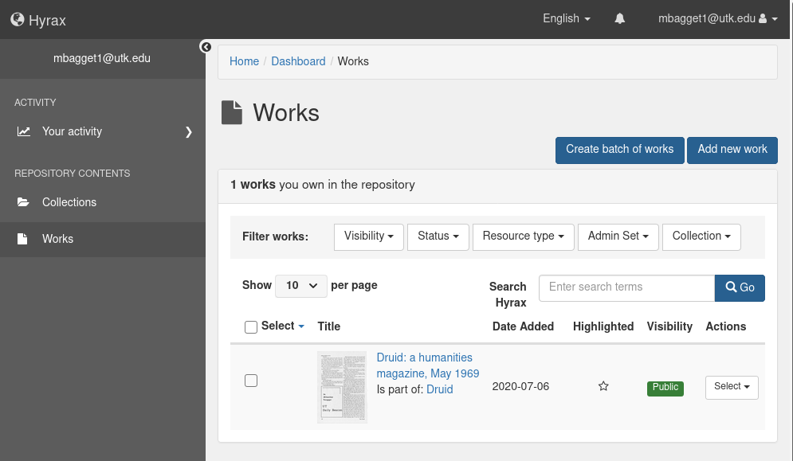
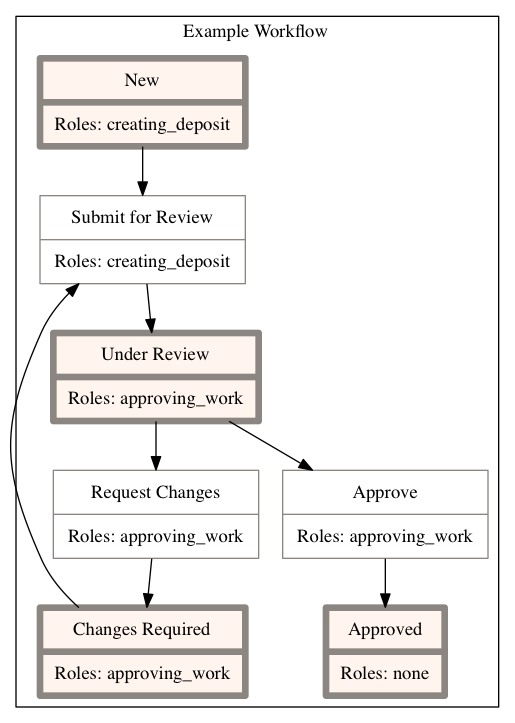
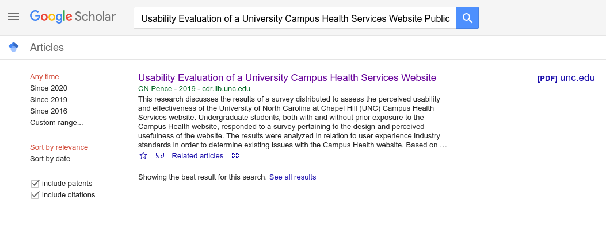
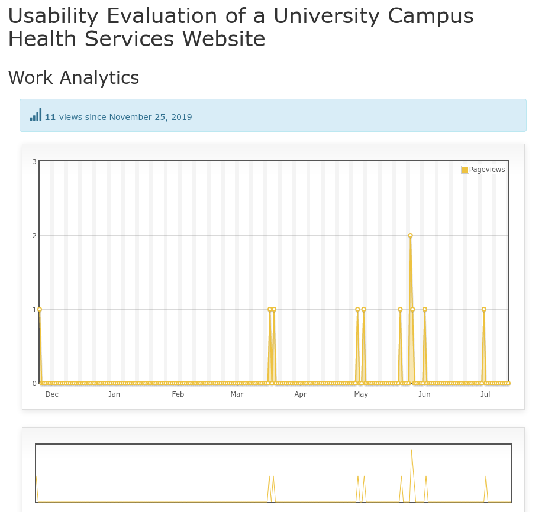

IX. Hyrax as an Institutional Repository Solution
=================================================

Sufia and Hyrax Origins
-----------------------

For many years, the Hydra / Samvera community had two major *variants*:

1. `CurationConcerns <https://github.com/samvera-deprecated/curation_concerns>`_
2. `Sufia <https://github.com/samvera-deprecated/sufia>`_

These solutions were built on the Hydra (Samvera) framework and geared at separate needs. CurationConcerns' main focus
was on digital collections.  Sufia on the other hand was built for institutional repositories and had functionality to
support features like self-deposit, proxy deposit, mediated deposit, and embargoing.

As both solutions matured, they got their own unique features to fit their specialties and continued to diverge on
separate courses.

In 2015, PCDM was realized and adopted by the Samvera community as a shared way to model content. This adoption steered
both platforms towards a common way of modeling objects.

At Hydra Connect 2016, a session was held based on a circulating white paper called
`"Should Sufia and CurationConcerns Merge?" <https://docs.google.com/document/d/1bkc2Cik1T3KXFQdS5UrU2XE3Kywd7di2IIjyo-T_Atc/edit>`_.
The results of the session and its discussion resulted in a decision to merge the Sufia and Curation Concerns code bases
into a single solution called `Hyrax <https://github.com/samvera/hyrax>`_.

Because of Hyrax's origins in Sufia, it works as an institutional repository out-of-the-box. In fact, as stated in
`Hyrax's Current Roadmap <https://wiki.lyrasis.org/display/samvera/Hyrax+Roadmap>`_, the Samvera Interest Group for
Advising the Hyrax Roadmap (SIGAHR) recognizes:

    the current implementation of Hyrax is more suited to institutional & data repository use cases than it is to digital
    collections management repository use cases.

Hyrax as an Institutional Repository
------------------------------------

In order to serve as a replacement for our current institutional repository, the following functionality must exist as
specified by the IR RFP Group:

1. Mediated and Unmediated Uploads
2. Google Scholar Integration
3. Accept, Publish, and Other Workflows
4. Embargoing
5. Usage statistics
6. Tombstoning

Hyrax supports all of these things out-of-the-box.  In this section, I'll describe these features in detail and point
to examples of Hyrax being used as an institutional repository.

===============================
Mediated and Unmediated Uploads
===============================

Hyrax is designed to support mediated and unmediated uploads. You can easily configure it to allow an authenticated user through
your campus authentication system to login and deposit objects directly or reviewed and approved by another user.

Here you can see an example of what a user's screen might look like and how they'd add new "works".

In the next section we'll discuss creating workflows for particular use cases.

===================
Designing Workflows
===================

Workflows in Hyrax are incredibly dynamic and completely up to the institution. These workflows are a database driven
implementation of `finite state machines <https://en.wikipedia.org/wiki/Finite-state_machine>`_

---------------
Getting Started
---------------

In order to create a workflow, you start by laying it out in something like draw.io or a whiteboard. In your drawings:

* Circles should represent states
* Lines should represent actions
* Determine what roles are required to take an action
* Determine what roles can see an item in the given state
* When changing state, what else should happen (e.g. send notifications, update metadata, etc.)

Keep in mind that some roles will be assigned to all items in the workflow (e.g. Metadata Reviewer) while other roles will
be assigned to single items in the workflow (e.g. Graduate School Accepter / Publisher)

Here is an example:

--------------------
Translating to Hyrax
--------------------

By default, Hyrax will create a workflow configuration when you generate a new work type:

.. code-block:: shell

    rails generate hyrax:work

To use it, you need to load it into the database with `rails hyrax:workflow:load`.  Before you do it though, you should
review your workflow and make sure it is correct.

To model the workflow in the drawing above, we'd create JSON like this:

.. code-block:: json

    {
      "work_types": [
        {
          "name": "example",
             "actions": [{
                 "name": "submit_for_review", "transition_to": "under_review",
                 "from_states": [{"names": ["new", "changes_required"], "roles": ["creating_deposit"]}]
             }, {
                 "name": "request_changes", "transition_to": "changes_required",
                 "from_states": [{"names": ["under_review"], "roles": ["approving_work"]}]
            }, {
                 "name": "approve", "transition_to": "approved",
                 "from_states": [{"names": ["under_review"], "roles": ["approving_work"]}]
            }]
         }
      ]
    }

-----------------
Loading Workflows
-----------------

When a Hyrax app is created by running `rails generate hyrax:install`, a default workflow is created in
`config/workflows/default_workflow.json`.

You can define additional workflows following the syntax described Defining a Workflow in Hyrax above.
Add the json files to config/workflows directory in your app.

All workflows defined in config/workflows directory can be loaded using the following command.

.. code-block:: shell

    rails hyrax:workflow:load

This will load the workflow and create user roles. You will want to assign users/groups to the roles. You will be able
to select the workflow for use in an admin_set.

==========================
Google Scholar Integration
==========================

By default, Hyrax automatically injects Google Scholar metatags into the HTML DOM of objects.

While this is convenient, you actually have to disable this feature for other repository types.

As you can see here, Hyrax is inserting Google Scholar metatags for a book:

.. code-block:: xml

    <!-- Google Scholar metadata -->
    <meta name="citation_title" content="Druid: a humanities magazine, May 1969" />
    <meta name="citation_author" content="University of Tennessee" />
    <meta name="citation_publication_date" content="1969-05" />
    <meta name="citation_pdf_url" content="http://localhost/downloads/sf268508b" />

More appropriately, `here is an ETD from UNC <https://cdr.lib.unc.edu/concern/masters_papers/t435gj608>`_.  Here are the
metatags for this ETD:

.. code-block:: xml

    <!-- Google Scholar metadata -->
    <meta name="citation_title" content="Usability Evaluation of a University Campus Health Services Website" />
    <meta name="citation_author" content="Pence, Carson N. " />
    <meta name="citation_publication_date" content="November 25, 2019" />
    <meta name="citation_pdf_url" content="http://cdr.lib.unc.edu/downloads/1544bt87w" />

And finally, here is the object in Google Scholar:

================
Usage Statistics
================

Out of the box, Hyrax has the capability of tracking usage statistics for an object.  Here is an example of this integration:

This requires minimal configuration.

-----------------------------------
Capturing usage and download counts
-----------------------------------

To enable the Google Analytics javascript snippet, make sure that config.google_analytics_id is set in your app within
the config/initializers/hyrax.rb file. A Google Analytics ID typically looks like UA-99999999-1.

--------------------------
Displaying usage in the UI
--------------------------

To display data from Google Analytics in the UI, first head to the Google Developers Console and create a new project:

`<https://console.developers.google.com/project>`_

Let's assume for now Google assigns it a project ID of foo-bar-123. It may take a few seconds for this to complete
(watch the Activities bar near the bottom of the browser). Once it's complete, enable the Google+ and Google Analytics
APIs here (note: this is an example URL -- you'll have to change the project ID to match yours):

`<https://console.developers.google.com/apis/library?project=foo-bar-123>`_

Finally, click the 'credentials' menu item and create a new Service Account Key. This will give you the client ID, a
client email address, a private key file, and a private key secret/password, which you will need in the next step.

Edit config/analytics.yml to reflect the information that the Google Developer Console gave you earlier; namely you'll
need to provide it:

    The path to the private key
    The password/secret for the privatekey
    The Service Account ID (email)
    An application name (you can make this up)
    An application version (you can make this up)

Lastly, you will need to set config.analytics = true and config.analytic_start_date in config/initializers/hyrax.rb and
ensure that the client email has the proper access within your Google Analyics account. To do so, go to the Admin tab
for your Google Analytics account. Click on User Management, in the Account column, and add "Read & Analyze" permissions
for the OAuth client email address.

---------------------------
Populating the Analytics DB
---------------------------

The API access required in the UI integration step, above, enables more than just per-object stats display.
We can harvest GA stats for all of our objects into the local database, and use this data to integrate usage reports
into the Admin Statistics dashboard. So far this integration into the dashboard has not been done.

To harvest stats for all your objects, you might use a rake task that runs Sufia::UserStatImporter which in turn is called by a cron job.
Problems with Analytics

Having a problem setting up Analytics. See Analytics-workaround-for-non-production-environments, which documents a workaround for one known issue.

Institutions Using Hyrax as an Institutional Repository
-------------------------------------------------------

This section lists some examples of Hyrax used as an institutional repository:

1. `University of North Carolina's Carolina Digital Repository <https://cdr.lib.unc.edu/>`_
2. `George Washington University's ScholarSpace <https://scholarspace.library.gwu.edu/>`_
3. `Emory's Emory Theses and Dissertations <https://etd.library.emory.edu/>`_

