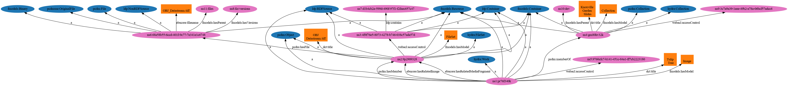

I. Diagrams and Object Modelling
================================

About
-----

This section includes all required materials in the "Diagram a Sample Image Object" section.

Object Modelling with the Portland Common Data Model
----------------------------------------------------

Hyrax, like most modern Fedora stacks, leverages the `Portland Common Data Model (PCDM) <https://github.com/duraspace/pcdm/wiki>`_.
As explained in the PCDM wiki:

    The Portland Common Data Model (PCDM) is a flexible, extensible domain model that is intended to underlie a wide
    array of repository and DAMS applications. The primary objective of this model is to establish a framework that
    developers of tools (e.g., Samvera-based engines, such as Hyrax, Hyku, Sufia, and Avalon; Islandora; custom Fedora
    sites) can use for working with models in a general way, allowing adopters to **easily use custom models with any tool**.
    Given this interoperability goal, the initial work has been focused on **structural metadata and access control**,
    since these are the key actionable metadata.

    To encourage adoption, this model must support the most complex use cases, which include rich hierarchies of
    inter-related collections and works, but also elegantly support the simplest use cases, such as a single
    user-contributed file with a few fields of metadata. It must provide a compact interface that tool developers can
    easily implement, but also **be extensible enough for adopters to customize to their local needs**.

    As the community migrates to Fedora 4, much of our metadata is migrating to RDF. This model encourages linked data
    best practices, such as using URIs to identify all resources, using widely-used vocabularies where possible, and
    subclassing existing classes and properties when creating new terms.

Below is a visualization of a collection, with an image, a file set, a file, and a related webacl in a Hyrax stack
generated with `Ontology Visualization <https://github.com/usc-isi-i2/ontology-visualization>`_.  Since Hyrax and
Fedora 4+ are built on Linked Data Platform, I've removed dozens of relationships to simplify the diagram.

    Click the Image to Zoom In and See Relationships

If you'd prefer to see RDF representations of the Fedora containers, you can see those below.

Let's dissect a little bit of what is happening here.

=====================
The Collection Object
=====================

The **collection** object (ns4:gm80hv32k / Knoxville Gardens Slides) is an instance of (rdf:type):

* fmodels:Resource
* ldp:Container
* fmodels:Container
* pcdm:Collection
* hydra:Collection

It has a webacl:accesscontrol that governs who can view it and manage it.

It also has a fmodels:hasParent ns10:dev which is our Fedora repository.

==============
The Hydra Work
==============

The **Work** (ns1:pr76f340k / Tulip Tree) is an instance of (rdf:type):

* fmodels:Resource
* ldp:Container
* fmodels:Container
* ldp:RDFSource
* pcdm:Object
* hydra:Work

It has a webacl:accesscontrol that governs who can view it and manage it.

It is a pcdm:memberOf our collection object.

It also has the following relationships with our fileset:

* pcdm:hasMember
* ebucore:hasRelatedImage
* ebucore:hasRelatedMediaFragment

===========
The Fileset
===========

The **Fileset** (ns2:9p2909328 / OBJ Datastream.tiff) is an instance of (has rdf:type relationships):

* fmodels:Resource
* ldp:Container
* fmodels:Container
* ldp:RDFSource
* fmodels:Container
* pcdm:Object
* hydra:FileSet

It has a webacl:accesscontrol that governs who can view it and manage it.

It has a pcdm:hasFile relationship to our file.

========
The File
========

The **File** (ns6:68a58b55-6ccd-401f-9c77-7e341e1c6748 / OBJ Datastream.tiff) is an instance of (has rdf:type relationships):

* fmodels:Resource
* fmodels:Binary
* pcdmuse:OriginalFile
* pcdm:File
* ldpNonRDFResource

It has a fmodels:hasParent to ns11:files with is a Fedora resource to represent all files in our Fedora instance.

It has a fmodels:hasVersions that points at a resource that represents the versions of this file.

==========
The Turtle
==========

We've looked at a visualization, but it this what's actually in Fedora? Yes. In Fedora 3.8, we have this concept of object, but that idea
does not exist in a post Fedora 3.8 world. Instead, we have containers and binaries.  Below is turtle some turtle for
the objects in the visualization above.

**PLEASE NOTE:** For your viewing pleasure, I've stripped away most descriptive metadata and other non structural metadata
in order to make things easier to understand.  We'll get to look at some of that later.

Here is a ttl representation of the "Knoxville Garden Slides" Collection object:

.. code-block:: turtle
    :linenos:
    :caption: Knoxville Garden Slides Collection Object with Minimal Descriptive Metadata modeled as RDF
    :name: Knoxville Garden Slides Collection Object with Minimal Descriptive Metadata modeled as RDF
    :emphasize-lines: 24, 26

    @prefix premis:  <http://www.loc.gov/premis/rdf/v1#> .
    @prefix rdfs:  <http://www.w3.org/2000/01/rdf-schema#> .
    @prefix hydra:  <http://projecthydra.org/works/models#> .
    @prefix webacl:  <http://www.w3.org/ns/auth/acl#> .
    @prefix dct:  <http://purl.org/dc/terms/> .
    @prefix fedora:  <info:fedora/fedora-system:def/model#> .
    @prefix xsi:  <http://www.w3.org/2001/XMLSchema-instance> .
    @prefix xmlns:  <http://www.w3.org/2000/xmlns/> .
    @prefix pcdm:  <http://pcdm.org/models#> .
    @prefix relators:  <http://id.loc.gov/vocabulary/relators/> .
    @prefix xml:  <http://www.w3.org/XML/1998/namespace> .
    @prefix fedoraconfig:  <http://fedora.info/definitions/v4/config#> .
    @prefix foaf:  <http://xmlns.com/foaf/0.1/> .
    @prefix test:  <info:fedora/test/> .
    @prefix schema:  <http://schema.org/> .
    @prefix rdf:  <http://www.w3.org/1999/02/22-rdf-syntax-ns#> .
    @prefix fedora:  <http://fedora.info/definitions/v4/repository#> .
    @prefix ebucore:  <http://www.ebu.ch/metadata/ontologies/ebucore/ebucore#> .
    @prefix ldp:  <http://www.w3.org/ns/ldp#> .
    @prefix xs:  <http://www.w3.org/2001/XMLSchema> .
    @prefix dc:  <http://purl.org/dc/elements/1.1/> .

    <http://localhost:8984/rest/dev/gm/80/hv/32/gm80hv32k>
            rdf:type pcdm:Collection ;
            rdf:type fedora:Container ;
            rdf:type hydra:Collection ;
            rdf:type fedora:Resource ;
            fedora:lastModifiedBy "bypassAdmin"^^<http://www.w3.org/2001/XMLSchema#string> ;
            fedora:hasModel "Collection"^^<http://www.w3.org/2001/XMLSchema#string> ;
            fedora:createdBy "bypassAdmin"^^<http://www.w3.org/2001/XMLSchema#string> ;
            relators:dpt "mbagget1@utk.edu"^^<http://www.w3.org/2001/XMLSchema#string> ;
            fedora:created "2020-05-12T21:56:09.247Z"^^<http://www.w3.org/2001/XMLSchema#dateTime> ;
            fedora:lastModified "2020-05-12T21:56:26.349Z"^^<http://www.w3.org/2001/XMLSchema#dateTime> ;
            webacl:accessControl <http://localhost:8984/rest/dev/3c/7a/9a/39/3c7a9a39-1eee-49b2-a78a-06bcf57adcc6> ;
            schema:additionalType "gid://ucla2019/hyrax-collectiontype/1"^^<http://www.w3.org/2001/XMLSchema#string> ;
            dct:title "Knoxville Garden Slides"^^<http://www.w3.org/2001/XMLSchema#string> ;
            dc:description "This collection of hand-colored lantern slides dates from the late 1920s and early 1930s. The slides depict ornamental gardens in the Knoxville, Tennessee, area and feature a variety of garden styles, plants, flowers, and foliage."^^<http://www.w3.org/2001/XMLSchema#string> ;
            rdf:type ldp:RDFSource ;
            rdf:type ldp:Container ;
            fedora:writable "true"^^<http://www.w3.org/2001/XMLSchema#boolean> ;
            fedora:hasParent <http://localhost:8984/rest/dev> .

The following ttl shows how the object `knoxgardens:115` from our Fedora 3.8 instance looks migrated to Hyrax and its
relationship with its parent collection and its preservation Tiff.

.. code-block:: turtle
    :linenos:
    :caption: knoxgardens:115 in Hyrax as ttl and using PCDM, highlight structural metadata, with only core descriptive metadata
    :name:  knoxgardens:115 in Hyrax as ttl and using PCDM with only core metadata
    :emphasize-lines: 16-17, 24, 44

    @prefix pcdm:  <http://pcdm.org/models#> .
    @prefix dct: <http://purl.org/dc/terms/> .
    @prefix rdf:  <http://www.w3.org/1999/02/22-rdf-syntax-ns#> .
    @prefix relators: <http://id.loc.gov/vocabulary/relators/> .
    @prefix pcdmuse:  <http://pcdm.org/use#> .
    @prefix hydra:  <http://projecthydra.org/works/models#> .
    @prefix fedora:  <http://fedora.info/definitions/v4/repository#> .
    @prefix iana:  <http://www.iana.org/assignments/relation/> .
    @prefix faccess:  <http://fedora.info/definitions/1/0/access/ObjState#> .
    @prefix fmodels:  <info:fedora/fedora-system:def/model#> .
    @prefix ebucore:  <http://www.ebu.ch/metadata/ontologies/ebucore/ebucore#> .
    @prefix acl:  <http://www.w3.org/ns/auth/acl#> .
    @prefix ldp:  <http://www.w3.org/ns/ldp#> .

    <http://localhost:8984/rest/dev/pr/76/f3/40/pr76f340k>
        rdf:type pcdm:Object ;
        rdf:type hydra:Work ;
        rdf:type fedora:Container;
        rdf:type fedora:Resource;
        dct:title "Tulip Tree"^^<http://www.w3.org/2001/XMLSchema#string> ;
        relators:dpt "mbagget1@utk.edu"^^<http://www.w3.org/2001/XMLSchema#string> ;
        dct:dateSubmitted "2020-05-12T21:59:19.647826267+00:00"^^<http://www.w3.org/2001/XMLSchema#dateTime> ;
        dct:modified "2020-05-12T21:59:19.65408406+00:00"^^<http://www.w3.org/2001/XMLSchema#dateTime> ;
        pcdm:memberOf <http://localhost:8984/rest/dev/gm/80/hv/32/gm80hv32k> ;
        iana:last <http://localhost:8984/rest/dev/pr/76/f3/40/pr76f340k/list_source#g47218150558240> ;
        faccess:objState faccess:active ;
        fmodels:hasModel "Image"^^<http://www.w3.org/2001/XMLSchema#string> ;
        ebucore:hasRelatedMediaFragment <http://localhost:8984/rest/dev/9p/29/09/32/9p2909328> ;
        fedora:createdBy "bypassAdmin"^^<http://www.w3.org/2001/XMLSchema#string> ;
        fedora:created "2020-05-12T21:59:19.736Z"^^<http://www.w3.org/2001/XMLSchema#dateTime> ;
        fedora:lastModified "2020-05-12T21:59:26.707Z"^^<http://www.w3.org/2001/XMLSchema#dateTime> ;
        dct:isPartOf <http://localhost:8984/rest/dev/ad/mi/n_/se/admin_set/default> ;
        dct:modified "2020-05-12T21:59:19.65408406+00:00"^^<http://www.w3.org/2001/XMLSchema#dateTime> ;
        acl:accessControl <http://localhost:8984/rest/dev/97/60/cf/c7/9760cfc7-b141-451c-84a1-ff7cb2223180> ;
        ebucore:hasRelatedImage <http://localhost:8984/rest/dev/9p/29/09/32/9p2909328> ;
        iana:first <http://localhost:8984/rest/dev/pr/76/f3/40/pr76f340k/list_source#g47218150558240> ;
        rdf:type ldp:RDFSource ;
        rdf:type ldp:Container ;
        fedora:writable "true"^^<http://www.w3.org/2001/XMLSchema#boolean> ;
        fedora:hasParent <http://localhost:8984/rest/dev> ;
        ldp:contains <http://localhost:8984/rest/dev/pr/76/f3/40/pr76f340k/member_of_collections> ;
        ldp:contains <http://localhost:8984/rest/dev/pr/76/f3/40/pr76f340k/members> ;
        ldp:contains <http://localhost:8984/rest/dev/pr/76/f3/40/pr76f340k/list_source> ;
        pcdm:hasMember <http://localhost:8984/rest/dev/9p/29/09/32/9p2909328> .

And here is our `fileset` for the container based on `knoxgardens:115`:

.. code-block:: turtle
    :linenos:
    :caption: The fileset belonging to knoxgardens:115 modeled as RDF in Fedora
    :name: The fileset belonging to knoxgardens:115 modeled as RDF in Fedora
    :emphasize-lines: 24, 26, 44

    @prefix premis:  <http://www.loc.gov/premis/rdf/v1#> .
    @prefix rdfs:  <http://www.w3.org/2000/01/rdf-schema#> .
    @prefix hydra:  <http://projecthydra.org/works/models#> .
    @prefix webacl:  <http://www.w3.org/ns/auth/acl#> .
    @prefix dct:  <http://purl.org/dc/terms/> .
    @prefix fedora:  <info:fedora/fedora-system:def/model#> .
    @prefix xsi:  <http://www.w3.org/2001/XMLSchema-instance> .
    @prefix xmlns:  <http://www.w3.org/2000/xmlns/> .
    @prefix pcdm:  <http://pcdm.org/models#> .
    @prefix relators:  <http://id.loc.gov/vocabulary/relators/> .
    @prefix xml:  <http://www.w3.org/XML/1998/namespace> .
    @prefix fedoraconfig:  <http://fedora.info/definitions/v4/config#> .
    @prefix foaf:  <http://xmlns.com/foaf/0.1/> .
    @prefix test:  <info:fedora/test/> .
    @prefix rdf:  <http://www.w3.org/1999/02/22-rdf-syntax-ns#> .
    @prefix fedora:  <http://fedora.info/definitions/v4/repository#> .
    @prefix ebucore:  <http://www.ebu.ch/metadata/ontologies/ebucore/ebucore#> .
    @prefix ldp:  <http://www.w3.org/ns/ldp#> .
    @prefix xs:  <http://www.w3.org/2001/XMLSchema> .
    @prefix dc:  <http://purl.org/dc/elements/1.1/> .

    <http://localhost:8984/rest/dev/9p/29/09/32/9p2909328>
            rdf:type fedora:Container ;
            rdf:type hydra:FileSet ;
            rdf:type fedora:Resource ;
            rdf:type pcdm:Object ;
            fedora:lastModifiedBy "bypassAdmin"^^<http://www.w3.org/2001/XMLSchema#string> ;
            fedora:downloadFilename "OBJ Datastream.tiff"^^<http://www.w3.org/2001/XMLSchema#string> ;
            fedora:hasModel "FileSet"^^<http://www.w3.org/2001/XMLSchema#string> ;
            dct:dateSubmitted "2020-05-12T21:59:21.995548515+00:00"^^<http://www.w3.org/2001/XMLSchema#dateTime> ;
            fedora:createdBy "bypassAdmin"^^<http://www.w3.org/2001/XMLSchema#string> ;
            relators:dpt "mbagget1@utk.edu"^^<http://www.w3.org/2001/XMLSchema#string> ;
            fedora:created "2020-05-12T21:59:21.831Z"^^<http://www.w3.org/2001/XMLSchema#dateTime> ;
            fedora:lastModified "2020-05-12T21:59:26.063Z"^^<http://www.w3.org/2001/XMLSchema#dateTime> ;
            dct:modified "2020-05-12T21:59:21.995548515+00:00"^^<http://www.w3.org/2001/XMLSchema#dateTime> ;
            dc:creator "mbagget1@utk.edu"^^<http://www.w3.org/2001/XMLSchema#string> ;
            webacl:accessControl <http://localhost:8984/rest/dev/4f/9f/76/e5/4f9f76e5-8073-4278-b746-038c57ada57d> ;
            dct:title "OBJ Datastream.tiff"^^<http://www.w3.org/2001/XMLSchema#string> ;
            rdf:type ldp:RDFSource ;
            rdf:type ldp:Container ;
            fedora:writable "true"^^<http://www.w3.org/2001/XMLSchema#boolean> ;
            fedora:hasParent <http://localhost:8984/rest/dev> ;
            ldp:contains <http://localhost:8984/rest/dev/9p/29/09/32/9p2909328/files> ;
            pcdm:hasFile <http://localhost:8984/rest/dev/9p/29/09/32/9p2909328/files/68a58b55-6ccd-401f-9c77-7e341e1c6748> .

And our Tiff:

.. code-block:: turtle
    :linenos:
    :caption: The Actual File
    :name: The Actual File
    :emphasize-lines: 24

    @prefix premis:  <http://www.loc.gov/premis/rdf/v1#> .
    @prefix rdfs:  <http://www.w3.org/2000/01/rdf-schema#> .
    @prefix xsi:  <http://www.w3.org/2001/XMLSchema-instance> .
    @prefix xmlns:  <http://www.w3.org/2000/xmlns/> .
    @prefix pcdm:  <http://pcdm.org/models#> .
    @prefix xml:  <http://www.w3.org/XML/1998/namespace> .
    @prefix pcdmuse:  <http://pcdm.org/use#> .
    @prefix fedoraconfig:  <http://fedora.info/definitions/v4/config#> .
    @prefix foaf:  <http://xmlns.com/foaf/0.1/> .
    @prefix test:  <info:fedora/test/> .
    @prefix hydramix:  <http://projecthydra.org/ns/mix/> .
    @prefix nepomuk:  <http://www.semanticdesktop.org/ontologies/2007/03/22/nfo#> .
    @prefix iana:  <http://www.iana.org/assignments/relation/> .
    @prefix exif:  <http://www.w3.org/2003/12/exif/ns#> .
    @prefix rdf:  <http://www.w3.org/1999/02/22-rdf-syntax-ns#> .
    @prefix fedora:  <http://fedora.info/definitions/v4/repository#> .
    @prefix ebucore:  <http://www.ebu.ch/metadata/ontologies/ebucore/ebucore#> .
    @prefix ldp:  <http://www.w3.org/ns/ldp#> .
    @prefix xs:  <http://www.w3.org/2001/XMLSchema> .
    @prefix dc:  <http://purl.org/dc/elements/1.1/> .

    <http://localhost:8984/rest/dev/9p/29/09/32/9p2909328/files/68a58b55-6ccd-401f-9c77-7e341e1c6748>
            rdf:type ldp:NonRDFSource ;
            rdf:type pcdm:File ;
            rdf:type pcdmuse:OriginalFile ;
            rdf:type fedora:Binary ;
            rdf:type fedora:Resource ;
            fedora:lastModifiedBy "bypassAdmin"^^<http://www.w3.org/2001/XMLSchema#string> ;
            premis:hasFormatName "TIFF EXIF"^^<http://www.w3.org/2001/XMLSchema#string> ;
            ebucore:width "2106"^^<http://www.w3.org/2001/XMLSchema#string> ;
            ebucore:fileSize "17765536"^^<http://www.w3.org/2001/XMLSchema#string> ;
            premis:hasSize "17765536"^^<http://www.w3.org/2001/XMLSchema#long> ;
            exif:orientation "normal*"^^<http://www.w3.org/2001/XMLSchema#string> ;
            fedora:createdBy "bypassAdmin"^^<http://www.w3.org/2001/XMLSchema#string> ;
            fedora:created "2020-05-17T13:20:03.252Z"^^<http://www.w3.org/2001/XMLSchema#dateTime> ;
            premis:hasMessageDigest <urn:sha1:3fe991ef65c061f65233cd7eb9353b8ca109ea2c> ;
            hydramix:colorProfileVersion "2.1.0"^^<http://www.w3.org/2001/XMLSchema#string> ;
            ebucore:filename "OBJ_Datastream.tiff"^^<http://www.w3.org/2001/XMLSchema#string> ;
            exif:software "Adobe Photoshop CS2 Windows"^^<http://www.w3.org/2001/XMLSchema#string> ;
            hydramix:colorProfileName "Adobe RGB (1998)"^^<http://www.w3.org/2001/XMLSchema#string> ;
            nepomuk:hashValue "99d14ee8c28517e10c637e0e0a675b94"^^<http://www.w3.org/2001/XMLSchema#string> ;
            ebucore:dateCreated "2010:01:28 17:33:15-05:00"^^<http://www.w3.org/2001/XMLSchema#string> ;
            exif:colorSpace "RGB"^^<http://www.w3.org/2001/XMLSchema#string> ;
            ebucore:hasMimeType "image/tiff"^^<http://www.w3.org/2001/XMLSchema#string> ;
            fedora:lastModified "2020-05-17T13:20:07.078Z"^^<http://www.w3.org/2001/XMLSchema#dateTime> ;
            ebucore:height "2808"^^<http://www.w3.org/2001/XMLSchema#string> ;
            hydramix:compressionScheme "Uncompressed"^^<http://www.w3.org/2001/XMLSchema#string> ;
            ebucore:dateModified "2010:01:28 17:38:53"^^<http://www.w3.org/2001/XMLSchema#string> ;
            rdf:type ldp:NonRDFSource ;
            fedora:writable "true"^^<http://www.w3.org/2001/XMLSchema#boolean> ;
            iana:describedby <http://localhost:8984/rest/dev/9p/29/09/32/9p2909328/files/68a58b55-6ccd-401f-9c77-7e341e1c6748/fcr:metadata> ;
            fedora:hasParent <http://localhost:8984/rest/dev/9p/29/09/32/9p2909328/files> ;
            fedora:hasFixityService <http://localhost:8984/rest/dev/9p/29/09/32/9p2909328/files/68a58b55-6ccd-401f-9c77-7e341e1c6748/fcr:fixity> ;
            fedora:hasVersions <http://localhost:8984/rest/dev/9p/29/09/32/9p2909328/files/68a58b55-6ccd-401f-9c77-7e341e1c6748/fcr:versions> .

Finally, you're probably wondering, what about those **ACLs**? Isn't that related to PCDM and structural metadata? Are
those not containers? Of course they are, but I haven't done much with them yet (what's an embargoed item look like
versus a public item.)

.. code-block:: turtle
    :linenos:
    :caption: A Web ACL
    :name: A Web ACL

    @prefix premis:  <http://www.loc.gov/premis/rdf/v1#> .
    @prefix rdfs:  <http://www.w3.org/2000/01/rdf-schema#> .
    @prefix ns004:  <http://projecthydra.org/works/models#> .
    @prefix ns003:  <http://www.w3.org/ns/auth/acl#> .
    @prefix ns002:  <http://purl.org/dc/terms/> .
    @prefix ns001:  <info:fedora/fedora-system:def/model#> .
    @prefix xsi:  <http://www.w3.org/2001/XMLSchema-instance> .
    @prefix ns008:  <http://fedora.info/definitions/1/0/access/ObjState#> .
    @prefix ns007:  <http://www.europeana.eu/schemas/edm/> .
    @prefix xmlns:  <http://www.w3.org/2000/xmlns/> .
    @prefix ns006:  <http://pcdm.org/models#> .
    @prefix ns005:  <http://id.loc.gov/vocabulary/relators/> .
    @prefix xml:  <http://www.w3.org/XML/1998/namespace> .
    @prefix ns009:  <http://pcdm.org/use#> .
    @prefix fedoraconfig:  <http://fedora.info/definitions/v4/config#> .
    @prefix foaf:  <http://xmlns.com/foaf/0.1/> .
    @prefix test:  <info:fedora/test/> .
    @prefix hydramix:  <http://projecthydra.org/ns/mix/> .
    @prefix nfo:  <http://www.semanticdesktop.org/ontologies/2007/03/22/nfo#> .
    @prefix ns015:  <http://projecthydra.org/ns/fits/> .
    @prefix linkrelations:  <http://www.iana.org/assignments/relation/> .
    @prefix ns013:  <http://www.openarchives.org/ore/terms/> .
    @prefix exif:  <http://www.w3.org/2003/12/exif/ns#> .
    @prefix ns018:  <http://www.w3.org/2011/content#> .
    @prefix ns017:  <http://schema.org/> .
    @prefix ns016:  <http://sweet.jpl.nasa.gov/2.2/reprDataFormat.owl#> .
    @prefix rdf:  <http://www.w3.org/1999/02/22-rdf-syntax-ns#> .
    @prefix fedora:  <http://fedora.info/definitions/v4/repository#> .
    @prefix ebucore:  <http://www.ebu.ch/metadata/ontologies/ebucore/ebucore#> .
    @prefix ldp:  <http://www.w3.org/ns/ldp#> .
    @prefix xs:  <http://www.w3.org/2001/XMLSchema> .
    @prefix dc:  <http://purl.org/dc/elements/1.1/> .

    <http://localhost:8984/rest/dev/4f/9f/76/e5/4f9f76e5-8073-4278-b746-038c57ada57d>
            rdf:type               fedora:Container ;
            rdf:type               fedora:Resource ;
            fedora:lastModifiedBy  "bypassAdmin"^^<http://www.w3.org/2001/XMLSchema#string> ;
            fedora:createdBy       "bypassAdmin"^^<http://www.w3.org/2001/XMLSchema#string> ;
            fedora:created         "2020-05-12T21:59:21.795Z"^^<http://www.w3.org/2001/XMLSchema#dateTime> ;
            fedora:lastModified    "2020-05-12T21:59:21.969Z"^^<http://www.w3.org/2001/XMLSchema#dateTime> ;
            ns001:hasModel         "Hydra::AccessControl"^^<http://www.w3.org/2001/XMLSchema#string> ;
            rdf:type               ldp:RDFSource ;
            rdf:type               ldp:Container ;
            fedora:writable        "true"^^<http://www.w3.org/2001/XMLSchema#boolean> ;
            fedora:hasParent       <http://localhost:8984/rest/dev> ;
            ldp:contains           <http://localhost:8984/rest/dev/4f/9f/76/e5/4f9f76e5-8073-4278-b746-038c57ada57d/b5/c4/a0/37/b5c4a037-5259-4974-826a-64dadf3cf382> ;
            ldp:contains           <http://localhost:8984/rest/dev/4f/9f/76/e5/4f9f76e5-8073-4278-b746-038c57ada57d/63/e0/63/f0/63e063f0-b661-412f-9352-11c38df46582> ;
            ldp:contains           <http://localhost:8984/rest/dev/4f/9f/76/e5/4f9f76e5-8073-4278-b746-038c57ada57d/d1/b4/cb/2a/d1b4cb2a-599d-490f-97f1-f2faec657c47> .

Data Stored in Fedora
---------------------

As you can see in the documentation above, all structural metadata is stored in Fedora. Additionally, there are several
other things stored in Fedora.

==================================
Access Control and Rights Metadata
==================================

Rights metadata, what we thought of as XACML policies in Fedora 3.8, is different in Hyrax.  As Hyrax uses the Portland
Common Data Model, it uses WebACLs to specify what actions users can perform on resources. As the PCDM website states:

    Each ACL is created as its own resource which links to the users, resources, and actions allowed. Users and
    resources can both be identified individually or using classes. The WebACL ontology includes several actions (read,
    write, append, control).

Historically, Samvera access control also had a discover permission. The PCDM documentation encourages adopters to
create new actions for permissions they wish to assign separately (e.g., download). This too is done as an RDF triple
and stored in Fedora.

Each Collection, Object and File instance can be assigned its own Web ACL. For example, an Object and its thumbnail
image might be assigned a public ACL, but the high-resolution master image might be limited to a specific group of
users.

Let's look at some example data.

A Fedora object may have a WebACL like this:

.. code-block:: turtle

    @prefix ns001:  <info:fedora/fedora-system:def/model#> .
    @prefix rdf:  <http://www.w3.org/1999/02/22-rdf-syntax-ns#> .
    @prefix fedora:  <http://fedora.info/definitions/v4/repository#> .
    @prefix ldp:  <http://www.w3.org/ns/ldp#> .
    @prefix xs:  <http://www.w3.org/2001/XMLSchema> .

    <http://localhost:8984/rest/dev/f5/bd/e7/0b/f5bde70b-bc77-4536-96ef-6cbd9798b98f>
            rdf:type               fedora:Container ;
            rdf:type               fedora:Resource ;
            fedora:lastModifiedBy  "bypassAdmin"^^<http://www.w3.org/2001/XMLSchema#string> ;
            fedora:createdBy       "bypassAdmin"^^<http://www.w3.org/2001/XMLSchema#string> ;
            fedora:created         "2020-07-06T20:31:39.781Z"^^<http://www.w3.org/2001/XMLSchema#dateTime> ;
            fedora:lastModified    "2020-07-06T21:17:58.424Z"^^<http://www.w3.org/2001/XMLSchema#dateTime> ;
            ns001:hasModel         "Hydra::AccessControl"^^<http://www.w3.org/2001/XMLSchema#string> ;
            rdf:type               ldp:RDFSource ;
            rdf:type               ldp:Container ;
            fedora:writable        "true"^^<http://www.w3.org/2001/XMLSchema#boolean> ;
            fedora:hasParent       <http://localhost:8984/rest/dev> ;
            ldp:contains           <http://localhost:8984/rest/dev/f5/bd/e7/0b/f5bde70b-bc77-4536-96ef-6cbd9798b98f/5f/23/4f/ab/5f234fab-2817-4a16-af1e-a2ced4f284f0> ;
            ldp:contains           <http://localhost:8984/rest/dev/f5/bd/e7/0b/f5bde70b-bc77-4536-96ef-6cbd9798b98f/bb/da/75/84/bbda7584-45a3-4156-ba3f-9a3a86d6a150> ;
            ldp:contains           <http://localhost:8984/rest/dev/f5/bd/e7/0b/f5bde70b-bc77-4536-96ef-6cbd9798b98f/b5/fc/46/9b/b5fc469b-b0ca-4b8b-a616-39715beed2f6> .

This WebACL contains instances of fedora:Resource / fedora:Containers with specific policies and restrictions:

.. code-block:: turtle
    :linenos:
    :emphasize-lines: 14, 18

        @prefix ns001:  <info:fedora/fedora-system:def/model#> .
        @prefix rdf:  <http://www.w3.org/1999/02/22-rdf-syntax-ns#> .
        @prefix fedora:  <http://fedora.info/definitions/v4/repository#> .
        @prefix ldp:  <http://www.w3.org/ns/ldp#> .
        @prefix xs:  <http://www.w3.org/2001/XMLSchema> .
        @prefix ns003:  <http://www.w3.org/ns/auth/acl#> .

        <http://localhost:8984/rest/dev/f5/bd/e7/0b/f5bde70b-bc77-4536-96ef-6cbd9798b98f/5f/23/4f/ab/5f234fab-2817-4a16-af1e-a2ced4f284f0>
                rdf:type               fedora:Container ;
                rdf:type               fedora:Resource ;
                fedora:lastModifiedBy  "bypassAdmin"^^<http://www.w3.org/2001/XMLSchema#string> ;
                ns003:mode             ns003:Write ;
                ns001:hasModel         "Hydra::AccessControls::Permission"^^<http://www.w3.org/2001/XMLSchema#string> ;
                ns003:accessTo         <http://localhost:8984/rest/dev/86/23/hx/72/8623hx72q> ;
                fedora:createdBy       "bypassAdmin"^^<http://www.w3.org/2001/XMLSchema#string> ;
                fedora:created         "2020-07-06T20:31:39.884Z"^^<http://www.w3.org/2001/XMLSchema#dateTime> ;
                fedora:lastModified    "2020-07-06T21:18:13.65Z"^^<http://www.w3.org/2001/XMLSchema#dateTime> ;
                ns003:agent            <http://projecthydra.org/ns/auth/person#mbagget1@utk.edu> ;
                rdf:type               ldp:RDFSource ;
                rdf:type               ldp:Container ;
                fedora:writable        "true"^^<http://www.w3.org/2001/XMLSchema#boolean> ;
                fedora:hasParent       <http://localhost:8984/rest/dev/f5/bd/e7/0b/f5bde70b-bc77-4536-96ef-6cbd9798b98f> .

You can see that this specific policy limits access to an agent, mbagget1@utk.edu.

Rights metadata is also stored as triples in Fedora. The Samvera community suggests two rights properties:

1. edm:rights containing a URI designating the primary rights statement of the resource
2. dcterms:rightsHolder containing a URI for the rights holder

The Samvera Rights Metadata Working Group suggests several other properties for describing rights. You can see those
`here <https://wiki.lyrasis.org/display/samvera/Rights+Metadata+Recommendation>`_.

====================
Descriptive Metadata
====================

In Hyrax, descriptive metadata elements are also stored as RDF triples in Fedora.  For instance, an identifier on a
Fedora object representing a Druid book would look something like this:

.. code-block:: turtle

    @prefix dcterms: <http://purl.org/dc/terms/> .
    @prefix fedoraobject: <https://example.org/objects/> .
    @prefix xs:  <http://www.w3.org/2001/XMLSchema#> .

    <fedoraobject:1>
        dcterms:identifier "druid_1969may"^^<xs:string>,  "druid:123"^^<xs:string> .

**Note**: If you're not minting new RDF instances outside of Fedora things, an external triple store is unnecessary. If
you need to mint new intances, you'll need one as that should not go in Fedora.  For instance, if you wanted to mint
a new RDF instance to represent a subject, you'd need a separate triple store.

.. code-block:: turtle
    :name: Subject in Fedora
    :caption: Subject in Fedora

    @prefix fedoraobject: <https://example.org/objects/> .
    @prefix dcterms: <http://purl.org/dc/terms/> .
    @prefix utksubjects: <https://example.org/subjects/>

    <fedoraobject:1> dcterms:subject <utksubjects:1> .

.. code-block:: turtle
    :name: Minted Subject in External Triplestore
    :caption: Minted Subject in External Triplestore

    @prefix utksubjects: <https://example.org/subjects/>
    @prefix skos: <http://www.w3.org/2004/02/skos/core#> .
    @prefix rdfs: <https://www.w3.org/TR/rdf-schema/> .

    <utksubjects:1>
        a skos:Concept ;
        rdfs:label "Photography of gardens";
        skos:exactMatch <http://id.loc.gov/authorities/subjects/sh85101348.html> .

===================================
Preservation and Technical Metadata
===================================

Preservation and technical metadata is also stored in Fedora. In PCDM, a pcdm:File is a sequence of binary data that is
described by some accompanying metadata. As a pcdm:File in Hyrax is a Fedora container, this applies here.  Looking at a
very basic configuration of Hyrax, a pcdm:File object may look something like this in Fedora:

.. code-block::
    :name: pcdm:File
    :caption: pcdm:File

    @prefix premis:  <http://www.loc.gov/premis/rdf/v1#> .
    @prefix rdfs:  <http://www.w3.org/2000/01/rdf-schema#> .
    @prefix xsi:  <http://www.w3.org/2001/XMLSchema-instance> .
    @prefix xmlns:  <http://www.w3.org/2000/xmlns/> .
    @prefix xml:  <http://www.w3.org/XML/1998/namespace> .
    @prefix fedoraconfig:  <http://fedora.info/definitions/v4/config#> .
    @prefix foaf:  <http://xmlns.com/foaf/0.1/> .
    @prefix test:  <info:fedora/test/> .
    @prefix hydramix:  <http://projecthydra.org/ns/mix/> .
    @prefix nfo:  <http://www.semanticdesktop.org/ontologies/2007/03/22/nfo#> .
    @prefix linkrelations:  <http://www.iana.org/assignments/relation/> .
    @prefix exif:  <http://www.w3.org/2003/12/exif/ns#> .
    @prefix rdf:  <http://www.w3.org/1999/02/22-rdf-syntax-ns#> .
    @prefix fedora:  <http://fedora.info/definitions/v4/repository#> .
    @prefix ebucore:  <http://www.ebu.ch/metadata/ontologies/ebucore/ebucore#> .
    @prefix ldp:  <http://www.w3.org/ns/ldp#> .
    @prefix xs:  <http://www.w3.org/2001/XMLSchema> .
    @prefix dc:  <http://purl.org/dc/elements/1.1/> .
    
    <http://localhost:8984/rest/dev/1g/05/fb/60/1g05fb60f/files/9a854dd0-31c5-4c3b-81b8-8a4d1a9d3799>
            rdf:type                 ldp:NonRDFSource ;
            rdf:type                 ns006:File ;
            rdf:type                 ns009:OriginalFile ;
            rdf:type                 fedora:Binary ;
            rdf:type                 fedora:Resource ;
            fedora:lastModifiedBy    "bypassAdmin"^^<http://www.w3.org/2001/XMLSchema#string> ;
            premis:hasFormatName     "TIFF EXIF"^^<http://www.w3.org/2001/XMLSchema#string> ;
            ebucore:width            "2060"^^<http://www.w3.org/2001/XMLSchema#string> ;
            ebucore:fileSize         "6096764"^^<http://www.w3.org/2001/XMLSchema#string> ;
            premis:hasSize           "6096764"^^<http://www.w3.org/2001/XMLSchema#long> ;
            exif:orientation        "normal*"^^<http://www.w3.org/2001/XMLSchema#string> ;
            fedora:createdBy         "bypassAdmin"^^<http://www.w3.org/2001/XMLSchema#string> ;
            fedora:created           "2020-07-06T20:32:32.875Z"^^<http://www.w3.org/2001/XMLSchema#dateTime> ;
            premis:hasMessageDigest  <urn:sha1:4dade79cfc6e8a4404711a879248f08ab9213515> ;
            ebucore:filename         "09.tiff"^^<http://www.w3.org/2001/XMLSchema#string> ;
            exif:software           "Adobe Photoshop CS4 Windows"^^<http://www.w3.org/2001/XMLSchema#string> ;
            nfo:hashValue          "cd946000902654d3f0e6094c335a5f0d"^^<http://www.w3.org/2001/XMLSchema#string> ;
            ebucore:dateCreated      "2012:05:09 11:59:42-04:00"^^<http://www.w3.org/2001/XMLSchema#string> ;
            exif:colorSpace         "BlackIsZero"^^<http://www.w3.org/2001/XMLSchema#string> ;
            ebucore:hasMimeType      "image/tiff"^^<http://www.w3.org/2001/XMLSchema#string> ;
            fedora:lastModified      "2020-07-06T20:32:36.533Z"^^<http://www.w3.org/2001/XMLSchema#dateTime> ;
            ebucore:height           "2954"^^<http://www.w3.org/2001/XMLSchema#string> ;
            hydramix:compressionScheme  "Uncompressed"^^<http://www.w3.org/2001/XMLSchema#string> ;
            ebucore:dateModified     "2012:05:09 12:48:56"^^<http://www.w3.org/2001/XMLSchema#string> ;
            rdf:type                 ldp:NonRDFSource ;
            fedora:writable          "true"^^<http://www.w3.org/2001/XMLSchema#boolean> ;
            linkrelations:describedby        <http://localhost:8984/rest/dev/1g/05/fb/60/1g05fb60f/files/9a854dd0-31c5-4c3b-81b8-8a4d1a9d3799/fcr:metadata> ;
            fedora:hasParent         <http://localhost:8984/rest/dev/1g/05/fb/60/1g05fb60f/files> ;
            fedora:hasFixityService  <http://localhost:8984/rest/dev/1g/05/fb/60/1g05fb60f/files/9a854dd0-31c5-4c3b-81b8-8a4d1a9d3799/fcr:fixity> ;
            fedora:hasVersions       <http://localhost:8984/rest/dev/1g/05/fb/60/1g05fb60f/files/9a854dd0-31c5-4c3b-81b8-8a4d1a9d3799/fcr:versions> .

=======================
Administrative Metadata
=======================

Like other forms of metadata, Fedora also contains our administrative metadata as RDF triples.

.. code-block:: turtle

    @prefix premis:  <http://www.loc.gov/premis/rdf/v1#> .
    @prefix rdfs:  <http://www.w3.org/2000/01/rdf-schema#> .
    @prefix hydraworks:  <http://projecthydra.org/works/models#> .
    @prefix dcterms:  <http://purl.org/dc/terms/> .
    @prefix fedorasystem:  <info:fedora/fedora-system:def/model#> .
    @prefix xsi:  <http://www.w3.org/2001/XMLSchema-instance> .
    @prefix xmlns:  <http://www.w3.org/2000/xmlns/> .
    @prefix pcdm:  <http://pcdm.org/models#> .
    @prefix relators:  <http://id.loc.gov/vocabulary/relators/> .
    @prefix xml:  <http://www.w3.org/XML/1998/namespace> .
    @prefix fedoraconfig:  <http://fedora.info/definitions/v4/config#> .
    @prefix foaf:  <http://xmlns.com/foaf/0.1/> .
    @prefix test:  <info:fedora/test/> .
    @prefix rdf:  <http://www.w3.org/1999/02/22-rdf-syntax-ns#> .
    @prefix fedora:  <http://fedora.info/definitions/v4/repository#> .
    @prefix ebucore:  <http://www.ebu.ch/metadata/ontologies/ebucore/ebucore#> .
    @prefix ldp:  <http://www.w3.org/ns/ldp#> .
    @prefix xs:  <http://www.w3.org/2001/XMLSchema> .
    @prefix dc:  <http://purl.org/dc/elements/1.1/> .

    <http://localhost:8984/rest/dev/1g/05/fb/60/1g05fb60f>
            rdf:type                fedora:Container ;
            rdf:type                hydraworks:FileSet ;
            rdf:type                fedora:Resource ;
            rdf:type                pcdm:Object ;
            fedora:lastModifiedBy   "bypassAdmin"^^<http://www.w3.org/2001/XMLSchema#string> ;
            fedorasystem:downloadFilename  "09.tiff"^^<http://www.w3.org/2001/XMLSchema#string> ;
            fedorasystem:hasModel          "FileSet"^^<http://www.w3.org/2001/XMLSchema#string> ;
            dcterms:dateSubmitted     "2020-07-06T20:32:32.581801767+00:00"^^<http://www.w3.org/2001/XMLSchema#dateTime> ;
            fedora:createdBy        "bypassAdmin"^^<http://www.w3.org/2001/XMLSchema#string> ;
            relators:dpt               "mbagget1@utk.edu"^^<http://www.w3.org/2001/XMLSchema#string> ;
            fedora:created          "2020-07-06T20:32:32.453Z"^^<http://www.w3.org/2001/XMLSchema#dateTime> ;
            fedora:lastModified     "2020-07-06T20:32:37.521Z"^^<http://www.w3.org/2001/XMLSchema#dateTime> ;
            dcterms:modified          "2020-07-06T20:32:32.581801767+00:00"^^<http://www.w3.org/2001/XMLSchema#dateTime> ;
            dc:creator              "mbagget1@utk.edu"^^<http://www.w3.org/2001/XMLSchema#string> ;
            dcterms:title             "09.tiff"^^<http://www.w3.org/2001/XMLSchema#string> ;
            rdf:type                ldp:RDFSource ;
            rdf:type                ldp:Container ;
            fedora:writable         "true"^^<http://www.w3.org/2001/XMLSchema#boolean> ;
            fedora:hasParent        <http://localhost:8984/rest/dev> ;
            ldp:contains            <http://localhost:8984/rest/dev/1g/05/fb/60/1g05fb60f/files> ;
            pcdm:hasFile           <http://localhost:8984/rest/dev/1g/05/fb/60/1g05fb60f/files/9a854dd0-31c5-4c3b-81b8-8a4d1a9d3799> .

====================
Preservation Objects
====================

Finally, our preservation objects are attached as versions to our pcdm:Files in Fedora.

Data Stored in Postgres
-----------------------

Data Stored Elsewhere
---------------------

